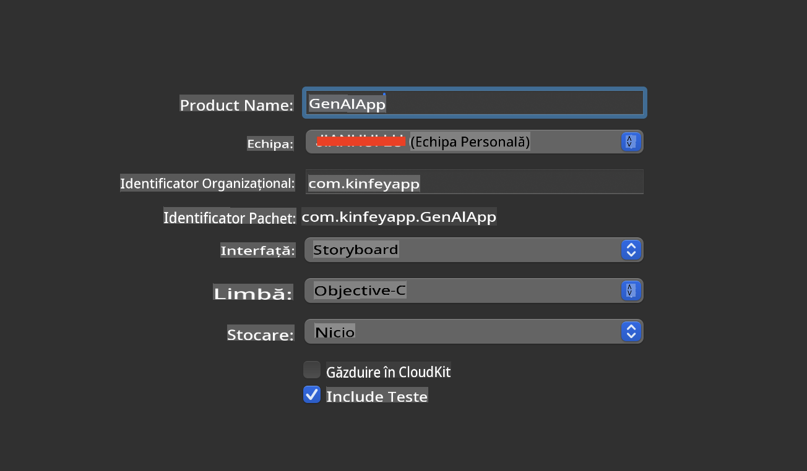
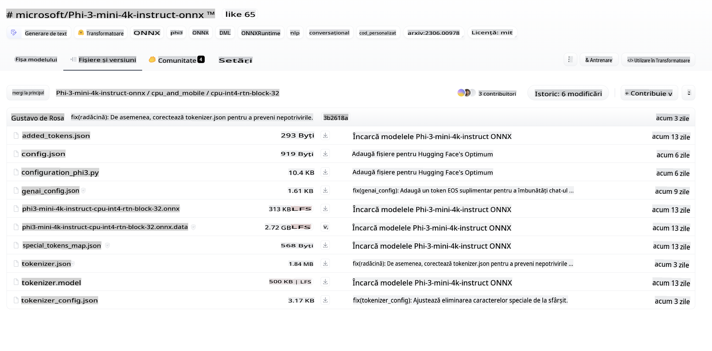
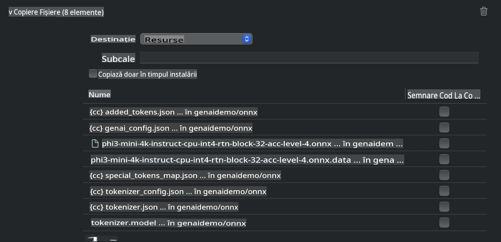
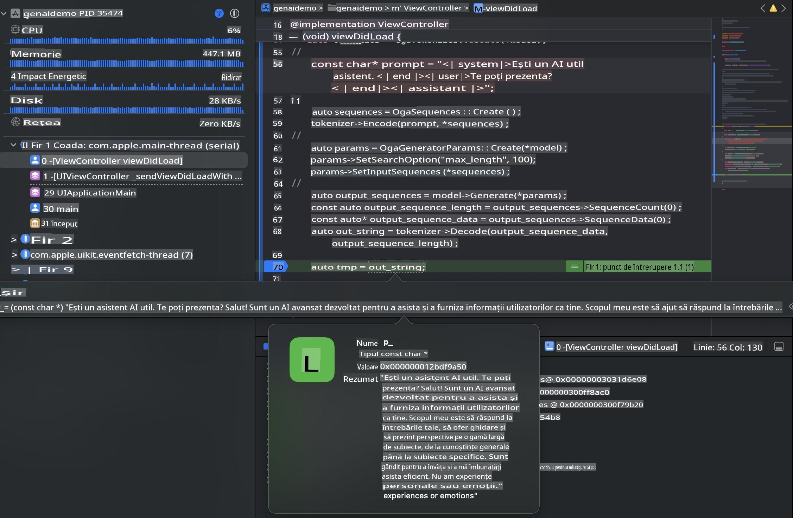

# **Inferența Phi-3 pe iOS**

Phi-3-mini este o nouă serie de modele de la Microsoft care permite implementarea de modele de limbaj mari (LLM) pe dispozitive edge și IoT. Phi-3-mini este disponibil pentru implementări pe iOS, Android și dispozitive edge, permițând utilizarea AI generative în medii BYOD. Următorul exemplu demonstrează cum să implementezi Phi-3-mini pe iOS.

## **1. Pregătire**

- **a.** macOS 14+
- **b.** Xcode 15+
- **c.** iOS SDK 17.x (iPhone 14 A16 sau mai recent)
- **d.** Instalează Python 3.10+ (se recomandă Conda)
- **e.** Instalează biblioteca Python: `python-flatbuffers`
- **f.** Instalează CMake

### Semantic Kernel și Inferență

Semantic Kernel este un framework de aplicații care îți permite să creezi aplicații compatibile cu Azure OpenAI Service, modelele OpenAI și chiar modele locale. Accesarea serviciilor locale prin Semantic Kernel facilitează integrarea cu serverul tău Phi-3-mini găzduit local.

### Apelarea modelelor cuantificate cu Ollama sau LlamaEdge

Mulți utilizatori preferă utilizarea modelelor cuantificate pentru rularea locală a acestora. [Ollama](https://ollama.com) și [LlamaEdge](https://llamaedge.com) permit utilizatorilor să apeleze diferite modele cuantificate:

#### **Ollama**

Poți rula `ollama run phi3` direct sau să-l configurezi offline. Creează un fișier Modelfile cu calea către fișierul tău `gguf`. Cod de exemplu pentru rularea modelului cuantificat Phi-3-mini:

```gguf
FROM {Add your gguf file path}
TEMPLATE \"\"\"<|user|> .Prompt<|end|> <|assistant|>\"\"\"
PARAMETER stop <|end|>
PARAMETER num_ctx 4096
```

#### **LlamaEdge**

Dacă dorești să folosești `gguf` atât pe dispozitive cloud, cât și pe dispozitive edge simultan, LlamaEdge este o opțiune excelentă.

## **2. Compilarea ONNX Runtime pentru iOS**

```bash

git clone https://github.com/microsoft/onnxruntime.git

cd onnxruntime

./build.sh --build_shared_lib --ios --skip_tests --parallel --build_dir ./build_ios --ios --apple_sysroot iphoneos --osx_arch arm64 --apple_deploy_target 17.5 --cmake_generator Xcode --config Release

cd ../

```

### **Observație**

- **a.** Înainte de compilare, asigură-te că Xcode este configurat corect și setează-l ca director activ pentru dezvoltare în terminal:

    ```bash
    sudo xcode-select -switch /Applications/Xcode.app/Contents/Developer
    ```

- **b.** ONNX Runtime trebuie compilat pentru platforme diferite. Pentru iOS, poți compila pentru `arm64` or `x86_64`.

- **c.** Este recomandat să folosești cea mai recentă versiune a SDK-ului iOS pentru compilare. Totuși, poți folosi și o versiune mai veche dacă ai nevoie de compatibilitate cu SDK-uri anterioare.

## **3. Compilarea AI generativ cu ONNX Runtime pentru iOS**

> **Notă:** Deoarece AI generativ cu ONNX Runtime este în faza de previzualizare, te rugăm să fii conștient de posibilele schimbări.

```bash

git clone https://github.com/microsoft/onnxruntime-genai
 
cd onnxruntime-genai
 
mkdir ort
 
cd ort
 
mkdir include
 
mkdir lib
 
cd ../
 
cp ../onnxruntime/include/onnxruntime/core/session/onnxruntime_c_api.h ort/include
 
cp ../onnxruntime/build_ios/Release/Release-iphoneos/libonnxruntime*.dylib* ort/lib
 
export OPENCV_SKIP_XCODEBUILD_FORCE_TRYCOMPILE_DEBUG=1
 
python3 build.py --parallel --build_dir ./build_ios --ios --ios_sysroot iphoneos --ios_arch arm64 --ios_deployment_target 17.5 --cmake_generator Xcode --cmake_extra_defines CMAKE_XCODE_ATTRIBUTE_CODE_SIGNING_ALLOWED=NO

```

## **4. Crearea unei aplicații App în Xcode**

Am ales Objective-C ca metodă de dezvoltare a aplicației, deoarece folosind AI generativ cu API-ul ONNX Runtime C++, Objective-C este mai compatibil. Desigur, poți realiza apelurile necesare și prin intermediul bridging-ului Swift.



## **5. Copierea modelului ONNX cuantificat INT4 în proiectul aplicației**

Trebuie să importăm modelul cu cuantificare INT4 în format ONNX, care trebuie descărcat mai întâi.



După descărcare, trebuie să-l adaugi în directorul Resources al proiectului în Xcode.



## **6. Adăugarea API-ului C++ în ViewControllers**

> **Observație:**

- **a.** Adaugă fișierele header C++ corespunzătoare în proiect.

  

- **b.** Include `onnxruntime-genai` dynamic library in Xcode.

  

- **c.** Use the C Samples code for testing. You can also add additional features like ChatUI for more functionality.

- **d.** Since you need to use C++ in your project, rename `ViewController.m` to `ViewController.mm` pentru a activa suportul pentru Objective-C++.

```objc

    NSString *llmPath = [[NSBundle mainBundle] resourcePath];
    char const *modelPath = llmPath.cString;

    auto model =  OgaModel::Create(modelPath);

    auto tokenizer = OgaTokenizer::Create(*model);

    const char* prompt = "<|system|>You are a helpful AI assistant.<|end|><|user|>Can you introduce yourself?<|end|><|assistant|>";

    auto sequences = OgaSequences::Create();
    tokenizer->Encode(prompt, *sequences);

    auto params = OgaGeneratorParams::Create(*model);
    params->SetSearchOption("max_length", 100);
    params->SetInputSequences(*sequences);

    auto output_sequences = model->Generate(*params);
    const auto output_sequence_length = output_sequences->SequenceCount(0);
    const auto* output_sequence_data = output_sequences->SequenceData(0);
    auto out_string = tokenizer->Decode(output_sequence_data, output_sequence_length);
    
    auto tmp = out_string;

```

## **7. Rularea aplicației**

Odată ce configurarea este completă, poți rula aplicația pentru a vedea rezultatele inferenței modelului Phi-3-mini.



Pentru mai multe exemple de cod și instrucțiuni detaliate, vizitează [Phi-3 Mini Samples repository](https://github.com/Azure-Samples/Phi-3MiniSamples/tree/main/ios).

**Declinarea responsabilității**:  
Acest document a fost tradus folosind servicii de traducere bazate pe inteligență artificială. Deși depunem eforturi pentru a asigura acuratețea, vă rugăm să rețineți că traducerile automate pot conține erori sau inexactități. Documentul original în limba sa natală ar trebui considerat sursa autoritară. Pentru informații critice, se recomandă o traducere profesională realizată de un specialist uman. Nu ne asumăm răspunderea pentru eventualele neînțelegeri sau interpretări greșite care pot apărea din utilizarea acestei traduceri.