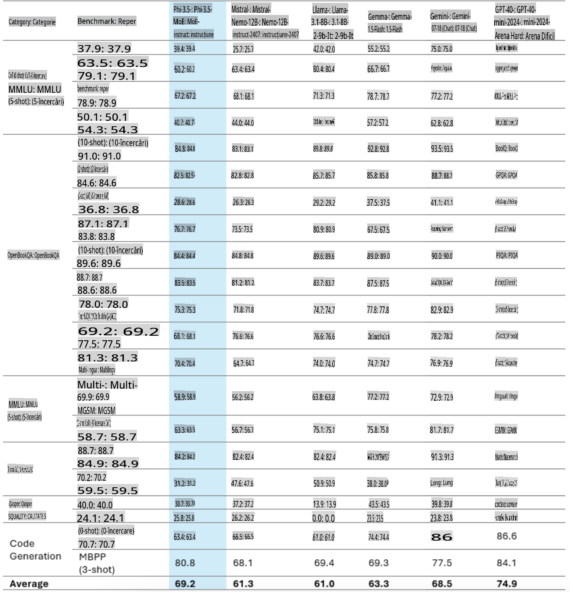
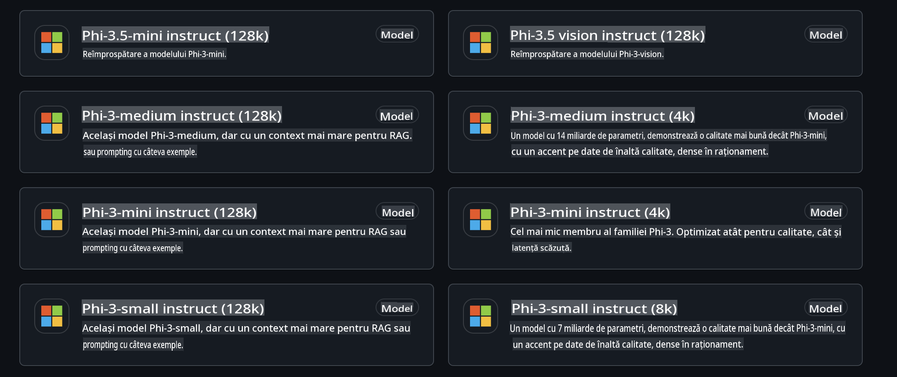
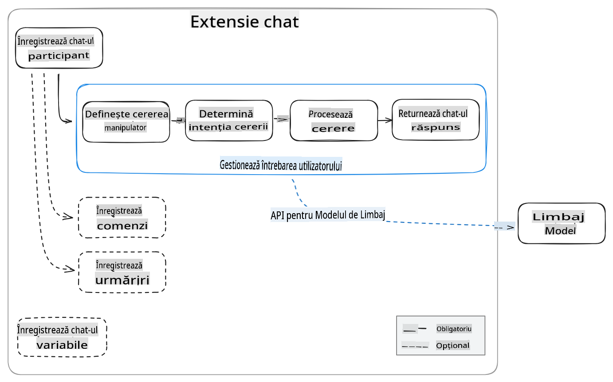
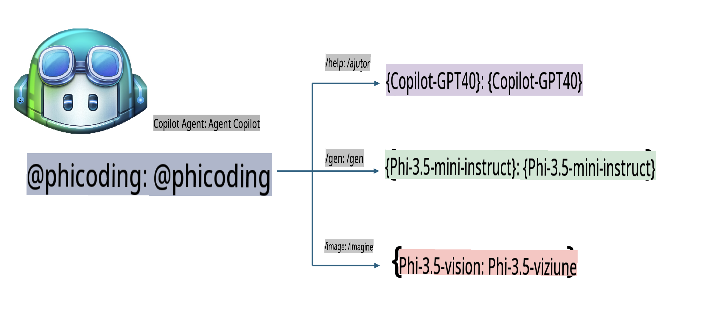
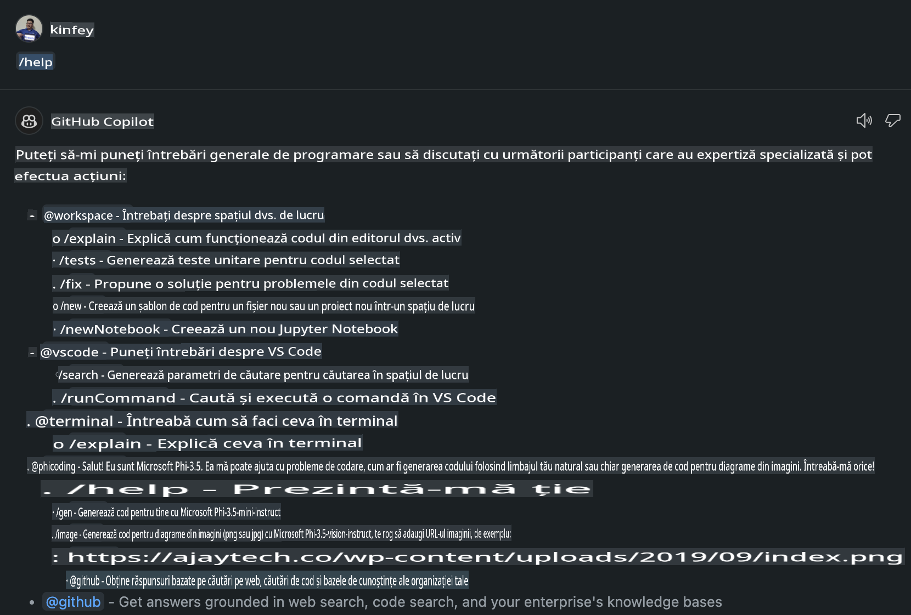
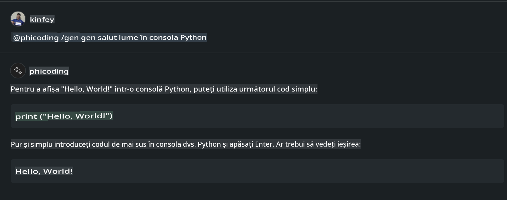
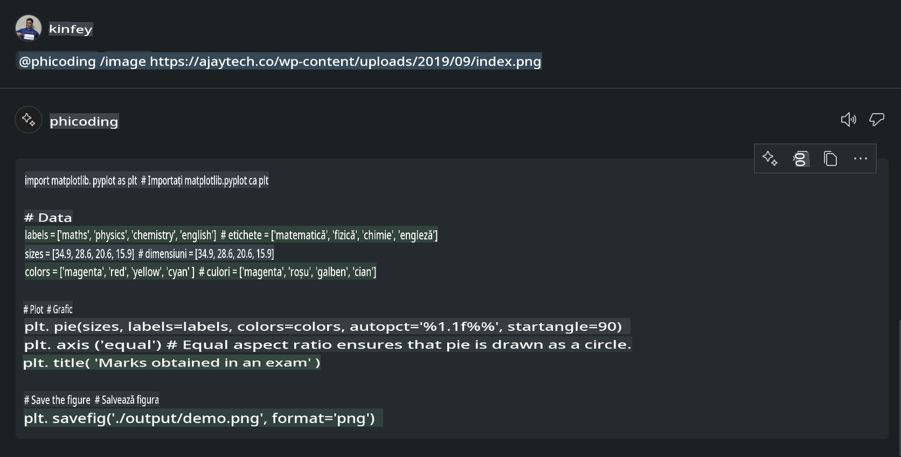

# **Creează-ți propriul agent Visual Studio Code Chat Copilot cu Phi-3.5 de la GitHub Models**

Folosești Visual Studio Code Copilot? Mai ales în modul Chat, poți utiliza diferiți agenți pentru a îmbunătăți abilitatea de a crea, scrie și întreține proiecte în Visual Studio Code. Visual Studio Code oferă un API care permite companiilor și persoanelor să creeze agenți diferiți, adaptați pe baza afacerii lor, pentru a extinde capacitățile în diverse domenii specifice. În acest articol, ne vom concentra pe **Phi-3.5-mini-instruct (128k)** și **Phi-3.5-vision-instruct (128k)** de la GitHub Models pentru a crea propriul tău agent Visual Studio Code.

## **Despre Phi-3.5 din GitHub Models**

Știm că Phi-3/3.5-mini-instruct din familia Phi-3/3.5 are capacități puternice de înțelegere și generare de cod și are avantaje față de Gemma-2-9b și Mistral-Nemo-12B-instruct-2407.



Cele mai recente GitHub Models oferă deja acces la modelele Phi-3.5-mini-instruct (128k) și Phi-3.5-vision-instruct (128k). Dezvoltatorii pot accesa aceste modele prin OpenAI SDK, Azure AI Inference SDK și REST API.



***Notă:*** Se recomandă utilizarea Azure AI Inference SDK, deoarece permite o integrare mai bună cu Azure Model Catalog în mediul de producție.

Mai jos sunt prezentate rezultatele obținute cu **Phi-3.5-mini-instruct (128k)** și **Phi-3.5-vision-instruct (128k)** în scenariul de generare de cod după integrarea cu GitHub Models, pregătind astfel terenul pentru exemplele ce urmează.

**Demo: GitHub Models Phi-3.5-mini-instruct (128k) generează cod din Prompt** ([click aici](../../../../../../code/09.UpdateSamples/Aug/ghmodel_phi35_instruct_demo.ipynb))

**Demo: GitHub Models Phi-3.5-vision-instruct (128k) generează cod din imagine** ([click aici](../../../../../../code/09.UpdateSamples/Aug/ghmodel_phi35_vision_demo.ipynb))

## **Despre GitHub Copilot Chat Agent**

GitHub Copilot Chat Agent poate finaliza diverse sarcini în diferite scenarii de proiect pe baza codului. Sistemul include patru agenți: workspace, github, terminal, vscode.


Adăugând numele agentului cu ‘@’, poți finaliza rapid sarcinile corespunzătoare. Pentru companii, dacă adaugi conținut specific afacerii tale, cum ar fi cerințe, codare, specificații de testare și lansare, poți obține funcții private mult mai puternice, bazate pe GitHub Copilot.

Visual Studio Code Chat Agent a lansat acum oficial API-ul său, permițând companiilor sau dezvoltatorilor să creeze agenți adaptați ecosistemelor lor software. Pe baza metodei de dezvoltare a extensiilor Visual Studio Code, poți accesa cu ușurință interfața API-ului Visual Studio Code Chat Agent. Dezvoltarea se poate realiza urmând acest proces.



Scenariul de dezvoltare suportă accesul la API-uri de modele terțe (cum ar fi GitHub Models, Azure Model Catalog și servicii construite pe modele open-source) și, de asemenea, permite utilizarea modelelor gpt-35-turbo, gpt-4 și gpt-4o oferite de GitHub Copilot.

## **Adaugă un agent @phicoding bazat pe Phi-3.5**

Încercăm să integrăm capacitățile de programare ale Phi-3.5 pentru a finaliza sarcini precum scrierea codului, generarea de cod din imagini și altele. Creăm un agent construit în jurul Phi-3.5 - @PHI. Mai jos sunt câteva funcții:

1. Generarea unei auto-prezentări folosind GPT-4o oferit de GitHub Copilot prin comanda **@phicoding /help**.

2. Generarea de cod pentru diferite limbaje de programare folosind **Phi-3.5-mini-instruct (128k)** prin comanda **@phicoding /gen**.

3. Generarea de cod pe baza **Phi-3.5-vision-instruct (128k)** și completarea imaginilor prin comanda **@phicoding /image**.



## **Pași necesari**

1. Instalează suportul pentru dezvoltarea extensiilor Visual Studio Code folosind npm.

```bash

npm install --global yo generator-code 

```

2. Creează un plugin de extensie Visual Studio Code (folosind modul de dezvoltare Typescript, numit phiext).

```bash

yo code 

```

3. Deschide proiectul creat și modifică fișierul package.json. Aici se includ instrucțiunile și configurațiile necesare, precum și configurarea GitHub Models. Reține că trebuie să adaugi token-ul tău GitHub Models.

```json

{
  "name": "phiext",
  "displayName": "phiext",
  "description": "",
  "version": "0.0.1",
  "engines": {
    "vscode": "^1.93.0"
  },
  "categories": [
    "AI",
    "Chat"
  ],
  "activationEvents": [],
  "enabledApiProposals": [
      "chatVariableResolver"
  ],
  "main": "./dist/extension.js",
  "contributes": {
    "chatParticipants": [
        {
            "id": "chat.phicoding",
            "name": "phicoding",
            "description": "Hey! I am Microsoft Phi-3.5, She can help me with coding problems, such as generation code with your natural language, or even generation code about chart from images. Just ask me anything!",
            "isSticky": true,
            "commands": [
                {
                    "name": "help",
                    "description": "Introduce myself to you"
                },
                {
                    "name": "gen",
                    "description": "Generate code for you with Microsoft Phi-3.5-mini-instruct"
                },
                {
                    "name": "image",
                    "description": "Generate code for chart from image(png or jpg) with Microsoft Phi-3.5-vision-instruct, please add image url like this : https://ajaytech.co/wp-content/uploads/2019/09/index.png"
                }
            ]
        }
    ],
    "commands": [
        {
            "command": "phicoding.namesInEditor",
            "title": "Use Microsoft Phi 3.5 in Editor"
        }
    ],
    "configuration": {
      "type": "object",
      "title": "githubmodels",
      "properties": {
        "githubmodels.endpoint": {
          "type": "string",
          "default": "https://models.inference.ai.azure.com",
          "description": "Your GitHub Models Endpoint",
          "order": 0
        },
        "githubmodels.api_key": {
          "type": "string",
          "default": "Your GitHub Models Token",
          "description": "Your GitHub Models Token",
          "order": 1
        },
        "githubmodels.phi35instruct": {
          "type": "string",
          "default": "Phi-3.5-mini-instruct",
          "description": "Your Phi-35-Instruct Model",
          "order": 2
        },
        "githubmodels.phi35vision": {
          "type": "string",
          "default": "Phi-3.5-vision-instruct",
          "description": "Your Phi-35-Vision Model",
          "order": 3
        }
      }
    }
  },
  "scripts": {
    "vscode:prepublish": "npm run package",
    "compile": "webpack",
    "watch": "webpack --watch",
    "package": "webpack --mode production --devtool hidden-source-map",
    "compile-tests": "tsc -p . --outDir out",
    "watch-tests": "tsc -p . -w --outDir out",
    "pretest": "npm run compile-tests && npm run compile && npm run lint",
    "lint": "eslint src",
    "test": "vscode-test"
  },
  "devDependencies": {
    "@types/vscode": "^1.93.0",
    "@types/mocha": "^10.0.7",
    "@types/node": "20.x",
    "@typescript-eslint/eslint-plugin": "^8.3.0",
    "@typescript-eslint/parser": "^8.3.0",
    "eslint": "^9.9.1",
    "typescript": "^5.5.4",
    "ts-loader": "^9.5.1",
    "webpack": "^5.94.0",
    "webpack-cli": "^5.1.4",
    "@vscode/test-cli": "^0.0.10",
    "@vscode/test-electron": "^2.4.1"
  },
  "dependencies": {
    "@types/node-fetch": "^2.6.11",
    "node-fetch": "^3.3.2",
    "@azure-rest/ai-inference": "latest",
    "@azure/core-auth": "latest",
    "@azure/core-sse": "latest"
  }
}


```

4. Modifică fișierul src/extension.ts.

```typescript

// The module 'vscode' contains the VS Code extensibility API
// Import the module and reference it with the alias vscode in your code below
import * as vscode from 'vscode';
import ModelClient from "@azure-rest/ai-inference";
import { AzureKeyCredential } from "@azure/core-auth";


interface IPhiChatResult extends vscode.ChatResult {
    metadata: {
        command: string;
    };
}


const MODEL_SELECTOR: vscode.LanguageModelChatSelector = { vendor: 'copilot', family: 'gpt-4o' };

function isValidImageUrl(url: string): boolean {
    const regex = /^(https?:\/\/.*\.(?:png|jpg))$/i;
    return regex.test(url);
}
  

// This method is called when your extension is activated
// Your extension is activated the very first time the command is executed
export function activate(context: vscode.ExtensionContext) {

    const codinghandler: vscode.ChatRequestHandler = async (request: vscode.ChatRequest, context: vscode.ChatContext, stream: vscode.ChatResponseStream, token: vscode.CancellationToken): Promise<IPhiChatResult> => {


        const config : any = vscode.workspace.getConfiguration('githubmodels');
        const endPoint: string = config.get('endpoint');
        const apiKey: string = config.get('api_key');
        const phi35instruct: string = config.get('phi35instruct');
        const phi35vision: string = config.get('phi35vision');
        
        if (request.command === 'help') {

            const content = "Welcome to Coding assistant with Microsoft Phi-3.5"; 
            stream.progress(content);


            try {
                const [model] = await vscode.lm.selectChatModels(MODEL_SELECTOR);
                if (model) {
                    const messages = [
                        vscode.LanguageModelChatMessage.User("Please help me express this content in a humorous way: I am a programming assistant who can help you convert natural language into code and generate code based on the charts in the images. output format like this : Hey I am Phi ......")
                    ];
                    const chatResponse = await model.sendRequest(messages, {}, token);
                    for await (const fragment of chatResponse.text) {
                        stream.markdown(fragment);
                    }
                }
            } catch(err) {
                console.log(err);
            }


            return { metadata: { command: 'help' } };

        }

        
        if (request.command === 'gen') {

            const content = "Welcome to use phi-3.5 to generate code";

            stream.progress(content);

            const client = new ModelClient(endPoint, new AzureKeyCredential(apiKey));

            const response = await client.path("/chat/completions").post({
              body: {
                messages: [
                  { role:"system", content: "You are a coding assistant.Help answer all code generation questions." },
                  { role:"user", content: request.prompt }
                ],
                model: phi35instruct,
                temperature: 0.4,
                max_tokens: 1000,
                top_p: 1.
              }
            });

            stream.markdown(response.body.choices[0].message.content);

            return { metadata: { command: 'gen' } };

        }


        
        if (request.command === 'image') {


            const content = "Welcome to use phi-3.5 to generate code from image(png or jpg),image url like this:https://ajaytech.co/wp-content/uploads/2019/09/index.png";

            stream.progress(content);

            if (!isValidImageUrl(request.prompt)) {
                stream.markdown('Please provide a valid image URL');
                return { metadata: { command: 'image' } };
            }
            else
            {

                const client = new ModelClient(endPoint, new AzureKeyCredential(apiKey));
    
                const response = await client.path("/chat/completions").post({
                    body: {
                      messages: [
                        { role: "system", content: "You are a helpful assistant that describes images in details." },
                        { role: "user", content: [
                            { type: "text", text: "Please generate code according to the chart in the picture according to the following requirements\n1. Keep all information in the chart, including data and text\n2. Do not generate additional information that is not included in the chart\n3. Please extract data from the picture, do not generate it from csv\n4. Please save the regenerated chart as a chart and save it to ./output/demo.png"},
                            { type: "image_url", image_url: {url: request.prompt}
                            }
                          ]
                        }
                      ],
                      model: phi35vision,
                      temperature: 0.4,
                      max_tokens: 2048,
                      top_p: 1.
                    }
                  });
    
                
                stream.markdown(response.body.choices[0].message.content);
    
                return { metadata: { command: 'image' } };
            }


        }


        return { metadata: { command: '' } };
    };


    const phi_ext = vscode.chat.createChatParticipant("chat.phicoding", codinghandler);

    phi_ext.iconPath = new vscode.ThemeIcon('sparkle');


    phi_ext.followupProvider = {
        provideFollowups(result: IPhiChatResult, context: vscode.ChatContext, token: vscode.CancellationToken) {
            return [{
                prompt: 'Let us coding with Phi-3.5 😋😋😋😋',
                label: vscode.l10n.t('Enjoy coding with Phi-3.5'),
                command: 'help'
            } satisfies vscode.ChatFollowup];
        }
    };

    context.subscriptions.push(phi_ext);
}

// This method is called when your extension is deactivated
export function deactivate() {}


```

6. Rulează.

***/help***



***@phicoding /help***


***@phicoding /gen***



***@phicoding /image***



Poți descărca codul exemplu: [click aici](../../../../../../code/09.UpdateSamples/Aug/vscode)

## **Resurse**

1. Înscrie-te la GitHub Models [https://gh.io/models](https://gh.io/models)

2. Învață despre dezvoltarea extensiilor Visual Studio Code [https://code.visualstudio.com/api/get-started/your-first-extension](https://code.visualstudio.com/api/get-started/your-first-extension)

3. Află mai multe despre API-ul Visual Studio Code Copilot Chat [https://code.visualstudio.com/api/extension-guides/chat](https://code.visualstudio.com/api/extension-guides/chat)

**Declinări de responsabilitate**:  
Acest document a fost tradus utilizând servicii de traducere automată bazate pe inteligență artificială. Deși ne străduim să asigurăm acuratețea, vă rugăm să rețineți că traducerile automate pot conține erori sau inexactități. Documentul original, în limba sa natală, ar trebui considerat sursa autoritară. Pentru informații critice, se recomandă traducerea profesională realizată de un specialist uman. Nu ne asumăm răspunderea pentru neînțelegeri sau interpretări greșite care pot apărea din utilizarea acestei traduceri.