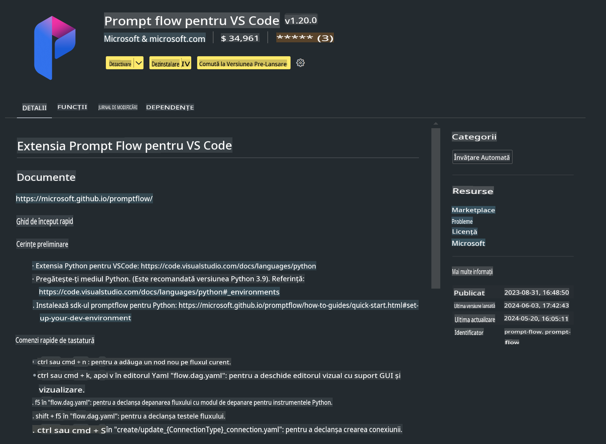

# **Lab 0 - Instalare**

Când intrăm în Lab, trebuie să configurăm mediul relevant:

### **1. Python 3.11+**

Este recomandat să folosiți miniforge pentru a configura mediul Python.

Pentru a configura miniforge, consultați [https://github.com/conda-forge/miniforge](https://github.com/conda-forge/miniforge).

După ce ați configurat miniforge, rulați următoarea comandă în Power Shell:

```bash

conda create -n pyenv python==3.11.8 -y

conda activate pyenv

```

### **2. Instalare Prompt flow SDK**

În Lab 1, vom folosi Prompt flow, așa că trebuie să configurați Prompt flow SDK.

```bash

pip install promptflow --upgrade

```

Puteți verifica promptflow sdk folosind această comandă:

```bash

pf --version

```

### **3. Instalare Extensie Prompt flow pentru Visual Studio Code**



### **4. Framework-ul MLX de la Apple**

MLX este un framework pentru cercetare în învățarea automată pe siliconul Apple, dezvoltat de echipa de cercetare în învățarea automată de la Apple. Puteți folosi **framework-ul Apple MLX** pentru a accelera LLM / SLM pe siliconul Apple. Dacă doriți să aflați mai multe, puteți citi [https://github.com/microsoft/PhiCookBook/blob/main/md/01.Introduction/03/MLX_Inference.md](https://github.com/microsoft/PhiCookBook/blob/main/md/01.Introduction/03/MLX_Inference.md).

Instalați biblioteca MLX framework în bash:

```bash

pip install mlx-lm

```

### **5. Alte Biblioteci Python**

Creați un fișier requirements.txt și adăugați acest conținut:

```txt

notebook
numpy 
scipy 
scikit-learn 
matplotlib 
pandas 
pillow 
graphviz

```

### **6. Instalare NVM**

Instalați nvm în Powershell:

```bash

brew install nvm

```

Instalați nodejs 18.20:

```bash

nvm install 18.20.0

nvm use 18.20.0

```

### **7. Instalare Suport pentru Dezvoltare în Visual Studio Code**

```bash

npm install --global yo generator-code

```

Felicitări! Ați configurat cu succes SDK-ul. În continuare, treceți la pașii practici.

**Declinarea responsabilității**:  
Acest document a fost tradus folosind servicii de traducere bazate pe inteligență artificială. Deși ne străduim să asigurăm acuratețea, vă rugăm să rețineți că traducerile automate pot conține erori sau inexactități. Documentul original, în limba sa natală, ar trebui considerat sursa de autoritate. Pentru informații critice, se recomandă traducerea profesională realizată de un traducător uman. Nu ne asumăm răspunderea pentru eventualele neînțelegeri sau interpretări greșite care pot apărea din utilizarea acestei traduceri.