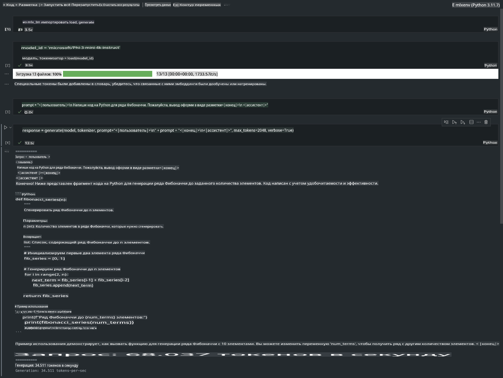

# **Inference Phi-3 с использованием Apple MLX Framework**

## **Что такое MLX Framework**

MLX — это фреймворк для исследований в области машинного обучения на устройствах с Apple Silicon, разработанный командой Apple machine learning research.

MLX создан исследователями машинного обучения для исследователей машинного обучения. Этот фреймворк ориентирован на удобство использования, но при этом сохраняет высокую эффективность для обучения и развертывания моделей. Концептуально дизайн фреймворка также прост. Наша цель — сделать MLX легким для расширения и улучшения, чтобы исследователи могли быстро тестировать новые идеи.

LLM-модели могут быть ускорены на устройствах с Apple Silicon с помощью MLX, и их можно запускать локально с максимальным удобством.

## **Использование MLX для инференса Phi-3-mini**

### **1. Настройка окружения MLX**

1. Python 3.11.x  
2. Установите библиотеку MLX  

```bash

pip install mlx-lm

```

### **2. Запуск Phi-3-mini в терминале с использованием MLX**

```bash

python -m mlx_lm.generate --model microsoft/Phi-3-mini-4k-instruct --max-token 2048 --prompt  "<|user|>\nCan you introduce yourself<|end|>\n<|assistant|>"

```

Результат (мое окружение: Apple M1 Max, 64GB):  


### **3. Квантование Phi-3-mini с использованием MLX в терминале**

```bash

python -m mlx_lm.convert --hf-path microsoft/Phi-3-mini-4k-instruct

```

***Примечание:*** Модель можно квантовать с помощью mlx_lm.convert, и квантование по умолчанию выполняется в INT4. В этом примере Phi-3-mini квантуется в INT4.

Модель можно квантовать с помощью mlx_lm.convert, и квантование по умолчанию выполняется в INT4. В этом примере Phi-3-mini квантуется в INT4. После квантования модель будет сохранена в стандартной директории ./mlx_model.

Мы можем протестировать квантованную модель с использованием MLX из терминала.  

```bash

python -m mlx_lm.generate --model ./mlx_model/ --max-token 2048 --prompt  "<|user|>\nCan you introduce yourself<|end|>\n<|assistant|>"

```

Результат:  


### **4. Запуск Phi-3-mini с использованием MLX в Jupyter Notebook**



***Примечание:*** Ознакомьтесь с этим примером [нажав на ссылку](../../../../../code/03.Inference/MLX/MLX_DEMO.ipynb).

## **Ресурсы**

1. Узнайте больше о Apple MLX Framework [https://ml-explore.github.io](https://ml-explore.github.io/mlx/build/html/index.html)

2. Репозиторий Apple MLX на GitHub [https://github.com/ml-explore](https://github.com/ml-explore)

**Отказ от ответственности**:  
Этот документ был переведен с использованием автоматизированных сервисов перевода на основе ИИ. Несмотря на наши усилия обеспечить точность, имейте в виду, что автоматические переводы могут содержать ошибки или неточности. Оригинальный документ на его родном языке следует считать авторитетным источником. Для получения критически важной информации рекомендуется использовать профессиональный человеческий перевод. Мы не несем ответственности за любые недоразумения или неправильные толкования, возникающие в результате использования этого перевода.