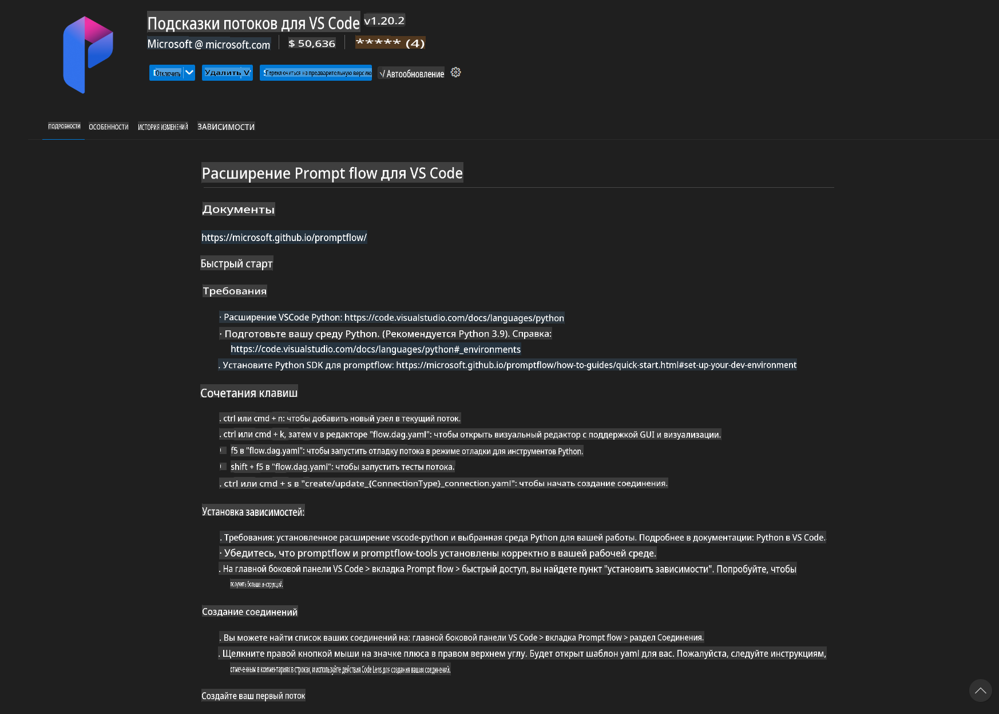
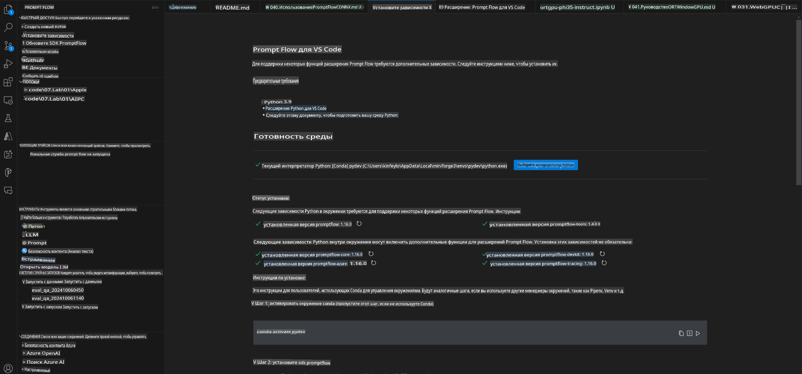
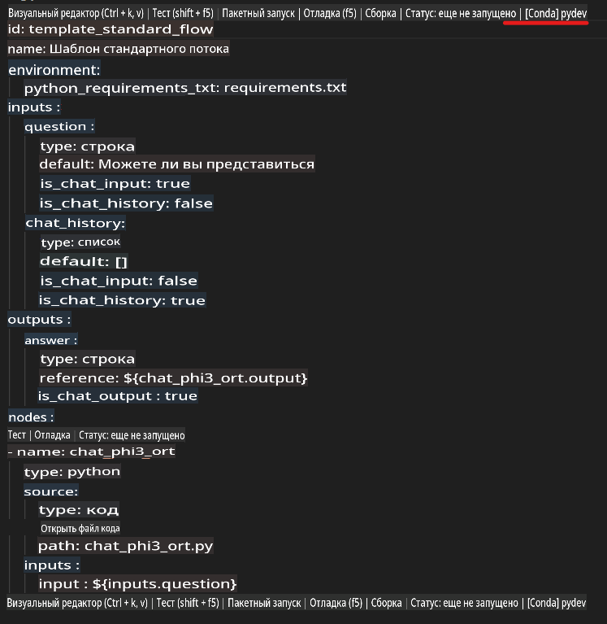

# Использование Windows GPU для создания решения Prompt Flow с Phi-3.5-Instruct ONNX

Этот документ представляет собой пример использования PromptFlow с ONNX (Open Neural Network Exchange) для разработки AI-приложений на основе моделей Phi-3.

PromptFlow — это набор инструментов для разработки, созданный для упрощения полного цикла разработки AI-приложений на основе больших языковых моделей (LLM), начиная с идей и прототипирования и заканчивая тестированием и оценкой.

Интеграция PromptFlow с ONNX позволяет разработчикам:

- Оптимизировать производительность модели: Используйте ONNX для эффективного вывода и развертывания моделей.
- Упростить разработку: Используйте PromptFlow для управления рабочим процессом и автоматизации повторяющихся задач.
- Улучшить сотрудничество: Обеспечьте лучшую командную работу благодаря единой среде разработки.

**Prompt flow** — это набор инструментов для разработки, созданный для упрощения полного цикла разработки AI-приложений на основе LLM: от идей и прототипирования до тестирования, оценки, развертывания и мониторинга в производственной среде. Он значительно упрощает процесс проектирования подсказок и позволяет создавать LLM-приложения высокого качества.

Prompt flow может подключаться к OpenAI, Azure OpenAI Service и настраиваемым моделям (Huggingface, локальные LLM/SLM). Мы стремимся развернуть квантованную ONNX-модель Phi-3.5 в локальных приложениях. Prompt flow поможет нам лучше спланировать наш бизнес и реализовать локальные решения на основе Phi-3.5. В этом примере мы объединим ONNX Runtime GenAI Library, чтобы завершить создание решения Prompt flow на основе Windows GPU.

## **Установка**

### **ONNX Runtime GenAI для Windows GPU**

Ознакомьтесь с этим руководством по настройке ONNX Runtime GenAI для Windows GPU [нажмите здесь](./ORTWindowGPUGuideline.md).

### **Настройка Prompt flow в VSCode**

1. Установите расширение Prompt flow для VS Code.



2. После установки расширения Prompt flow для VS Code, нажмите на него и выберите **Installation dependencies**. Следуйте этому руководству, чтобы установить SDK Prompt flow в вашей среде.



3. Загрузите [Пример кода](../../../../../../code/09.UpdateSamples/Aug/pf/onnx_inference_pf) и откройте этот пример в VS Code.


4. Откройте **flow.dag.yaml**, чтобы выбрать вашу Python-среду.



   Откройте **chat_phi3_ort.py**, чтобы указать расположение вашей ONNX-модели Phi-3.5-instruct.


5. Запустите ваш Prompt flow для тестирования.

Откройте **flow.dag.yaml** и нажмите на визуальный редактор.


После этого запустите его для тестирования.


1. Вы можете запустить пакетную обработку в терминале, чтобы проверить больше результатов.

```bash

pf run create --file batch_run.yaml --stream --name 'Your eval qa name'    

```

Вы можете просмотреть результаты в вашем браузере по умолчанию.


**Отказ от ответственности**:  
Этот документ был переведен с использованием автоматических услуг машинного перевода на основе ИИ. Хотя мы стремимся к точности, имейте в виду, что автоматические переводы могут содержать ошибки или неточности. Оригинальный документ на его исходном языке следует считать авторитетным источником. Для получения критически важной информации рекомендуется профессиональный перевод человеком. Мы не несем ответственности за любые недоразумения или неверные толкования, возникающие в результате использования данного перевода.