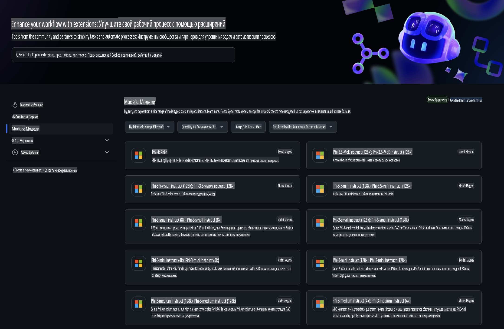

## Модели GitHub - Ограниченная публичная бета-версия

Добро пожаловать в [GitHub Models](https://github.com/marketplace/models)! Мы всё подготовили, чтобы вы могли исследовать модели ИИ, размещённые на Azure AI.



Для получения дополнительной информации о моделях, доступных в GitHub Models, посетите [GitHub Model Marketplace](https://github.com/marketplace/models).

## Доступные модели

Каждая модель имеет свою собственную песочницу и пример кода.


### Модели Phi-3 в каталоге GitHub Models

[Phi-3-Medium-128k-Instruct](https://github.com/marketplace/models/azureml/Phi-3-medium-128k-instruct)

[Phi-3-medium-4k-instruct](https://github.com/marketplace/models/azureml/Phi-3-medium-4k-instruct)

[Phi-3-mini-128k-instruct](https://github.com/marketplace/models/azureml/Phi-3-mini-128k-instruct)

[Phi-3-mini-4k-instruct](https://github.com/marketplace/models/azureml/Phi-3-mini-4k-instruct)

[Phi-3-small-128k-instruct](https://github.com/marketplace/models/azureml/Phi-3-small-128k-instruct)

[Phi-3-small-8k-instruct](https://github.com/marketplace/models/azureml/Phi-3-small-8k-instruct)

## Начало работы

У нас есть несколько простых примеров, которые вы можете сразу запустить. Вы найдёте их в папке с примерами. Если вы хотите сразу перейти к своему любимому языку программирования, примеры доступны на следующих языках:

- Python
- JavaScript
- cURL

Также есть выделенная среда Codespaces для запуска примеров и моделей.


## Пример кода

Ниже приведены фрагменты кода для некоторых вариантов использования. Для дополнительной информации о Azure AI Inference SDK, ознакомьтесь с полной документацией и примерами.

## Настройка

1. Создайте персональный токен доступа  
Для токена не требуется предоставлять какие-либо разрешения. Обратите внимание, что токен будет отправлен в сервис Microsoft.

Чтобы использовать приведённые ниже фрагменты кода, создайте переменную окружения и задайте токен как ключ для клиентского кода.

Если вы используете bash:  
```
export GITHUB_TOKEN="<your-github-token-goes-here>"
```  
Если вы используете PowerShell:  
```
$Env:GITHUB_TOKEN="<your-github-token-goes-here>"
```  

Если вы используете командную строку Windows:  
```
set GITHUB_TOKEN=<your-github-token-goes-here>
```  

## Пример для Python

### Установка зависимостей  
Установите Azure AI Inference SDK с помощью pip (требуется Python >=3.8):  

```
pip install azure-ai-inference
```  

### Запуск базового примера кода  

Этот пример демонстрирует базовый вызов API завершения чата. Используется конечная точка GitHub AI model inference и ваш GitHub токен. Вызов синхронный.

```
import os
from azure.ai.inference import ChatCompletionsClient
from azure.ai.inference.models import SystemMessage, UserMessage
from azure.core.credentials import AzureKeyCredential

endpoint = "https://models.inference.ai.azure.com"
# Replace Model_Name 
model_name = "Phi-3-small-8k-instruct"
token = os.environ["GITHUB_TOKEN"]

client = ChatCompletionsClient(
    endpoint=endpoint,
    credential=AzureKeyCredential(token),
)

response = client.complete(
    messages=[
        SystemMessage(content="You are a helpful assistant."),
        UserMessage(content="What is the capital of France?"),
    ],
    model=model_name,
    temperature=1.,
    max_tokens=1000,
    top_p=1.
)

print(response.choices[0].message.content)
```  

### Запуск многократного диалога  

Этот пример демонстрирует многократный диалог с API завершения чата. При использовании модели для чата необходимо управлять историей диалога и отправлять модели последние сообщения.

```
import os
from azure.ai.inference import ChatCompletionsClient
from azure.ai.inference.models import AssistantMessage, SystemMessage, UserMessage
from azure.core.credentials import AzureKeyCredential

token = os.environ["GITHUB_TOKEN"]
endpoint = "https://models.inference.ai.azure.com"
# Replace Model_Name
model_name = "Phi-3-small-8k-instruct"

client = ChatCompletionsClient(
    endpoint=endpoint,
    credential=AzureKeyCredential(token),
)

messages = [
    SystemMessage(content="You are a helpful assistant."),
    UserMessage(content="What is the capital of France?"),
    AssistantMessage(content="The capital of France is Paris."),
    UserMessage(content="What about Spain?"),
]

response = client.complete(messages=messages, model=model_name)

print(response.choices[0].message.content)
```  

### Потоковая передача вывода  

Для улучшения пользовательского опыта вы можете настроить потоковую передачу ответа модели, чтобы первые токены отображались раньше, избегая долгого ожидания.

```
import os
from azure.ai.inference import ChatCompletionsClient
from azure.ai.inference.models import SystemMessage, UserMessage
from azure.core.credentials import AzureKeyCredential

token = os.environ["GITHUB_TOKEN"]
endpoint = "https://models.inference.ai.azure.com"
# Replace Model_Name
model_name = "Phi-3-small-8k-instruct"

client = ChatCompletionsClient(
    endpoint=endpoint,
    credential=AzureKeyCredential(token),
)

response = client.complete(
    stream=True,
    messages=[
        SystemMessage(content="You are a helpful assistant."),
        UserMessage(content="Give me 5 good reasons why I should exercise every day."),
    ],
    model=model_name,
)

for update in response:
    if update.choices:
        print(update.choices[0].delta.content or "", end="")

client.close()
```  

## Пример для JavaScript

### Установка зависимостей  

Установите Node.js.

Скопируйте следующий текст и сохраните его как файл package.json в своей папке.

```
{
  "type": "module",
  "dependencies": {
    "@azure-rest/ai-inference": "latest",
    "@azure/core-auth": "latest",
    "@azure/core-sse": "latest"
  }
}
```  

Примечание: @azure/core-sse требуется только для потоковой передачи ответа завершения чата.

Откройте терминал в этой папке и выполните npm install.

Для каждого из приведённых ниже фрагментов кода скопируйте содержимое в файл sample.js и выполните его с помощью node sample.js.

### Запуск базового примера кода  

Этот пример демонстрирует базовый вызов API завершения чата. Используется конечная точка GitHub AI model inference и ваш GitHub токен. Вызов синхронный.

```
import ModelClient from "@azure-rest/ai-inference";
import { AzureKeyCredential } from "@azure/core-auth";

const token = process.env["GITHUB_TOKEN"];
const endpoint = "https://models.inference.ai.azure.com";
// Update your modelname
const modelName = "Phi-3-small-8k-instruct";

export async function main() {

  const client = new ModelClient(endpoint, new AzureKeyCredential(token));

  const response = await client.path("/chat/completions").post({
    body: {
      messages: [
        { role:"system", content: "You are a helpful assistant." },
        { role:"user", content: "What is the capital of France?" }
      ],
      model: modelName,
      temperature: 1.,
      max_tokens: 1000,
      top_p: 1.
    }
  });

  if (response.status !== "200") {
    throw response.body.error;
  }
  console.log(response.body.choices[0].message.content);
}

main().catch((err) => {
  console.error("The sample encountered an error:", err);
});
```  

### Запуск многократного диалога  

Этот пример демонстрирует многократный диалог с API завершения чата. При использовании модели для чата необходимо управлять историей диалога и отправлять модели последние сообщения.

```
import ModelClient from "@azure-rest/ai-inference";
import { AzureKeyCredential } from "@azure/core-auth";

const token = process.env["GITHUB_TOKEN"];
const endpoint = "https://models.inference.ai.azure.com";
// Update your modelname
const modelName = "Phi-3-small-8k-instruct";

export async function main() {

  const client = new ModelClient(endpoint, new AzureKeyCredential(token));

  const response = await client.path("/chat/completions").post({
    body: {
      messages: [
        { role: "system", content: "You are a helpful assistant." },
        { role: "user", content: "What is the capital of France?" },
        { role: "assistant", content: "The capital of France is Paris." },
        { role: "user", content: "What about Spain?" },
      ],
      model: modelName,
    }
  });

  if (response.status !== "200") {
    throw response.body.error;
  }

  for (const choice of response.body.choices) {
    console.log(choice.message.content);
  }
}

main().catch((err) => {
  console.error("The sample encountered an error:", err);
});
```  

### Потоковая передача вывода  
Для улучшения пользовательского опыта вы можете настроить потоковую передачу ответа модели, чтобы первые токены отображались раньше, избегая долгого ожидания.

```
import ModelClient from "@azure-rest/ai-inference";
import { AzureKeyCredential } from "@azure/core-auth";
import { createSseStream } from "@azure/core-sse";

const token = process.env["GITHUB_TOKEN"];
const endpoint = "https://models.inference.ai.azure.com";
// Update your modelname
const modelName = "Phi-3-small-8k-instruct";

export async function main() {

  const client = new ModelClient(endpoint, new AzureKeyCredential(token));

  const response = await client.path("/chat/completions").post({
    body: {
      messages: [
        { role: "system", content: "You are a helpful assistant." },
        { role: "user", content: "Give me 5 good reasons why I should exercise every day." },
      ],
      model: modelName,
      stream: true
    }
  }).asNodeStream();

  const stream = response.body;
  if (!stream) {
    throw new Error("The response stream is undefined");
  }

  if (response.status !== "200") {
    stream.destroy();
    throw new Error(`Failed to get chat completions, http operation failed with ${response.status} code`);
  }

  const sseStream = createSseStream(stream);

  for await (const event of sseStream) {
    if (event.data === "[DONE]") {
      return;
    }
    for (const choice of (JSON.parse(event.data)).choices) {
        process.stdout.write(choice.delta?.content ?? ``);
    }
  }
}

main().catch((err) => {
  console.error("The sample encountered an error:", err);
});
```  

## Пример для REST

### Запуск базового примера кода  

Вставьте следующее в оболочку:  

```
curl -X POST "https://models.inference.ai.azure.com/chat/completions" \
    -H "Content-Type: application/json" \
    -H "Authorization: Bearer $GITHUB_TOKEN" \
    -d '{
        "messages": [
            {
                "role": "system",
                "content": "You are a helpful assistant."
            },
            {
                "role": "user",
                "content": "What is the capital of France?"
            }
        ],
        "model": "Phi-3-small-8k-instruct"
    }'
```  

### Запуск многократного диалога  

Вызовите API завершения чата и передайте историю чата:  

```
curl -X POST "https://models.inference.ai.azure.com/chat/completions" \
    -H "Content-Type: application/json" \
    -H "Authorization: Bearer $GITHUB_TOKEN" \
    -d '{
        "messages": [
            {
                "role": "system",
                "content": "You are a helpful assistant."
            },
            {
                "role": "user",
                "content": "What is the capital of France?"
            },
            {
                "role": "assistant",
                "content": "The capital of France is Paris."
            },
            {
                "role": "user",
                "content": "What about Spain?"
            }
        ],
        "model": "Phi-3-small-8k-instruct"
    }'
```  

### Потоковая передача вывода  

Пример вызова конечной точки и потоковой передачи ответа.

```
curl -X POST "https://models.inference.ai.azure.com/chat/completions" \
    -H "Content-Type: application/json" \
    -H "Authorization: Bearer $GITHUB_TOKEN" \
    -d '{
        "messages": [
            {
                "role": "system",
                "content": "You are a helpful assistant."
            },
            {
                "role": "user",
                "content": "Give me 5 good reasons why I should exercise every day."
            }
        ],
        "stream": true,
        "model": "Phi-3-small-8k-instruct"
    }'
```  

## Бесплатное использование и ограничения скорости для GitHub Models  


[Ограничения скорости для песочницы и бесплатного использования API](https://docs.github.com/en/github-models/prototyping-with-ai-models#rate-limits) предназначены для того, чтобы помочь вам экспериментировать с моделями и создавать прототипы приложений ИИ. Для использования за пределами этих ограничений, а также для масштабирования вашего приложения, вам нужно будет выделить ресурсы из учетной записи Azure и аутентифицироваться оттуда вместо использования вашего персонального токена GitHub. В коде ничего менять не нужно. Используйте эту ссылку, чтобы узнать, как выйти за пределы ограничений бесплатного уровня в Azure AI.

### Раскрытие информации  

Помните, что при взаимодействии с моделью вы экспериментируете с ИИ, поэтому возможны ошибки в содержании.

Функция подлежит различным ограничениям (включая запросы в минуту, запросы в день, токены на запрос и одновременные запросы) и не предназначена для производственного использования.

GitHub Models использует Azure AI Content Safety. Эти фильтры нельзя отключить в рамках использования GitHub Models. Если вы решите использовать модели через платный сервис, настройте фильтры контента в соответствии с вашими требованиями.

Эта услуга предоставляется в соответствии с условиями предварительного релиза GitHub.

**Отказ от ответственности**:  
Этот документ был переведен с использованием автоматизированных сервисов перевода на основе искусственного интеллекта. Хотя мы стремимся к точности, пожалуйста, имейте в виду, что автоматические переводы могут содержать ошибки или неточности. Оригинальный документ на его родном языке следует считать авторитетным источником. Для получения критически важной информации рекомендуется профессиональный перевод человеком. Мы не несем ответственности за любые недоразумения или неверные интерпретации, возникшие в результате использования данного перевода.