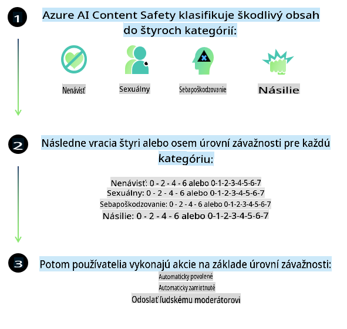
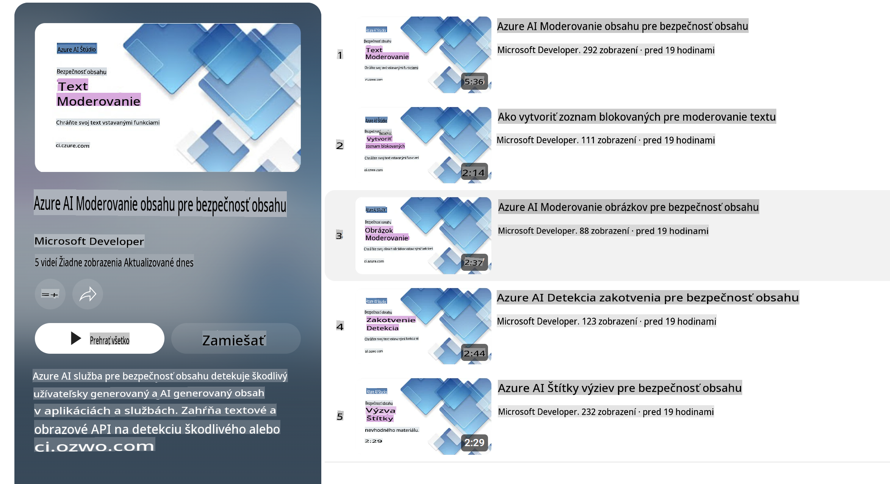

# Bezpečnosť AI pre modely Phi  
Rodina modelov Phi bola vyvinutá v súlade s [Microsoft Responsible AI Standard](https://query.prod.cms.rt.microsoft.com/cms/api/am/binary/RE5cmFl), čo je súbor požiadaviek na úrovni celej spoločnosti, založený na nasledujúcich šiestich princípoch: zodpovednosť, transparentnosť, spravodlivosť, spoľahlivosť a bezpečnosť, ochrana súkromia a bezpečnosť, a inkluzívnosť, ktoré tvoria [zásady zodpovednej AI spoločnosti Microsoft](https://www.microsoft.com/ai/responsible-ai).

Podobne ako pri predchádzajúcich modeloch Phi, bol prijatý viacvrstvový prístup hodnotenia bezpečnosti a bezpečnostného post-tréningu, pričom boli prijaté ďalšie opatrenia na zohľadnenie viacjazyčných schopností tejto verzie. Náš prístup k tréningu a hodnoteniu bezpečnosti vrátane testovania naprieč viacerými jazykmi a kategóriami rizík je podrobne opísaný v [Phi Safety Post-Training Paper](https://arxiv.org/abs/2407.13833). Hoci modely Phi z tohto prístupu profitujú, vývojári by mali uplatňovať osvedčené postupy zodpovednej AI, vrátane mapovania, merania a zmierňovania rizík spojených s ich konkrétnym prípadom použitia a kultúrnym či jazykovým kontextom.

## Najlepšie postupy  

Podobne ako iné modely, aj modely rodiny Phi sa môžu správať spôsobmi, ktoré sú nespravodlivé, nespoľahlivé alebo urážlivé.

Niektoré z obmedzení správania SLM a LLM, o ktorých by ste mali vedieť, zahŕňajú:  

- **Kvalita služby:** Modely Phi sú primárne trénované na anglických textoch. Jazyky iné ako angličtina budú mať horší výkon. Anglické jazykové varianty s menším zastúpením v tréningových údajoch môžu vykazovať horší výkon v porovnaní so štandardnou americkou angličtinou.  
- **Reprezentácia škôd a posilňovanie stereotypov:** Tieto modely môžu nadmerne alebo nedostatočne reprezentovať skupiny ľudí, vymazávať reprezentáciu niektorých skupín alebo posilňovať ponižujúce či negatívne stereotypy. Napriek bezpečnostnému post-tréningu môžu tieto obmedzenia pretrvávať kvôli rozdielnym úrovniam zastúpenia rôznych skupín alebo prevalencii príkladov negatívnych stereotypov v tréningových údajoch, ktoré odrážajú reálne vzory a spoločenské predsudky.  
- **Nevhodný alebo urážlivý obsah:** Tieto modely môžu generovať aj iné typy nevhodného alebo urážlivého obsahu, čo môže znamenať, že ich nasadenie v citlivých kontextoch nie je vhodné bez ďalších opatrení špecifických pre daný prípad použitia.  
- **Spoľahlivosť informácií:** Jazykové modely môžu generovať nezmyselný obsah alebo vymýšľať obsah, ktorý môže znieť dôveryhodne, ale je nepresný alebo zastaraný.  
- **Obmedzený rozsah pre kód:** Väčšina tréningových údajov Phi-3 je založená na Pythone a používa bežné balíky ako "typing, math, random, collections, datetime, itertools". Ak model generuje Python skripty, ktoré využívajú iné balíky alebo skripty v iných jazykoch, dôrazne odporúčame používateľom manuálne overiť všetky použitia API.  

Vývojári by mali uplatňovať osvedčené postupy zodpovednej AI a sú zodpovední za zabezpečenie toho, aby konkrétny prípad použitia bol v súlade s príslušnými zákonmi a nariadeniami (napr. ochrana súkromia, obchod a pod.).  

## Úvahy o zodpovednej AI  

Podobne ako iné jazykové modely, aj modely série Phi sa môžu správať spôsobmi, ktoré sú nespravodlivé, nespoľahlivé alebo urážlivé. Niektoré z obmedzení správania, o ktorých by ste mali vedieť, zahŕňajú:  

**Kvalita služby:** Modely Phi sú primárne trénované na anglických textoch. Jazyky iné ako angličtina budú mať horší výkon. Anglické jazykové varianty s menším zastúpením v tréningových údajoch môžu vykazovať horší výkon v porovnaní so štandardnou americkou angličtinou.  

**Reprezentácia škôd a posilňovanie stereotypov:** Tieto modely môžu nadmerne alebo nedostatočne reprezentovať skupiny ľudí, vymazávať reprezentáciu niektorých skupín alebo posilňovať ponižujúce či negatívne stereotypy. Napriek bezpečnostnému post-tréningu môžu tieto obmedzenia pretrvávať kvôli rozdielnym úrovniam zastúpenia rôznych skupín alebo prevalencii príkladov negatívnych stereotypov v tréningových údajoch, ktoré odrážajú reálne vzory a spoločenské predsudky.  

**Nevhodný alebo urážlivý obsah:** Tieto modely môžu generovať aj iné typy nevhodného alebo urážlivého obsahu, čo môže znamenať, že ich nasadenie v citlivých kontextoch nie je vhodné bez ďalších opatrení špecifických pre daný prípad použitia.  
**Spoľahlivosť informácií:** Jazykové modely môžu generovať nezmyselný obsah alebo vymýšľať obsah, ktorý môže znieť dôveryhodne, ale je nepresný alebo zastaraný.  

**Obmedzený rozsah pre kód:** Väčšina tréningových údajov Phi-3 je založená na Pythone a používa bežné balíky ako "typing, math, random, collections, datetime, itertools". Ak model generuje Python skripty, ktoré využívajú iné balíky alebo skripty v iných jazykoch, dôrazne odporúčame používateľom manuálne overiť všetky použitia API.  

Vývojári by mali uplatňovať osvedčené postupy zodpovednej AI a sú zodpovední za zabezpečenie toho, aby konkrétny prípad použitia bol v súlade s príslušnými zákonmi a nariadeniami (napr. ochrana súkromia, obchod a pod.). Dôležité oblasti na zváženie zahŕňajú:  

**Alokácia:** Modely nemusia byť vhodné pre scenáre, ktoré môžu mať významný dopad na právny status alebo alokáciu zdrojov či životných príležitostí (napr. bývanie, zamestnanie, úver a pod.) bez ďalších hodnotení a techník na odstránenie zaujatosti.  

**Scenáre s vysokým rizikom:** Vývojári by mali posúdiť vhodnosť použitia modelov v scenároch s vysokým rizikom, kde by nespravodlivé, nespoľahlivé alebo urážlivé výstupy mohli byť mimoriadne nákladné alebo viesť k poškodeniu. To zahŕňa poskytovanie rád v citlivých alebo odborných oblastiach, kde sú presnosť a spoľahlivosť kľúčové (napr. právne alebo zdravotné poradenstvo). Na úrovni aplikácie by sa mali implementovať dodatočné ochranné opatrenia podľa kontextu nasadenia.  

**Dezinformácie:** Modely môžu produkovať nepresné informácie. Vývojári by mali dodržiavať osvedčené postupy transparentnosti a informovať koncových používateľov, že komunikujú so systémom AI. Na úrovni aplikácie môžu vývojári vytvoriť mechanizmy spätnej väzby a kanály na ukotvenie odpovedí v špecifických kontextových informáciách prípadu použitia, čo je technika známa ako Retrieval Augmented Generation (RAG).  

**Generovanie škodlivého obsahu:** Vývojári by mali hodnotiť výstupy vo svojom kontexte a používať dostupné bezpečnostné klasifikátory alebo vlastné riešenia vhodné pre ich prípad použitia.  

**Zneužitie:** Iné formy zneužitia, ako podvody, spam alebo tvorba škodlivého softvéru, môžu byť možné, a vývojári by mali zabezpečiť, že ich aplikácie neporušujú platné zákony a nariadenia.  

### Finetuning a bezpečnosť obsahu AI  

Po doladení modelu dôrazne odporúčame využiť opatrenia [Azure AI Content Safety](https://learn.microsoft.com/azure/ai-services/content-safety/overview) na monitorovanie obsahu generovaného modelmi, identifikáciu a blokovanie potenciálnych rizík, hrozieb a problémov s kvalitou.  

  

[Azure AI Content Safety](https://learn.microsoft.com/azure/ai-services/content-safety/overview) podporuje textový aj obrazový obsah. Môže byť nasadený v cloude, odpojených kontajneroch a na okrajových/integrovaných zariadeniach.  

## Prehľad Azure AI Content Safety  

Azure AI Content Safety nie je univerzálne riešenie; môže byť prispôsobené tak, aby bolo v súlade so špecifickými politikami podnikov. Navyše, jeho viacjazyčné modely umožňujú porozumieť viacerým jazykom súčasne.  

  

- **Azure AI Content Safety**  
- **Microsoft Developer**  
- **5 videí**  

Služba Azure AI Content Safety deteguje škodlivý obsah generovaný používateľmi a AI v aplikáciách a službách. Obsahuje textové a obrazové API, ktoré umožňujú detegovať škodlivý alebo nevhodný materiál.  

[AI Content Safety Playlist](https://www.youtube.com/playlist?list=PLlrxD0HtieHjaQ9bJjyp1T7FeCbmVcPkQ)  

**Upozornenie**:  
Tento dokument bol preložený pomocou strojových AI prekladateľských služieb. Hoci sa snažíme o presnosť, prosím, berte na vedomie, že automatizované preklady môžu obsahovať chyby alebo nepresnosti. Pôvodný dokument v jeho pôvodnom jazyku by mal byť považovaný za autoritatívny zdroj. Pre kritické informácie sa odporúča profesionálny ľudský preklad. Nenesieme zodpovednosť za akékoľvek nedorozumenia alebo nesprávne interpretácie vyplývajúce z použitia tohto prekladu.