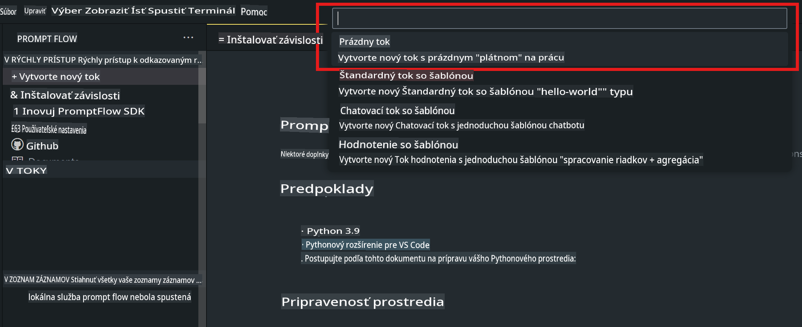

# **Lab 2 - Spustenie Prompt flow s Phi-3-mini na AIPC**

## **Čo je Prompt flow**

Prompt flow je sada vývojárskych nástrojov navrhnutých na zjednodušenie celého vývojového cyklu AI aplikácií založených na LLM, od nápadov, prototypovania, testovania, hodnotenia až po nasadenie do produkcie a monitorovanie. Uľahčuje prácu s promptami a umožňuje vytvárať AI aplikácie s produkčnou kvalitou.

S Prompt flow môžete:

- Vytvárať procesy, ktoré prepájajú LLM, prompty, Python kód a ďalšie nástroje do vykonateľného pracovného toku.

- Jednoducho ladiť a iterovať svoje procesy, najmä interakcie s LLM.

- Vyhodnocovať svoje procesy a počítať metriky kvality a výkonu na väčších datasetoch.

- Integrovať testovanie a hodnotenie do vášho CI/CD systému na zabezpečenie kvality procesu.

- Nasadzovať svoje procesy na vybranú platformu alebo ich jednoducho integrovať do kódu vašej aplikácie.

- (Voliteľné, ale vysoko odporúčané) Spolupracovať so svojím tímom pomocou cloudovej verzie Prompt flow v Azure AI.

## **Čo je AIPC**

AI PC obsahuje CPU, GPU a NPU, pričom každá z týchto jednotiek má špecifické schopnosti na akceleráciu AI. NPU, alebo neurónová procesná jednotka, je špecializovaný akcelerátor, ktorý spracováva úlohy umelej inteligencie (AI) a strojového učenia (ML) priamo na vašom PC namiesto odosielania údajov na spracovanie do cloudu. Hoci GPU a CPU dokážu tieto úlohy tiež spracovať, NPU je obzvlášť vhodná na AI výpočty s nízkou spotrebou energie. AI PC predstavuje zásadnú zmenu v tom, ako naše počítače fungujú. Nie je to riešenie pre problém, ktorý predtým neexistoval, ale skôr veľké zlepšenie každodenného používania PC.

Ako to teda funguje? V porovnaní s generatívnou AI a obrovskými modelmi LLM trénovanými na veľkých množstvách verejných údajov je AI na vašom PC prístupnejšia na každej úrovni. Tento koncept je jednoduchší na pochopenie a keďže je trénovaný na vašich údajoch bez potreby prístupu do cloudu, jeho výhody sú okamžite príťažlivejšie pre širšie publikum.

V blízkej budúcnosti svet AI PC zahŕňa osobných asistentov a menšie AI modely, ktoré bežia priamo na vašom PC, využívajúc vaše údaje na poskytovanie osobných, súkromných a bezpečnejších AI vylepšení pre veci, ktoré už robíte každý deň – zapisovanie poznámok zo stretnutí, organizovanie fantasy futbalovej ligy, automatizáciu úprav fotografií a videí alebo plánovanie dokonalého itinerára pre rodinné stretnutie na základe časov príchodu a odchodu každého člena.

## **Vytváranie generovania kódu na AIPC**

***Poznámka***: Ak ste ešte neukončili inštaláciu prostredia, navštívte [Lab 0 - Inštalácie](./01.Installations.md)

1. Otvorte rozšírenie Prompt flow vo Visual Studio Code a vytvorte prázdny projekt procesu.



2. Pridajte vstupné a výstupné parametre a pridajte Python kód ako nový proces.


Môžete použiť túto štruktúru (flow.dag.yaml) na zostavenie svojho procesu:

```yaml

inputs:
  question:
    type: string
    default: how to write Bubble Algorithm
outputs:
  answer:
    type: string
    reference: ${Chat_With_Phi3.output}
nodes:
- name: Chat_With_Phi3
  type: python
  source:
    type: code
    path: Chat_With_Phi3.py
  inputs:
    question: ${inputs.question}


```

3. Pridajte kód do súboru ***Chat_With_Phi3.py***

```python


from promptflow.core import tool

# import torch
from transformers import AutoTokenizer, pipeline,TextStreamer
import intel_npu_acceleration_library as npu_lib

import warnings

import asyncio
import platform

class Phi3CodeAgent:
    
    model = None
    tokenizer = None
    text_streamer = None
    
    model_id = "microsoft/Phi-3-mini-4k-instruct"

    @staticmethod
    def init_phi3():
        
        if Phi3CodeAgent.model is None or Phi3CodeAgent.tokenizer is None or Phi3CodeAgent.text_streamer is None:
            Phi3CodeAgent.model = npu_lib.NPUModelForCausalLM.from_pretrained(
                                    Phi3CodeAgent.model_id,
                                    torch_dtype="auto",
                                    dtype=npu_lib.int4,
                                    trust_remote_code=True
                                )
            Phi3CodeAgent.tokenizer = AutoTokenizer.from_pretrained(Phi3CodeAgent.model_id)
            Phi3CodeAgent.text_streamer = TextStreamer(Phi3CodeAgent.tokenizer, skip_prompt=True)

    

    @staticmethod
    def chat_with_phi3(prompt):
        
        Phi3CodeAgent.init_phi3()

        messages = "<|system|>You are a AI Python coding assistant. Please help me to generate code in Python.The answer only genertated Python code, but any comments and instructions do not need to be generated<|end|><|user|>" + prompt +"<|end|><|assistant|>"


        generation_args = {
            "max_new_tokens": 1024,
            "return_full_text": False,
            "temperature": 0.3,
            "do_sample": False,
            "streamer": Phi3CodeAgent.text_streamer,
        }

        pipe = pipeline(
            "text-generation",
            model=Phi3CodeAgent.model,
            tokenizer=Phi3CodeAgent.tokenizer,
            # **generation_args
        )

        result = ''

        with warnings.catch_warnings():
            warnings.simplefilter("ignore")
            response = pipe(messages, **generation_args)
            result =response[0]['generated_text']
            return result


@tool
def my_python_tool(question: str) -> str:
    if platform.system() == 'Windows':
        asyncio.set_event_loop_policy(asyncio.WindowsSelectorEventLoopPolicy())
    return Phi3CodeAgent.chat_with_phi3(question)


```

4. Proces môžete otestovať pomocou Debug alebo Run na overenie, či generovanie kódu funguje správne.


5. Spustite proces ako vývojové API v termináli.

```

pf flow serve --source ./ --port 8080 --host localhost   

```

Proces môžete otestovať v Postman / Thunder Client.

### **Poznámka**

1. Prvé spustenie trvá dlhšie. Odporúča sa stiahnuť model phi-3 pomocou Hugging Face CLI.

2. Vzhľadom na obmedzený výpočtový výkon Intel NPU sa odporúča použiť Phi-3-mini-4k-instruct.

3. Na akceleráciu používame Intel NPU na kvantizáciu INT4 konverzie, ale ak znovu spustíte službu, musíte vymazať cache a priečinky nc_workshop.

## **Zdroje**

1. Naučte sa Promptflow [https://microsoft.github.io/promptflow/](https://microsoft.github.io/promptflow/)

2. Naučte sa Intel NPU Acceleration [https://github.com/intel/intel-npu-acceleration-library](https://github.com/intel/intel-npu-acceleration-library)

3. Ukážkový kód, stiahnuť [Lokálny NPU Agent Ukážkový Kód](../../../../../../../../../code/07.Lab/01/AIPC)

**Upozornenie**:  
Tento dokument bol preložený pomocou strojových AI prekladateľských služieb. Hoci sa snažíme o presnosť, upozorňujeme, že automatizované preklady môžu obsahovať chyby alebo nepresnosti. Pôvodný dokument v jeho pôvodnom jazyku by mal byť považovaný za autoritatívny zdroj. Pre kritické informácie sa odporúča profesionálny ľudský preklad. Nenesieme zodpovednosť za akékoľvek nedorozumenia alebo nesprávne interpretácie vyplývajúce z použitia tohto prekladu.