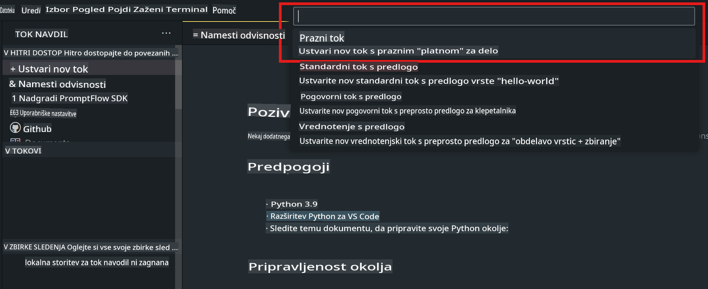
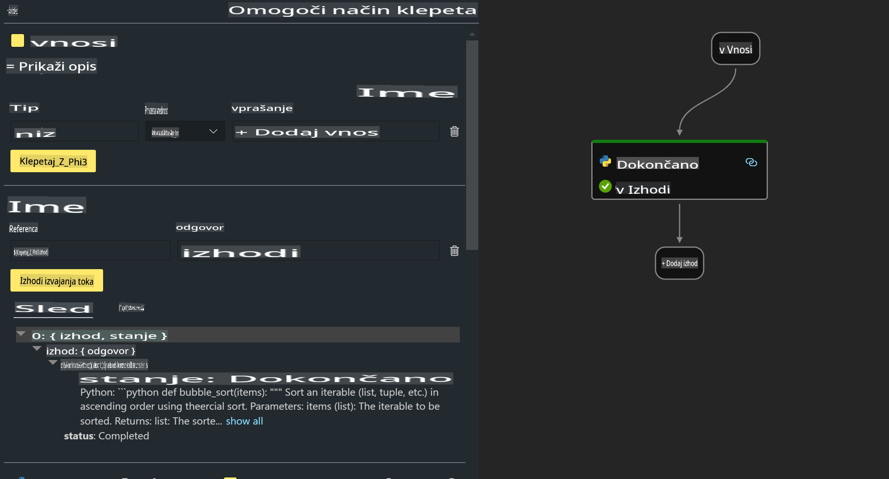

# **Lab 2 - Zaženite Prompt flow s Phi-3-mini v AIPC**

## **Kaj je Prompt flow**

Prompt flow je niz razvojnih orodij, zasnovan za poenostavitev celotnega razvojnega cikla aplikacij umetne inteligence, ki temeljijo na velikih jezikovnih modelih (LLM), od idejnega oblikovanja, prototipiranja, testiranja, evalvacije do uvedbe v produkcijo in spremljanja. Omogoča lažje delo s prompti in omogoča gradnjo LLM aplikacij s produkcijsko kakovostjo.

S Prompt flow lahko:

- Ustvarite tokove, ki povezujejo LLM-je, promte, Python kodo in druga orodja v izvedljiv delovni tok.

- Preprosto odpravljate napake in iterirate svoje tokove, še posebej interakcijo z LLM-ji.

- Evalvirate svoje tokove, izračunate kakovostne in zmogljivostne metrike z večjimi nabori podatkov.

- Integrirate testiranje in evalvacijo v svoj CI/CD sistem za zagotavljanje kakovosti vašega toka.

- Uvedete svoje tokove na izbrano platformo ali jih enostavno vključite v kodo svoje aplikacije.

- (Neobvezno, vendar zelo priporočljivo) Sodelujete s svojo ekipo z uporabo oblačne različice Prompt flow v Azure AI.


## **Gradnja generacijskih kodnih tokov na Apple Silicon**

***Opomba***: Če niste dokončali namestitve okolja, obiščite [Lab 0 - Namestitve](./01.Installations.md)

1. Odprite razširitev Prompt flow v Visual Studio Code in ustvarite prazen projekt toka.



2. Dodajte vhodne in izhodne parametre ter Python kodo kot nov tok.



Lahko se sklicujete na to strukturo (flow.dag.yaml), da sestavite svoj tok.

```yaml

inputs:
  prompt:
    type: string
    default: Write python code for Fibonacci serie. Please use markdown as output
outputs:
  result:
    type: string
    reference: ${gen_code_by_phi3.output}
nodes:
- name: gen_code_by_phi3
  type: python
  source:
    type: code
    path: gen_code_by_phi3.py
  inputs:
    prompt: ${inputs.prompt}


```

3. Kvantizirajte phi-3-mini

Želimo, da SLM bolje deluje na lokalnih napravah. Na splošno kvantiziramo model (INT4, FP16, FP32).

```bash

python -m mlx_lm.convert --hf-path microsoft/Phi-3-mini-4k-instruct

```

**Opomba:** privzeta mapa je mlx_model.

4. Dodajte kodo v ***Chat_With_Phi3.py***

```python


from promptflow import tool

from mlx_lm import load, generate


# The inputs section will change based on the arguments of the tool function, after you save the code
# Adding type to arguments and return value will help the system show the types properly
# Please update the function name/signature per need
@tool
def my_python_tool(prompt: str) -> str:

    model_id = './mlx_model_phi3_mini'

    model, tokenizer = load(model_id)

    # <|user|>\nWrite python code for Fibonacci serie. Please use markdown as output<|end|>\n<|assistant|>

    response = generate(model, tokenizer, prompt="<|user|>\n" + prompt  + "<|end|>\n<|assistant|>", max_tokens=2048, verbose=True)

    return response


```

4. Tok lahko preizkusite s funkcijo Debug ali Run, da preverite, ali generacijska koda deluje pravilno.


5. Zaženite tok kot razvojni API v terminalu.

```

pf flow serve --source ./ --port 8080 --host localhost   

```

Testirate ga lahko v Postman / Thunder Client.


### **Opombe**

1. Prvi zagon traja dolgo. Priporočamo, da model phi-3 prenesete prek Hugging face CLI.

2. Glede na omejeno računsko moč Intel NPU priporočamo uporabo Phi-3-mini-4k-instruct.

3. Uporabljamo Intel NPU pospeševanje za kvantizacijo v INT4 pretvorbo, vendar je ob ponovnem zagonu storitve potrebno izbrisati predpomnilnik in mape nc_workshop.


## **Viri**

1. Spoznajte Promptflow [https://microsoft.github.io/promptflow/](https://microsoft.github.io/promptflow/)

2. Spoznajte Intel NPU pospeševanje [https://github.com/intel/intel-npu-acceleration-library](https://github.com/intel/intel-npu-acceleration-library)

3. Vzorec kode, prenesite [Lokalni vzorec kode za NPU agent](../../../../../../../../../code/07.Lab/01/AIPC/local-npu-agent)

**Izjava o omejitvi odgovornosti**:  
Ta dokument je bil preveden s pomočjo storitev strojnega prevajanja z umetno inteligenco. Čeprav si prizadevamo za natančnost, vas prosimo, da se zavedate, da lahko avtomatski prevodi vsebujejo napake ali netočnosti. Izvirni dokument v svojem maternem jeziku naj se šteje za avtoritativni vir. Za ključne informacije je priporočljivo profesionalno človeško prevajanje. Ne prevzemamo odgovornosti za morebitne nesporazume ali napačne razlage, ki bi nastale zaradi uporabe tega prevoda.