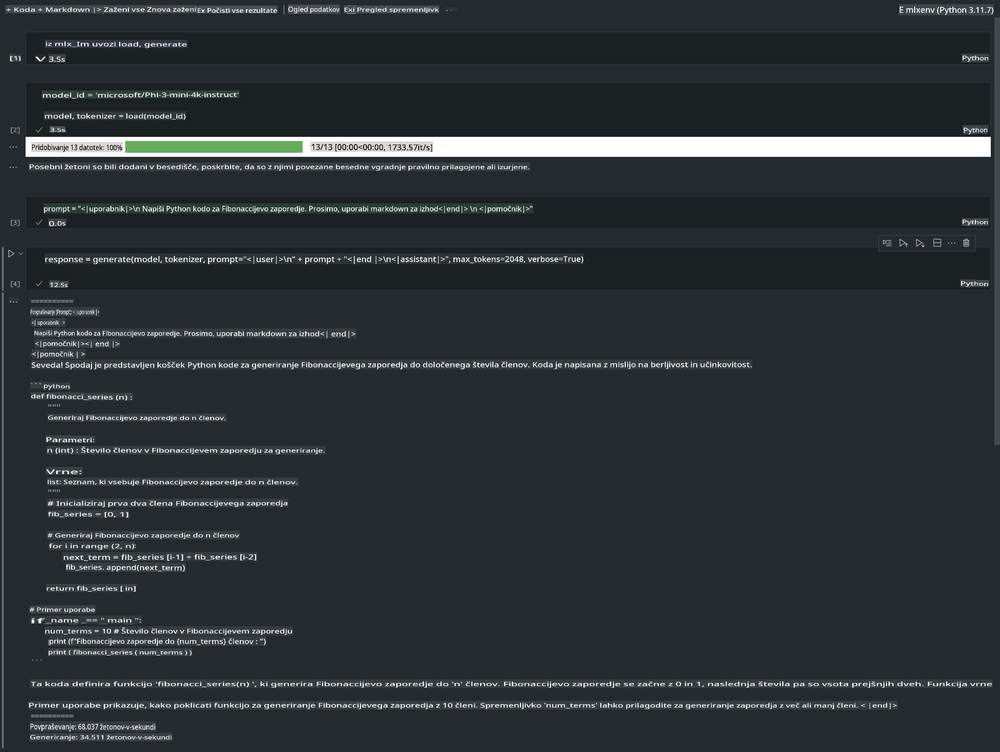

# **Izvajanje Phi-3 z Apple MLX ogrodjem**

## **Kaj je MLX ogrodje**

MLX je ogrodje za raziskave strojnega učenja na Apple siliciju, ki ga je razvila Apple raziskovalna ekipa za strojno učenje.

MLX je zasnovan s strani raziskovalcev strojnega učenja za raziskovalce strojnega učenja. Ogrodje je uporabniku prijazno, hkrati pa omogoča učinkovito treniranje in implementacijo modelov. Sama zasnova ogrodja je konceptualno preprosta. Naš cilj je raziskovalcem omogočiti enostavno razširitev in izboljšanje MLX, da lahko hitro preizkusijo nove ideje.

LLM-je je mogoče pospešiti na napravah z Apple silicijem prek MLX, kar omogoča lokalno izvajanje modelov na zelo priročen način.

## **Uporaba MLX za izvajanje Phi-3-mini**

### **1. Nastavite svoj MLX okolje**

1. Python 3.11.x  
2. Namestite knjižnico MLX  

```bash

pip install mlx-lm

```

### **2. Zagon Phi-3-mini v terminalu z MLX**

```bash

python -m mlx_lm.generate --model microsoft/Phi-3-mini-4k-instruct --max-token 2048 --prompt  "<|user|>\nCan you introduce yourself<|end|>\n<|assistant|>"

```

Rezultat (moje okolje je Apple M1 Max, 64GB) je naslednji:


### **3. Kvantizacija Phi-3-mini z MLX v terminalu**

```bash

python -m mlx_lm.convert --hf-path microsoft/Phi-3-mini-4k-instruct

```

***Opomba:*** Model je mogoče kvantizirati z mlx_lm.convert, pri čemer je privzeta kvantizacija INT4. V tem primeru je Phi-3-mini kvantiziran v INT4.

Model se kvantizira z mlx_lm.convert, kjer je privzeta kvantizacija INT4. V tem primeru je Phi-3-mini kvantiziran v INT4. Po kvantizaciji bo model shranjen v privzeto mapo ./mlx_model.

Model, ki je bil kvantiziran z MLX, lahko testiramo iz terminala.

```bash

python -m mlx_lm.generate --model ./mlx_model/ --max-token 2048 --prompt  "<|user|>\nCan you introduce yourself<|end|>\n<|assistant|>"

```

Rezultat je naslednji:


### **4. Zagon Phi-3-mini z MLX v Jupyter Notebook**



***Opomba:*** Prosimo, preberite ta primer [kliknite na povezavo](../../../../../code/03.Inference/MLX/MLX_DEMO.ipynb)

## **Viri**

1. Več o Apple MLX ogrodju [https://ml-explore.github.io](https://ml-explore.github.io/mlx/build/html/index.html)  

2. Apple MLX GitHub repozitorij [https://github.com/ml-explore](https://github.com/ml-explore)  

**Omejitev odgovornosti**:  
Ta dokument je bil preveden z uporabo storitev strojnega prevajanja z umetno inteligenco. Čeprav si prizadevamo za natančnost, prosimo, upoštevajte, da lahko samodejni prevodi vsebujejo napake ali netočnosti. Izvirni dokument v njegovem maternem jeziku je treba obravnavati kot avtoritativni vir. Za ključne informacije je priporočljivo profesionalno človeško prevajanje. Ne prevzemamo odgovornosti za morebitne nesporazume ali napačne razlage, ki izhajajo iz uporabe tega prevoda.