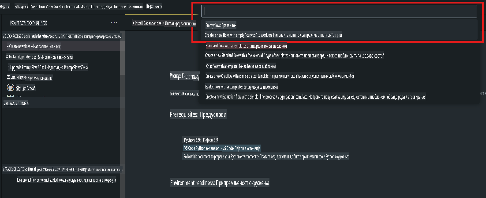

# **Laboratorija 2 - Pokretanje Prompt flow-a sa Phi-3-mini u AIPC**

## **Šta je Prompt flow**

Prompt flow je skup razvojnih alata dizajniranih da pojednostavi celokupan razvojni ciklus AI aplikacija zasnovanih na LLM-ovima, od ideje, prototipa, testiranja, evaluacije, do produkcijskog uvođenja i praćenja. Olakšava inženjering promptova i omogućava vam da gradite LLM aplikacije sa produkcijskim kvalitetom.

Uz Prompt flow, možete:

- Kreirati tokove koji povezuju LLM-ove, promptove, Python kod i druge alate u izvršni radni tok.

- Debagovati i iterirati svoje tokove, posebno interakcije sa LLM-ovima, sa lakoćom.

- Evaluirati svoje tokove, izračunavati metrike kvaliteta i performansi koristeći veće skupove podataka.

- Integrisati testiranje i evaluaciju u vaš CI/CD sistem kako biste osigurali kvalitet vašeg toka.

- Implementirati svoje tokove na izabranoj platformi za usluge ili ih lako integrisati u kod vaše aplikacije.

- (Opcionalno, ali visoko preporučeno) Saradnja sa vašim timom koristeći cloud verziju Prompt flow-a u Azure AI.


## **Izgradnja tokova za generisanje koda na Apple Silicon-u**

***Napomena***: Ako niste završili instalaciju okruženja, posetite [Lab 0 - Instalacije](./01.Installations.md)

1. Otvorite Prompt flow ekstenziju u Visual Studio Code-u i kreirajte prazan projekat toka



2. Dodajte ulazne i izlazne parametre i dodajte Python kod kao novi tok


Možete se pozvati na ovu strukturu (flow.dag.yaml) za konstruisanje vašeg toka

```yaml

inputs:
  prompt:
    type: string
    default: Write python code for Fibonacci serie. Please use markdown as output
outputs:
  result:
    type: string
    reference: ${gen_code_by_phi3.output}
nodes:
- name: gen_code_by_phi3
  type: python
  source:
    type: code
    path: gen_code_by_phi3.py
  inputs:
    prompt: ${inputs.prompt}


```

3. Kvantifikujte phi-3-mini

Cilj nam je da bolje pokrenemo SLM na lokalnim uređajima. Generalno, kvantifikujemo model (INT4, FP16, FP32)


```bash

python -m mlx_lm.convert --hf-path microsoft/Phi-3-mini-4k-instruct

```

**Napomena:** podrazumevani folder je mlx_model 

4. Dodajte kod u ***Chat_With_Phi3.py***


```python


from promptflow import tool

from mlx_lm import load, generate


# The inputs section will change based on the arguments of the tool function, after you save the code
# Adding type to arguments and return value will help the system show the types properly
# Please update the function name/signature per need
@tool
def my_python_tool(prompt: str) -> str:

    model_id = './mlx_model_phi3_mini'

    model, tokenizer = load(model_id)

    # <|user|>\nWrite python code for Fibonacci serie. Please use markdown as output<|end|>\n<|assistant|>

    response = generate(model, tokenizer, prompt="<|user|>\n" + prompt  + "<|end|>\n<|assistant|>", max_tokens=2048, verbose=True)

    return response


```

4. Možete testirati tok iz Debug-a ili Run-a kako biste proverili da li generisanje koda funkcioniše kako treba 


5. Pokrenite tok kao razvojni API u terminalu

```

pf flow serve --source ./ --port 8080 --host localhost   

```

Možete ga testirati u Postman-u / Thunder Client-u


### **Napomena**

1. Prvo pokretanje traje dugo. Preporučuje se preuzimanje phi-3 modela pomoću Hugging Face CLI.

2. S obzirom na ograničenu računarsku snagu Intel NPU-a, preporučuje se korišćenje Phi-3-mini-4k-instruct.

3. Koristimo Intel NPU akceleraciju za kvantizaciju u INT4 konverziju, ali ako ponovo pokrećete uslugu, potrebno je obrisati cache i nc_workshop foldere.


## **Resursi**

1. Naučite Promptflow [https://microsoft.github.io/promptflow/](https://microsoft.github.io/promptflow/)

2. Naučite Intel NPU akceleraciju [https://github.com/intel/intel-npu-acceleration-library](https://github.com/intel/intel-npu-acceleration-library)

3. Primer koda, preuzmite [Lokalni NPU Agent Primer Koda](../../../../../../../../../code/07.Lab/01/AIPC/local-npu-agent)

**Одрицање од одговорности**:  
Овај документ је преведен коришћењем услуга машинског превођења заснованог на вештачкој интелигенцији. Иако настојимо да превод буде тачан, молимо вас да имате у виду да аутоматски преводи могу садржати грешке или нетачности. Оригинални документ на изворном језику треба сматрати меродавним. За критичне информације препоручује се професионални превод од стране људи. Не преузимамо одговорност за било каква погрешна тумачења или неспоразуме који могу произаћи из употребе овог превода.