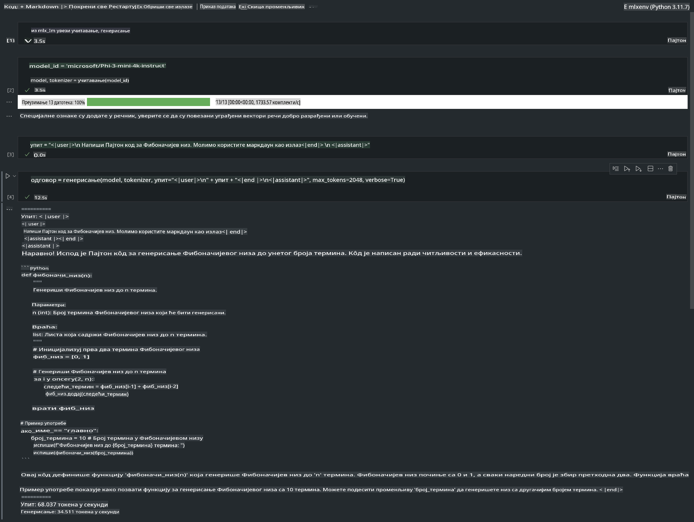

# **Izvođenje Phi-3 sa Apple MLX Framework-om**

## **Šta je MLX Framework**

MLX je okvir za istraživanje mašinskog učenja na Apple silicijumu, koji donosi Apple istraživački tim za mašinsko učenje.

MLX je dizajniran od strane istraživača mašinskog učenja za istraživače mašinskog učenja. Okvir je osmišljen da bude jednostavan za upotrebu, ali i dalje efikasan za treniranje i implementaciju modela. Sam dizajn okvira je konceptualno jednostavan. Naša namera je da istraživačima olakšamo proširivanje i unapređenje MLX-a sa ciljem brzog istraživanja novih ideja.

LLM-ovi mogu biti ubrzani na Apple Silicon uređajima pomoću MLX-a, a modeli se mogu pokretati lokalno na vrlo praktičan način.

## **Korišćenje MLX-a za izvođenje Phi-3-mini**

### **1. Postavite MLX okruženje**

1. Python 3.11.x  
2. Instalirajte MLX biblioteku  

```bash

pip install mlx-lm

```

### **2. Pokretanje Phi-3-mini u Terminalu pomoću MLX-a**

```bash

python -m mlx_lm.generate --model microsoft/Phi-3-mini-4k-instruct --max-token 2048 --prompt  "<|user|>\nCan you introduce yourself<|end|>\n<|assistant|>"

```

Rezultat (moje okruženje je Apple M1 Max, 64GB) je


### **3. Kvantizacija Phi-3-mini pomoću MLX-a u Terminalu**

```bash

python -m mlx_lm.convert --hf-path microsoft/Phi-3-mini-4k-instruct

```

***Napomena:*** Model se može kvantizovati pomoću mlx_lm.convert, a podrazumevana kvantizacija je INT4. Ovaj primer kvantizuje Phi-3-mini u INT4.

Model se može kvantizovati pomoću mlx_lm.convert, a podrazumevana kvantizacija je INT4. Ovaj primer kvantizuje Phi-3-mini u INT4. Nakon kvantizacije, model će biti sačuvan u podrazumevanom direktorijumu ./mlx_model.

Model kvantizovan pomoću MLX-a možemo testirati iz terminala.

```bash

python -m mlx_lm.generate --model ./mlx_model/ --max-token 2048 --prompt  "<|user|>\nCan you introduce yourself<|end|>\n<|assistant|>"

```

Rezultat je


### **4. Pokretanje Phi-3-mini pomoću MLX-a u Jupyter Notebook-u**



***Napomena:*** Molimo vas da pročitate ovaj primer [kliknite na ovaj link](../../../../../code/03.Inference/MLX/MLX_DEMO.ipynb)

## **Resursi**

1. Saznajte više o Apple MLX Framework-u [https://ml-explore.github.io](https://ml-explore.github.io/mlx/build/html/index.html)

2. Apple MLX GitHub repozitorijum [https://github.com/ml-explore](https://github.com/ml-explore)

**Одрицање од одговорности**:  
Овај документ је преведен коришћењем услуга машинског превођења заснованих на вештачкој интелигенцији. Иако се трудимо да обезбедимо тачност, молимо вас да имате у виду да аутоматски преводи могу садржати грешке или нетачности. Оригинални документ на изворном језику треба сматрати меродавним. За критичне информације препоручује се професионални превод од стране људи. Не сносимо одговорност за било какве неспоразуме или погрешна тумачења која могу настати услед коришћења овог превода.