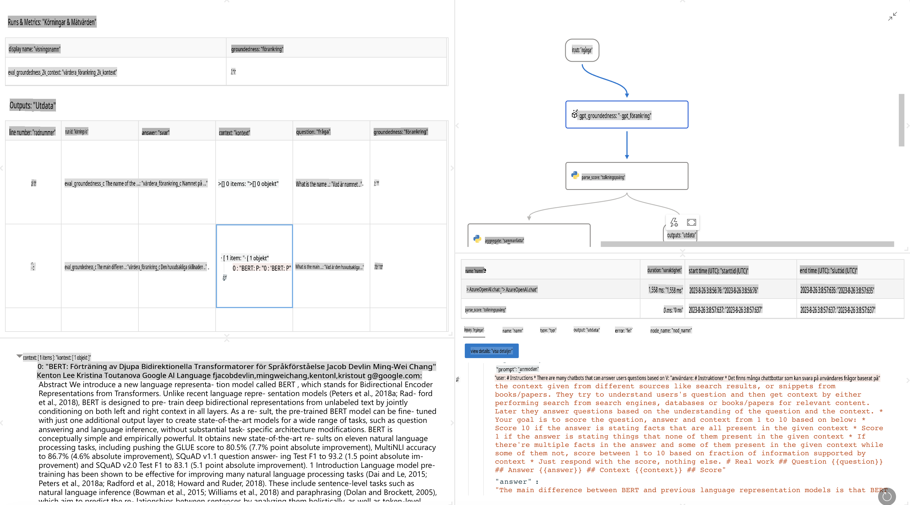

# **Introducera Promptflow**

[Microsoft Prompt Flow](https://microsoft.github.io/promptflow/index.html?WT.mc_id=aiml-138114-kinfeylo) är ett visuellt verktyg för arbetsflödesautomation som låter användare skapa automatiserade arbetsflöden med hjälp av fördefinierade mallar och anpassade anslutningar. Det är utformat för att möjliggöra för utvecklare och affärsanalytiker att snabbt bygga automatiserade processer för uppgifter som datahantering, samarbete och processoptimering. Med Prompt Flow kan användare enkelt koppla samman olika tjänster, applikationer och system samt automatisera komplexa affärsprocesser.

Microsoft Prompt Flow är utformat för att effektivisera hela utvecklingscykeln för AI-applikationer som drivs av Large Language Models (LLMs). Oavsett om du skapar idéer, prototypar, testar, utvärderar eller distribuerar LLM-baserade applikationer, förenklar Prompt Flow processen och gör det möjligt att bygga LLM-appar med produktionskvalitet.

## Här är de viktigaste funktionerna och fördelarna med att använda Microsoft Prompt Flow:

**Interaktiv författarupplevelse**

Prompt Flow ger en visuell representation av strukturen i ditt flöde, vilket gör det enkelt att förstå och navigera i dina projekt.  
Det erbjuder en notebook-liknande kodningsupplevelse för effektiv utveckling och felsökning av flöden.

**Promptvarianter och finjustering**

Skapa och jämför flera promptvarianter för att underlätta en iterativ förfiningsprocess. Utvärdera prestandan hos olika prompts och välj de mest effektiva.

**Inbyggda utvärderingsflöden**  
Bedöm kvaliteten och effektiviteten hos dina prompts och flöden med hjälp av inbyggda utvärderingsverktyg.  
Förstå hur väl dina LLM-baserade applikationer presterar.

**Omfattande resurser**  

Prompt Flow inkluderar ett bibliotek med inbyggda verktyg, exempel och mallar. Dessa resurser fungerar som en startpunkt för utveckling, inspirerar kreativitet och påskyndar processen.

**Samarbete och företagsberedskap**

Stöd teamarbete genom att låta flera användare samarbeta i projekt för promptutveckling.  
Upprätthåll versionskontroll och dela kunskap effektivt. Effektivisera hela processen för promptutveckling, från utveckling och utvärdering till distribution och övervakning.

## Utvärdering i Prompt Flow  

I Microsoft Prompt Flow spelar utvärdering en avgörande roll för att bedöma hur väl dina AI-modeller presterar. Låt oss utforska hur du kan anpassa utvärderingsflöden och mätvärden i Prompt Flow:

**Förstå utvärdering i Prompt Flow**

I Prompt Flow representerar ett flöde en sekvens av noder som bearbetar indata och genererar utdata. Utvärderingsflöden är speciella typer av flöden som är utformade för att bedöma prestandan för en körning baserat på specifika kriterier och mål.

**Viktiga funktioner hos utvärderingsflöden**

De körs vanligtvis efter det flöde som testas, med hjälp av dess utdata. De beräknar poäng eller mätvärden för att mäta prestandan hos det testade flödet. Mätvärden kan inkludera noggrannhet, relevanspoäng eller andra relevanta mått.

### Anpassning av utvärderingsflöden  

**Definiera indata**

Utvärderingsflöden måste ta emot utdatan från körningen som testas. Definiera indata på samma sätt som för standardflöden.  
Till exempel, om du utvärderar ett QnA-flöde, kan du namnge en indata som "svar." Om du utvärderar ett klassificeringsflöde, kan du namnge en indata som "kategori." Även referensindata (t.ex. faktiska etiketter) kan behövas.

**Utdata och mätvärden**

Utvärderingsflöden genererar resultat som mäter prestandan hos det testade flödet. Mätvärden kan beräknas med hjälp av Python eller LLM (Large Language Models). Använd funktionen log_metric() för att logga relevanta mätvärden.

**Använda anpassade utvärderingsflöden**

Utveckla ditt eget utvärderingsflöde som är anpassat till dina specifika uppgifter och mål. Anpassa mätvärden baserat på dina utvärderingsmål.  
Applicera detta anpassade utvärderingsflöde på batchkörningar för storskaliga tester.

## Inbyggda utvärderingsmetoder  

Prompt Flow erbjuder också inbyggda utvärderingsmetoder.  
Du kan skicka in batchkörningar och använda dessa metoder för att utvärdera hur väl ditt flöde presterar med stora dataset.  
Visa utvärderingsresultat, jämför mätvärden och iterera vid behov.  
Kom ihåg att utvärdering är avgörande för att säkerställa att dina AI-modeller uppfyller önskade kriterier och mål. Utforska den officiella dokumentationen för detaljerade instruktioner om hur du utvecklar och använder utvärderingsflöden i Microsoft Prompt Flow.

Sammanfattningsvis gör Microsoft Prompt Flow det möjligt för utvecklare att skapa högkvalitativa LLM-applikationer genom att förenkla promptutveckling och erbjuda en robust utvecklingsmiljö. Om du arbetar med LLM:er är Prompt Flow ett värdefullt verktyg att utforska. Utforska [Prompt Flow Evaluation Documents](https://learn.microsoft.com/azure/machine-learning/prompt-flow/how-to-develop-an-evaluation-flow?view=azureml-api-2?WT.mc_id=aiml-138114-kinfeylo) för detaljerade instruktioner om hur du utvecklar och använder utvärderingsflöden i Microsoft Prompt Flow.

**Ansvarsfriskrivning**:  
Detta dokument har översatts med hjälp av AI-baserade maskinöversättningstjänster. Även om vi strävar efter noggrannhet, bör du vara medveten om att automatiserade översättningar kan innehålla fel eller felaktigheter. Det ursprungliga dokumentet på dess originalspråk bör betraktas som den auktoritativa källan. För kritisk information rekommenderas professionell human översättning. Vi tar inget ansvar för eventuella missförstånd eller feltolkningar som uppstår vid användning av denna översättning.