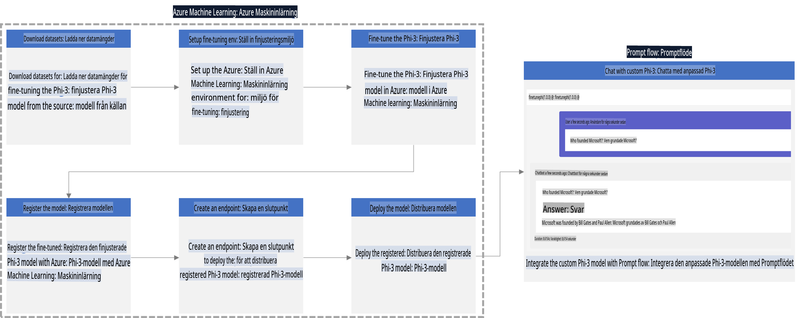
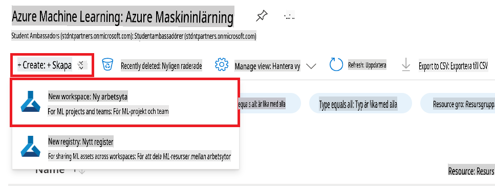
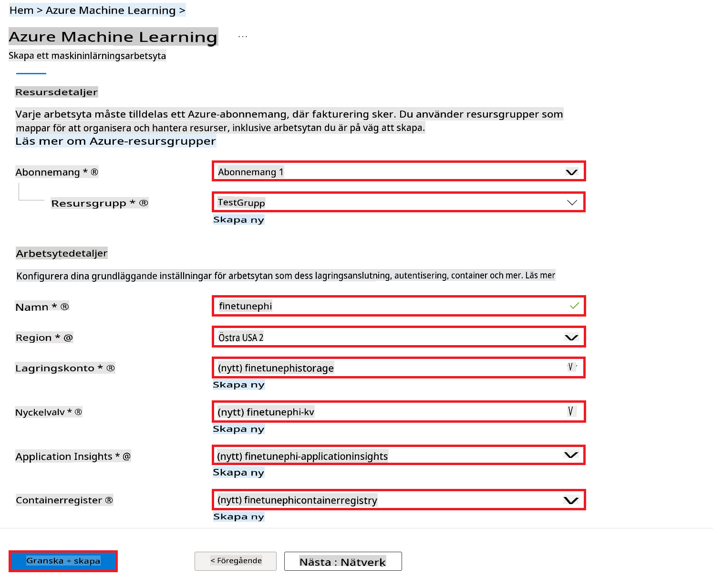
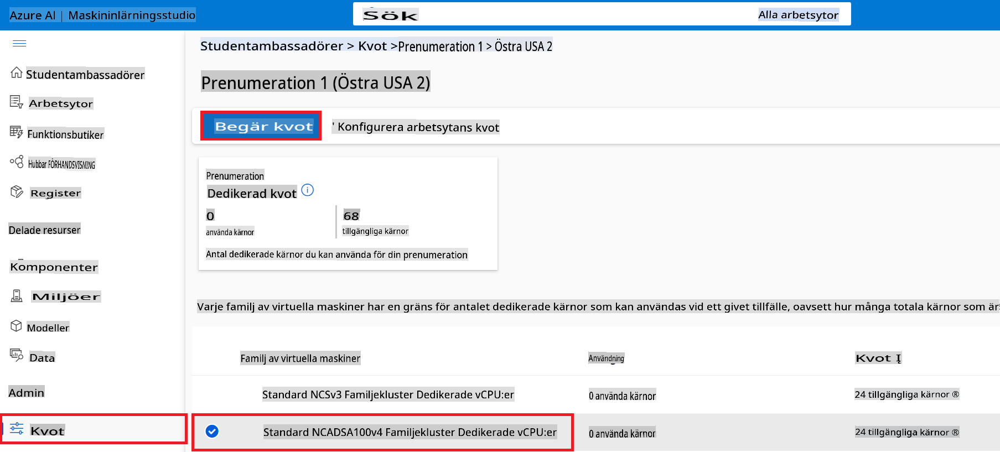
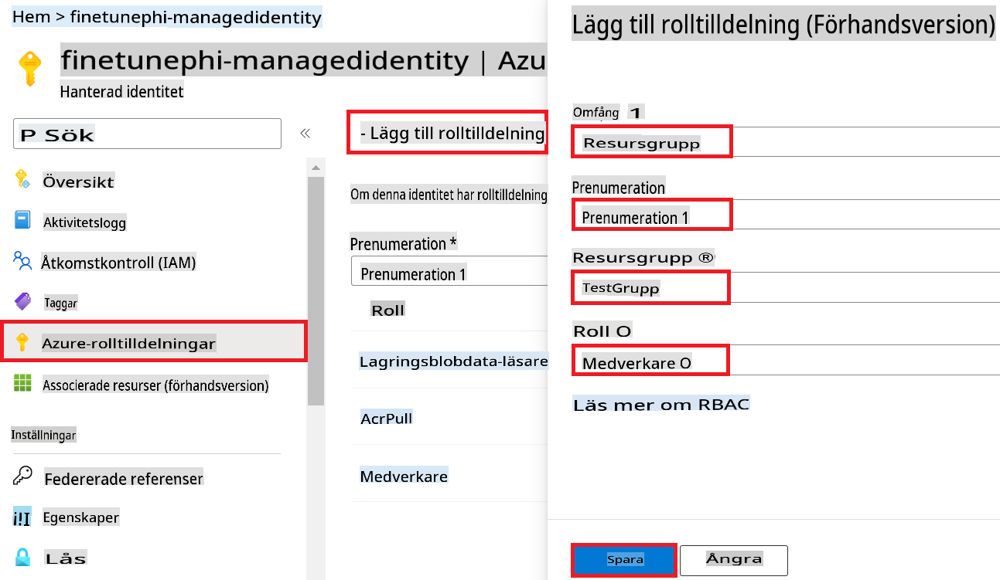
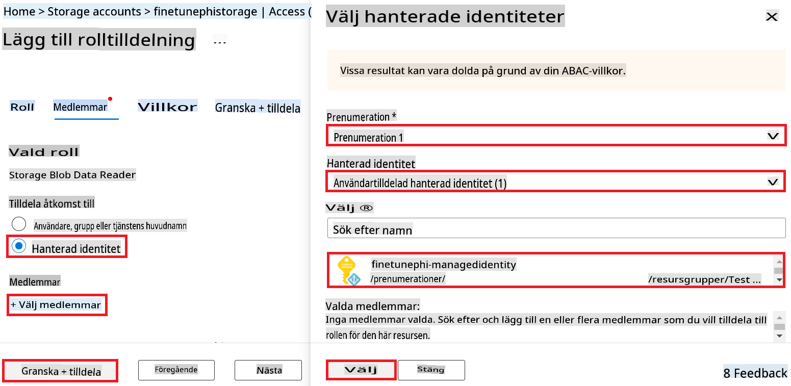
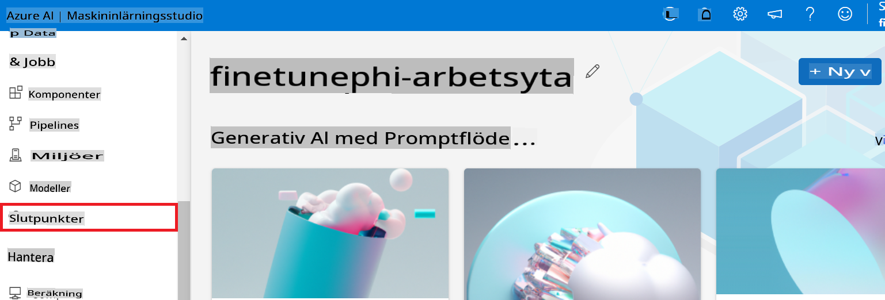
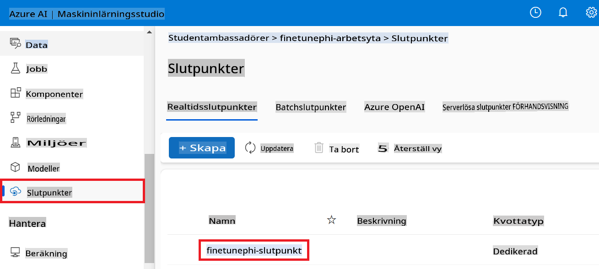
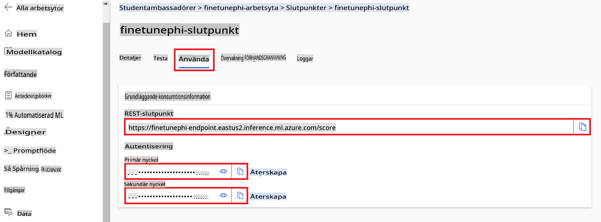
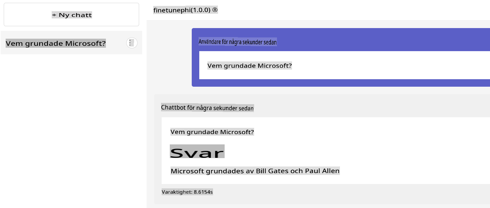

# Finjustera och integrera anpassade Phi-3-modeller med Prompt flow

Det här end-to-end-exemplet (E2E) är baserat på guiden "[Fine-Tune and Integrate Custom Phi-3 Models with Prompt Flow: Step-by-Step Guide](https://techcommunity.microsoft.com/t5/educator-developer-blog/fine-tune-and-integrate-custom-phi-3-models-with-prompt-flow/ba-p/4178612?WT.mc_id=aiml-137032-kinfeylo)" från Microsoft Tech Community. Det beskriver processen för att finjustera, distribuera och integrera anpassade Phi-3-modeller med Prompt flow.

## Översikt

I detta E2E-exempel kommer du att lära dig hur du finjusterar Phi-3-modellen och integrerar den med Prompt flow. Genom att använda Azure Machine Learning och Prompt flow kommer du att etablera ett arbetsflöde för att distribuera och använda anpassade AI-modeller. Detta E2E-exempel är uppdelat i tre scenarier:

**Scenario 1: Konfigurera Azure-resurser och förbered för finjustering**

**Scenario 2: Finjustera Phi-3-modellen och distribuera i Azure Machine Learning Studio**

**Scenario 3: Integrera med Prompt flow och chatta med din anpassade modell**

Här är en översikt över detta E2E-exempel.



### Innehållsförteckning

1. **[Scenario 1: Konfigurera Azure-resurser och förbered för finjustering](../../../../../../md/02.Application/01.TextAndChat/Phi3)**
    - [Skapa ett Azure Machine Learning-arbetsutrymme](../../../../../../md/02.Application/01.TextAndChat/Phi3)
    - [Begär GPU-kvoter i Azure-prenumerationen](../../../../../../md/02.Application/01.TextAndChat/Phi3)
    - [Lägg till rolltilldelning](../../../../../../md/02.Application/01.TextAndChat/Phi3)
    - [Konfigurera projekt](../../../../../../md/02.Application/01.TextAndChat/Phi3)
    - [Förbered dataset för finjustering](../../../../../../md/02.Application/01.TextAndChat/Phi3)

1. **[Scenario 2: Finjustera Phi-3-modellen och distribuera i Azure Machine Learning Studio](../../../../../../md/02.Application/01.TextAndChat/Phi3)**
    - [Konfigurera Azure CLI](../../../../../../md/02.Application/01.TextAndChat/Phi3)
    - [Finjustera Phi-3-modellen](../../../../../../md/02.Application/01.TextAndChat/Phi3)
    - [Distribuera den finjusterade modellen](../../../../../../md/02.Application/01.TextAndChat/Phi3)

1. **[Scenario 3: Integrera med Prompt flow och chatta med din anpassade modell](../../../../../../md/02.Application/01.TextAndChat/Phi3)**
    - [Integrera den anpassade Phi-3-modellen med Prompt flow](../../../../../../md/02.Application/01.TextAndChat/Phi3)
    - [Chatta med din anpassade modell](../../../../../../md/02.Application/01.TextAndChat/Phi3)

## Scenario 1: Konfigurera Azure-resurser och förbered för finjustering

### Skapa ett Azure Machine Learning-arbetsutrymme

1. Skriv *azure machine learning* i **sökfältet** högst upp på portalsidan och välj **Azure Machine Learning** från alternativen som visas.

    

1. Välj **+ Skapa** från navigeringsmenyn.

1. Välj **Nytt arbetsutrymme** från navigeringsmenyn.

    

1. Utför följande uppgifter:

    - Välj din Azure **Prenumeration**.
    - Välj **Resursgrupp** att använda (skapa en ny om det behövs).
    - Ange **Arbetsutrymmesnamn**. Det måste vara unikt.
    - Välj den **Region** du vill använda.
    - Välj det **Lagringskonto** att använda (skapa ett nytt om det behövs).
    - Välj **Nyckelvalv** att använda (skapa ett nytt om det behövs).
    - Välj **Application Insights** att använda (skapa ett nytt om det behövs).
    - Välj **Container Registry** att använda (skapa ett nytt om det behövs).

    

1. Välj **Granska + Skapa**.

1. Välj **Skapa**.

### Begär GPU-kvoter i Azure-prenumerationen

I detta E2E-exempel kommer du att använda *Standard_NC24ads_A100_v4 GPU* för finjustering, vilket kräver en kvotbegäran, och *Standard_E4s_v3* CPU för distribution, vilket inte kräver en kvotbegäran.

> [!NOTE]
>
> Endast Pay-As-You-Go-prenumerationer (standardtypen) är berättigade till GPU-tilldelning; förmånsprenumerationer stöds för närvarande inte.
>
> För de som använder förmånsprenumerationer (som Visual Studio Enterprise Subscription) eller de som snabbt vill testa finjusterings- och distributionsprocessen, innehåller denna handledning även vägledning för att finjustera med ett minimalt dataset med en CPU. Det är dock viktigt att notera att resultaten av finjustering blir betydligt bättre med en GPU och större dataset.

1. Besök [Azure ML Studio](https://ml.azure.com/home?wt.mc_id=studentamb_279723).

1. Utför följande uppgifter för att begära *Standard NCADSA100v4 Family*-kvot:

    - Välj **Kvot** från vänstermenyn.
    - Välj den **Virtuella maskinfamilj** att använda. Till exempel, välj **Standard NCADSA100v4 Family Cluster Dedicated vCPUs**, som inkluderar *Standard_NC24ads_A100_v4* GPU.
    - Välj **Begär kvot** från navigeringsmenyn.

        

    - På sidan Begär kvot, ange den **Nya kärnbegränsning** du vill använda. Till exempel, 24.
    - På sidan Begär kvot, välj **Skicka** för att begära GPU-kvoten.

> [!NOTE]
> Du kan välja lämplig GPU eller CPU efter dina behov genom att hänvisa till dokumentet [Storlekar för virtuella maskiner i Azure](https://learn.microsoft.com/azure/virtual-machines/sizes/overview?tabs=breakdownseries%2Cgeneralsizelist%2Ccomputesizelist%2Cmemorysizelist%2Cstoragesizelist%2Cgpusizelist%2Cfpgasizelist%2Chpcsizelist).

### Lägg till rolltilldelning

För att finjustera och distribuera dina modeller måste du först skapa en användartilldelad hanterad identitet (UAI) och tilldela den lämpliga behörigheter. Denna UAI kommer att användas för autentisering under distribution.

#### Skapa användartilldelad hanterad identitet (UAI)

1. Skriv *managed identities* i **sökfältet** högst upp på portalsidan och välj **Managed Identities** från alternativen som visas.

    

1. Välj **+ Skapa**.

    

1. Utför följande uppgifter:

    - Välj din Azure **Prenumeration**.
    - Välj **Resursgrupp** att använda (skapa en ny om det behövs).
    - Välj den **Region** du vill använda.
    - Ange **Namn**. Det måste vara unikt.

1. Välj **Granska + skapa**.

1. Välj **+ Skapa**.

#### Lägg till Contributor-rolltilldelning till Managed Identity

1. Navigera till den Managed Identity-resurs som du skapade.

1. Välj **Azure rolltilldelningar** från vänstermenyn.

1. Välj **+Lägg till rolltilldelning** från navigeringsmenyn.

1. På sidan Lägg till rolltilldelning, utför följande uppgifter:
    - Välj **Omfattning** till **Resursgrupp**.
    - Välj din Azure **Prenumeration**.
    - Välj **Resursgrupp** att använda.
    - Välj **Roll** till **Contributor**.

    

1. Välj **Spara**.

#### Lägg till Storage Blob Data Reader-rolltilldelning till Managed Identity

1. Skriv *storage accounts* i **sökfältet** högst upp på portalsidan och välj **Storage accounts** från alternativen som visas.

    

1. Välj det lagringskonto som är kopplat till det Azure Machine Learning-arbetsutrymme som du skapade. Till exempel, *finetunephistorage*.

1. Utför följande uppgifter för att navigera till sidan Lägg till rolltilldelning:

    - Navigera till det Azure Storage-konto som du skapade.
    - Välj **Åtkomstkontroll (IAM)** från vänstermenyn.
    - Välj **+ Lägg till** från navigeringsmenyn.
    - Välj **Lägg till rolltilldelning** från navigeringsmenyn.

    

1. På sidan Lägg till rolltilldelning, utför följande uppgifter:

    - På sidan Roll, skriv *Storage Blob Data Reader* i **sökfältet** och välj **Storage Blob Data Reader** från alternativen som visas.
    - På sidan Roll, välj **Nästa**.
    - På sidan Medlemmar, välj **Tilldela åtkomst till** **Managed identity**.
    - På sidan Medlemmar, välj **+ Välj medlemmar**.
    - På sidan Välj hanterade identiteter, välj din Azure **Prenumeration**.
    - På sidan Välj hanterade identiteter, välj **Managed identity** till **Manage Identity**.
    - På sidan Välj hanterade identiteter, välj den Managed Identity som du skapade. Till exempel, *finetunephi-managedidentity*.
    - På sidan Välj hanterade identiteter, välj **Välj**.

    

1. Välj **Granska + tilldela**.

#### Lägg till AcrPull-rolltilldelning till Managed Identity

1. Skriv *container registries* i **sökfältet** högst upp på portalsidan och välj **Container registries** från alternativen som visas.

    

1. Välj den container registry som är kopplad till det Azure Machine Learning-arbetsutrymme som du skapade. Till exempel, *finetunephicontainerregistries*.

1. Utför följande uppgifter för att navigera till sidan Lägg till rolltilldelning:

    - Välj **Åtkomstkontroll (IAM)** från vänstermenyn.
    - Välj **+ Lägg till** från navigeringsmenyn.
    - Välj **Lägg till rolltilldelning** från navigeringsmenyn.

1. På sidan Lägg till rolltilldelning, utför följande uppgifter:

    - På sidan Roll, skriv *AcrPull* i **sökfältet** och välj **AcrPull** från alternativen som visas.
    - På sidan Roll, välj **Nästa**.
    - På sidan Medlemmar, välj **Tilldela åtkomst till** **Managed identity**.
    - På sidan Medlemmar, välj **+ Välj medlemmar**.
    - På sidan Välj hanterade identiteter, välj din Azure **Prenumeration**.
    - På sidan Välj hanterade identiteter, välj **Managed identity** till **Manage Identity**.
    - På sidan Välj hanterade identiteter, välj den Managed Identity som du skapade. Till exempel, *finetunephi-managedidentity*.
    - På sidan Välj hanterade identiteter, välj **Välj**.
    - Välj **Granska + tilldela**.

### Konfigurera projekt

Nu kommer du att skapa en mapp att arbeta i och konfigurera en virtuell miljö för att utveckla ett program som interagerar med användare och använder lagrad chattdata från Azure Cosmos DB för att informera sina svar.

#### Skapa en mapp att arbeta i

1. Öppna ett terminalfönster och skriv följande kommando för att skapa en mapp med namnet *finetune-phi* i standardvägen.

    ```console
    mkdir finetune-phi
    ```

1. Skriv följande kommando i terminalen för att navigera till mappen *finetune-phi* som du skapade.

    ```console
    cd finetune-phi
    ```

#### Skapa en virtuell miljö

1. Skriv följande kommando i terminalen för att skapa en virtuell miljö med namnet *.venv*.

    ```console
    python -m venv .venv
    ```

1. Skriv följande kommando i terminalen för att aktivera den virtuella miljön.

    ```console
    .venv\Scripts\activate.bat
    ```

> [!NOTE]
>
> Om det fungerade bör du se *(.venv)* före kommandoprompten.

#### Installera de nödvändiga paketen

1. Skriv följande kommandon i terminalen för att installera de nödvändiga paketen.

    ```console
    pip install datasets==2.19.1
    pip install transformers==4.41.1
    pip install azure-ai-ml==1.16.0
    pip install torch==2.3.1
    pip install trl==0.9.4
    pip install promptflow==1.12.0
    ```

#### Skapa projektfiler

I denna övning kommer du att skapa de nödvändiga filerna för vårt projekt. Dessa filer inkluderar skript för att ladda ner datasetet, konfigurera Azure Machine Learning-miljön, finjustera Phi-3-modellen och distribuera den finjusterade modellen. Du kommer också att skapa en *conda.yml*-fil för att konfigurera finjusteringsmiljön.

I denna övning kommer du att:

- Skapa en fil *download_dataset.py* för att ladda ner datasetet.
- Skapa en fil *setup_ml.py* för att konfigurera Azure Machine Learning-miljön.
- Skapa en fil *fine_tune.py* i mappen *finetuning_dir* för att finjustera Phi-3-modellen med datasetet.
- Skapa en fil *conda.yml* för att konfigurera finjusteringsmiljön.
- Skapa en fil *deploy_model.py* för att distribuera den finjusterade modellen.
- Skapa en fil *integrate_with_promptflow.py* för att integrera den finjusterade modellen och köra modellen med Prompt flow.
- Skapa en fil *flow.dag.yml* för att konfigurera arbetsflödesstrukturen för Prompt flow.
- Skapa en fil *config.py* för att ange Azure-information.

> [!NOTE]
>
> Komplett mappstruktur:
>
> ```text
> └── YourUserName
> .    └── finetune-phi
> .        ├── finetuning_dir
> .        │      └── fine_tune.py
> .        ├── conda.yml
> .        ├── config.py
> .        ├── deploy_model.py
> .        ├── download_dataset.py
> .        ├── flow.dag.yml
> .        ├── integrate_with_promptflow.py
> .        └── setup_ml.py
> ```

1. Öppna **Visual Studio Code**.

1. Välj **Arkiv** från menyraden.

1. Välj **Öppna mapp**.

1. Välj mappen *finetune-phi* som du skapade, som finns på *C:\Users\yourUserName\finetune-phi*.

    

1. I den vänstra panelen i Visual Studio Code, högerklicka och välj **Ny fil** för att skapa en ny fil med namnet *download_dataset.py*.

1. I den vänstra panelen i Visual Studio Code, högerklicka och välj **Ny fil** för att skapa en ny fil med namnet *setup_ml.py*.

1. I den vänstra panelen i Visual Studio Code, högerklicka och välj **Ny fil** för att skapa en ny fil med namnet *deploy_model.py*.

    

1. I den vänstra panelen i Visual Studio Code, högerklicka och välj **Ny mapp** för att skapa en ny mapp med namnet *finetuning_dir*.

1. I mappen *finetuning_dir*, skapa en ny fil med namnet *fine_tune.py*.

#### Skapa och konfigurera *conda.yml*-fil

1. I den vänstra panelen i Visual Studio Code, högerklicka och välj **Ny fil** för att skapa en ny fil med namnet *conda.yml*.

1. Lägg till följande kod i filen *conda.yml* för att konfigurera finjusteringsmiljön för Phi-3-modellen.

    ```yml
    name: phi-3-training-env
    channels:
      - defaults
      - conda-forge
    dependencies:
      - python=3.10
      - pip
      - numpy<2.0
      - pip:
          - torch==2.4.0
          - torchvision==0.19.0
          - trl==0.8.6
          - transformers==4.41
          - datasets==2.21.0
          - azureml-core==1.57.0
          - azure-storage-blob==12.19.0
          - azure-ai-ml==1.16
          - azure-identity==1.17.1
          - accelerate==0.33.0
          - mlflow==2.15.1
          - azureml-mlflow==1.57.0
    ```

#### Skapa och konfigurera *config.py*-fil

1. I den vänstra panelen i Visual Studio Code, högerklicka och välj **Ny fil** för att skapa en ny fil med namnet *config.py*.

1. Lägg till följande kod i filen *config.py* för att inkludera din Azure-information.

    ```python
    # Azure settings
    AZURE_SUBSCRIPTION_ID = "your_subscription_id"
    AZURE_RESOURCE_GROUP_NAME = "your_resource_group_name" # "TestGroup"

    # Azure Machine Learning settings
    AZURE_ML_WORKSPACE_NAME = "your_workspace_name" # "finetunephi-workspace"

    # Azure Managed Identity settings
    AZURE_MANAGED_IDENTITY_CLIENT_ID = "your_azure_managed_identity_client_id"
    AZURE_MANAGED_IDENTITY_NAME = "your_azure_managed_identity_name" # "finetunephi-mangedidentity"
    AZURE_MANAGED_IDENTITY_RESOURCE_ID = f"/subscriptions/{AZURE_SUBSCRIPTION_ID}/resourceGroups/{AZURE_RESOURCE_GROUP_NAME}/providers/Microsoft.ManagedIdentity/userAssignedIdentities/{AZURE_MANAGED_IDENTITY_NAME}"

    # Dataset file paths
    TRAIN_DATA_PATH = "data/train_data.jsonl"
    TEST_DATA_PATH = "data/test_data.jsonl"

    # Fine-tuned model settings
    AZURE_MODEL_NAME = "your_fine_tuned_model_name" # "finetune-phi-model"
    AZURE_ENDPOINT_NAME = "your_fine_tuned_model_endpoint_name" # "finetune-phi-endpoint"
    AZURE_DEPLOYMENT_NAME = "your_fine_tuned_model_deployment_name" # "finetune-phi-deployment"

    AZURE_ML_API_KEY = "your_fine_tuned_model_api_key"
    AZURE_ML_ENDPOINT = "your_fine_tuned_model_endpoint_uri" # "https://{your-endpoint-name}.{your-region}.inference.ml.azure.com/score"
    ```

#### Lägg till Azure-miljövariabler

1. Utför följande uppgifter för att lägga till Azure-prenumerations-ID:

    - Skriv *subscriptions* i **sökfältet** högst upp på


1. Utför följande steg för att lägga till Azure Workspace-namnet:

    - Navigera till den Azure Machine Learning-resurs som du skapade.
    - Kopiera och klistra in ditt kontonamn i *config.py*-filen.

    

1. Utför följande steg för att lägga till Azure Resource Group-namnet:

    - Navigera till den Azure Machine Learning-resurs som du skapade.
    - Kopiera och klistra in ditt Azure Resource Group-namn i *config.py*-filen.

    

2. Utför följande steg för att lägga till namnet på Azure Managed Identity:

    - Navigera till den Managed Identities-resurs som du skapade.
    - Kopiera och klistra in namnet på din Azure Managed Identity i *config.py*-filen.

    

### Förbered dataset för finjustering

I denna övning kommer du att köra *download_dataset.py*-filen för att ladda ner *ULTRACHAT_200k*-datasets till din lokala miljö. Du kommer sedan att använda dessa datasets för att finjustera Phi-3-modellen i Azure Machine Learning.

#### Ladda ner dataset med *download_dataset.py*

1. Öppna *download_dataset.py*-filen i Visual Studio Code.

1. Lägg till följande kod i *download_dataset.py*.

    ```python
    import json
    import os
    from datasets import load_dataset
    from config import (
        TRAIN_DATA_PATH,
        TEST_DATA_PATH)

    def load_and_split_dataset(dataset_name, config_name, split_ratio):
        """
        Load and split a dataset.
        """
        # Load the dataset with the specified name, configuration, and split ratio
        dataset = load_dataset(dataset_name, config_name, split=split_ratio)
        print(f"Original dataset size: {len(dataset)}")
        
        # Split the dataset into train and test sets (80% train, 20% test)
        split_dataset = dataset.train_test_split(test_size=0.2)
        print(f"Train dataset size: {len(split_dataset['train'])}")
        print(f"Test dataset size: {len(split_dataset['test'])}")
        
        return split_dataset

    def save_dataset_to_jsonl(dataset, filepath):
        """
        Save a dataset to a JSONL file.
        """
        # Create the directory if it does not exist
        os.makedirs(os.path.dirname(filepath), exist_ok=True)
        
        # Open the file in write mode
        with open(filepath, 'w', encoding='utf-8') as f:
            # Iterate over each record in the dataset
            for record in dataset:
                # Dump the record as a JSON object and write it to the file
                json.dump(record, f)
                # Write a newline character to separate records
                f.write('\n')
        
        print(f"Dataset saved to {filepath}")

    def main():
        """
        Main function to load, split, and save the dataset.
        """
        # Load and split the ULTRACHAT_200k dataset with a specific configuration and split ratio
        dataset = load_and_split_dataset("HuggingFaceH4/ultrachat_200k", 'default', 'train_sft[:1%]')
        
        # Extract the train and test datasets from the split
        train_dataset = dataset['train']
        test_dataset = dataset['test']

        # Save the train dataset to a JSONL file
        save_dataset_to_jsonl(train_dataset, TRAIN_DATA_PATH)
        
        # Save the test dataset to a separate JSONL file
        save_dataset_to_jsonl(test_dataset, TEST_DATA_PATH)

    if __name__ == "__main__":
        main()

    ```

> [!TIP]
>
> **Vägledning för finjustering med ett minimalt dataset med hjälp av en CPU**
>
> Om du vill använda en CPU för finjustering är detta tillvägagångssätt idealiskt för dem med förmånsprenumerationer (som Visual Studio Enterprise Subscription) eller för att snabbt testa finjusterings- och distributionsprocessen.
>
> Ersätt `dataset = load_and_split_dataset("HuggingFaceH4/ultrachat_200k", 'default', 'train_sft[:1%]')` with `dataset = load_and_split_dataset("HuggingFaceH4/ultrachat_200k", 'default', 'train_sft[:10]')`
>

1. Skriv följande kommando i din terminal för att köra skriptet och ladda ner datasetet till din lokala miljö.

    ```console
    python download_data.py
    ```

1. Verifiera att datasets sparades framgångsrikt till din lokala *finetune-phi/data*-katalog.

> [!NOTE]
>
> **Datasets storlek och finjusteringstid**
>
> I detta E2E-exempel använder du endast 1% av datasetet (`train_sft[:1%]`). Detta minskar mängden data avsevärt och påskyndar både uppladdnings- och finjusteringsprocesserna. Du kan justera procentandelen för att hitta rätt balans mellan träningstid och modellprestanda. Att använda en mindre delmängd av datasetet minskar den tid som krävs för finjustering och gör processen mer hanterbar för ett E2E-exempel.

## Scenario 2: Finjustera Phi-3-modellen och distribuera i Azure Machine Learning Studio

### Konfigurera Azure CLI

Du behöver konfigurera Azure CLI för att autentisera din miljö. Azure CLI gör det möjligt att hantera Azure-resurser direkt från kommandoraden och tillhandahåller de autentiseringsuppgifter som krävs för att Azure Machine Learning ska kunna komma åt dessa resurser. För att komma igång, installera [Azure CLI](https://learn.microsoft.com/cli/azure/install-azure-cli)

1. Öppna ett terminalfönster och skriv följande kommando för att logga in på ditt Azure-konto.

    ```console
    az login
    ```

1. Välj det Azure-konto du vill använda.

1. Välj den Azure-prenumeration du vill använda.

    

> [!TIP]
>
> Om du har problem med att logga in på Azure kan du försöka använda en enhetskod. Öppna ett terminalfönster och skriv följande kommando för att logga in på ditt Azure-konto:
>
> ```console
> az login --use-device-code
> ```
>

### Finjustera Phi-3-modellen

I denna övning kommer du att finjustera Phi-3-modellen med hjälp av det medföljande datasetet. Först definierar du finjusteringsprocessen i *fine_tune.py*-filen. Därefter konfigurerar du Azure Machine Learning-miljön och initierar finjusteringsprocessen genom att köra *setup_ml.py*-filen. Detta skript säkerställer att finjusteringen sker inom Azure Machine Learning-miljön.

Genom att köra *setup_ml.py* kommer du att starta finjusteringsprocessen i Azure Machine Learning-miljön.

#### Lägg till kod i *fine_tune.py*-filen

1. Navigera till *finetuning_dir*-mappen och öppna *fine_tune.py*-filen i Visual Studio Code.

1. Lägg till följande kod i *fine_tune.py*.

    ```python
    import argparse
    import sys
    import logging
    import os
    from datasets import load_dataset
    import torch
    import mlflow
    from transformers import AutoModelForCausalLM, AutoTokenizer, TrainingArguments
    from trl import SFTTrainer

    # To avoid the INVALID_PARAMETER_VALUE error in MLflow, disable MLflow integration
    os.environ["DISABLE_MLFLOW_INTEGRATION"] = "True"

    # Logging setup
    logging.basicConfig(
        format="%(asctime)s - %(levelname)s - %(name)s - %(message)s",
        datefmt="%Y-%m-%d %H:%M:%S",
        handlers=[logging.StreamHandler(sys.stdout)],
        level=logging.WARNING
    )
    logger = logging.getLogger(__name__)

    def initialize_model_and_tokenizer(model_name, model_kwargs):
        """
        Initialize the model and tokenizer with the given pretrained model name and arguments.
        """
        model = AutoModelForCausalLM.from_pretrained(model_name, **model_kwargs)
        tokenizer = AutoTokenizer.from_pretrained(model_name)
        tokenizer.model_max_length = 2048
        tokenizer.pad_token = tokenizer.unk_token
        tokenizer.pad_token_id = tokenizer.convert_tokens_to_ids(tokenizer.pad_token)
        tokenizer.padding_side = 'right'
        return model, tokenizer

    def apply_chat_template(example, tokenizer):
        """
        Apply a chat template to tokenize messages in the example.
        """
        messages = example["messages"]
        if messages[0]["role"] != "system":
            messages.insert(0, {"role": "system", "content": ""})
        example["text"] = tokenizer.apply_chat_template(
            messages, tokenize=False, add_generation_prompt=False
        )
        return example

    def load_and_preprocess_data(train_filepath, test_filepath, tokenizer):
        """
        Load and preprocess the dataset.
        """
        train_dataset = load_dataset('json', data_files=train_filepath, split='train')
        test_dataset = load_dataset('json', data_files=test_filepath, split='train')
        column_names = list(train_dataset.features)

        train_dataset = train_dataset.map(
            apply_chat_template,
            fn_kwargs={"tokenizer": tokenizer},
            num_proc=10,
            remove_columns=column_names,
            desc="Applying chat template to train dataset",
        )

        test_dataset = test_dataset.map(
            apply_chat_template,
            fn_kwargs={"tokenizer": tokenizer},
            num_proc=10,
            remove_columns=column_names,
            desc="Applying chat template to test dataset",
        )

        return train_dataset, test_dataset

    def train_and_evaluate_model(train_dataset, test_dataset, model, tokenizer, output_dir):
        """
        Train and evaluate the model.
        """
        training_args = TrainingArguments(
            bf16=True,
            do_eval=True,
            output_dir=output_dir,
            eval_strategy="epoch",
            learning_rate=5.0e-06,
            logging_steps=20,
            lr_scheduler_type="cosine",
            num_train_epochs=3,
            overwrite_output_dir=True,
            per_device_eval_batch_size=4,
            per_device_train_batch_size=4,
            remove_unused_columns=True,
            save_steps=500,
            seed=0,
            gradient_checkpointing=True,
            gradient_accumulation_steps=1,
            warmup_ratio=0.2,
        )

        trainer = SFTTrainer(
            model=model,
            args=training_args,
            train_dataset=train_dataset,
            eval_dataset=test_dataset,
            max_seq_length=2048,
            dataset_text_field="text",
            tokenizer=tokenizer,
            packing=True
        )

        train_result = trainer.train()
        trainer.log_metrics("train", train_result.metrics)

        mlflow.transformers.log_model(
            transformers_model={"model": trainer.model, "tokenizer": tokenizer},
            artifact_path=output_dir,
        )

        tokenizer.padding_side = 'left'
        eval_metrics = trainer.evaluate()
        eval_metrics["eval_samples"] = len(test_dataset)
        trainer.log_metrics("eval", eval_metrics)

    def main(train_file, eval_file, model_output_dir):
        """
        Main function to fine-tune the model.
        """
        model_kwargs = {
            "use_cache": False,
            "trust_remote_code": True,
            "torch_dtype": torch.bfloat16,
            "device_map": None,
            "attn_implementation": "eager"
        }

        # pretrained_model_name = "microsoft/Phi-3-mini-4k-instruct"
        pretrained_model_name = "microsoft/Phi-3.5-mini-instruct"

        with mlflow.start_run():
            model, tokenizer = initialize_model_and_tokenizer(pretrained_model_name, model_kwargs)
            train_dataset, test_dataset = load_and_preprocess_data(train_file, eval_file, tokenizer)
            train_and_evaluate_model(train_dataset, test_dataset, model, tokenizer, model_output_dir)

    if __name__ == "__main__":
        parser = argparse.ArgumentParser()
        parser.add_argument("--train-file", type=str, required=True, help="Path to the training data")
        parser.add_argument("--eval-file", type=str, required=True, help="Path to the evaluation data")
        parser.add_argument("--model_output_dir", type=str, required=True, help="Directory to save the fine-tuned model")
        args = parser.parse_args()
        main(args.train_file, args.eval_file, args.model_output_dir)

    ```

1. Spara och stäng *fine_tune.py*-filen.

> [!TIP]
> **Du kan finjustera Phi-3.5-modellen**
>
> I *fine_tune.py*-filen kan du ändra `pretrained_model_name` from `"microsoft/Phi-3-mini-4k-instruct"` to any model you want to fine-tune. For example, if you change it to `"microsoft/Phi-3.5-mini-instruct"`, you'll be using the Phi-3.5-mini-instruct model for fine-tuning. To find and use the model name you prefer, visit [Hugging Face](https://huggingface.co/), search for the model you're interested in, and then copy and paste its name into the `pretrained_model_name`-fältet i ditt skript.
>
> :::image type="content" source="../../imgs/03/FineTuning-PromptFlow/finetunephi3.5.png" alt-text="Finjustera Phi-3.5.":::
>

#### Lägg till kod i *setup_ml.py*-filen

1. Öppna *setup_ml.py*-filen i Visual Studio Code.

1. Lägg till följande kod i *setup_ml.py*.

    ```python
    import logging
    from azure.ai.ml import MLClient, command, Input
    from azure.ai.ml.entities import Environment, AmlCompute
    from azure.identity import AzureCliCredential
    from config import (
        AZURE_SUBSCRIPTION_ID,
        AZURE_RESOURCE_GROUP_NAME,
        AZURE_ML_WORKSPACE_NAME,
        TRAIN_DATA_PATH,
        TEST_DATA_PATH
    )

    # Constants

    # Uncomment the following lines to use a CPU instance for training
    # COMPUTE_INSTANCE_TYPE = "Standard_E16s_v3" # cpu
    # COMPUTE_NAME = "cpu-e16s-v3"
    # DOCKER_IMAGE_NAME = "mcr.microsoft.com/azureml/openmpi4.1.0-ubuntu20.04:latest"

    # Uncomment the following lines to use a GPU instance for training
    COMPUTE_INSTANCE_TYPE = "Standard_NC24ads_A100_v4"
    COMPUTE_NAME = "gpu-nc24s-a100-v4"
    DOCKER_IMAGE_NAME = "mcr.microsoft.com/azureml/curated/acft-hf-nlp-gpu:59"

    CONDA_FILE = "conda.yml"
    LOCATION = "eastus2" # Replace with the location of your compute cluster
    FINETUNING_DIR = "./finetuning_dir" # Path to the fine-tuning script
    TRAINING_ENV_NAME = "phi-3-training-environment" # Name of the training environment
    MODEL_OUTPUT_DIR = "./model_output" # Path to the model output directory in azure ml

    # Logging setup to track the process
    logger = logging.getLogger(__name__)
    logging.basicConfig(
        format="%(asctime)s - %(levelname)s - %(name)s - %(message)s",
        datefmt="%Y-%m-%d %H:%M:%S",
        level=logging.WARNING
    )

    def get_ml_client():
        """
        Initialize the ML Client using Azure CLI credentials.
        """
        credential = AzureCliCredential()
        return MLClient(credential, AZURE_SUBSCRIPTION_ID, AZURE_RESOURCE_GROUP_NAME, AZURE_ML_WORKSPACE_NAME)

    def create_or_get_environment(ml_client):
        """
        Create or update the training environment in Azure ML.
        """
        env = Environment(
            image=DOCKER_IMAGE_NAME,  # Docker image for the environment
            conda_file=CONDA_FILE,  # Conda environment file
            name=TRAINING_ENV_NAME,  # Name of the environment
        )
        return ml_client.environments.create_or_update(env)

    def create_or_get_compute_cluster(ml_client, compute_name, COMPUTE_INSTANCE_TYPE, location):
        """
        Create or update the compute cluster in Azure ML.
        """
        try:
            compute_cluster = ml_client.compute.get(compute_name)
            logger.info(f"Compute cluster '{compute_name}' already exists. Reusing it for the current run.")
        except Exception:
            logger.info(f"Compute cluster '{compute_name}' does not exist. Creating a new one with size {COMPUTE_INSTANCE_TYPE}.")
            compute_cluster = AmlCompute(
                name=compute_name,
                size=COMPUTE_INSTANCE_TYPE,
                location=location,
                tier="Dedicated",  # Tier of the compute cluster
                min_instances=0,  # Minimum number of instances
                max_instances=1  # Maximum number of instances
            )
            ml_client.compute.begin_create_or_update(compute_cluster).wait()  # Wait for the cluster to be created
        return compute_cluster

    def create_fine_tuning_job(env, compute_name):
        """
        Set up the fine-tuning job in Azure ML.
        """
        return command(
            code=FINETUNING_DIR,  # Path to fine_tune.py
            command=(
                "python fine_tune.py "
                "--train-file ${{inputs.train_file}} "
                "--eval-file ${{inputs.eval_file}} "
                "--model_output_dir ${{inputs.model_output}}"
            ),
            environment=env,  # Training environment
            compute=compute_name,  # Compute cluster to use
            inputs={
                "train_file": Input(type="uri_file", path=TRAIN_DATA_PATH),  # Path to the training data file
                "eval_file": Input(type="uri_file", path=TEST_DATA_PATH),  # Path to the evaluation data file
                "model_output": MODEL_OUTPUT_DIR
            }
        )

    def main():
        """
        Main function to set up and run the fine-tuning job in Azure ML.
        """
        # Initialize ML Client
        ml_client = get_ml_client()

        # Create Environment
        env = create_or_get_environment(ml_client)
        
        # Create or get existing compute cluster
        create_or_get_compute_cluster(ml_client, COMPUTE_NAME, COMPUTE_INSTANCE_TYPE, LOCATION)

        # Create and Submit Fine-Tuning Job
        job = create_fine_tuning_job(env, COMPUTE_NAME)
        returned_job = ml_client.jobs.create_or_update(job)  # Submit the job
        ml_client.jobs.stream(returned_job.name)  # Stream the job logs
        
        # Capture the job name
        job_name = returned_job.name
        print(f"Job name: {job_name}")

    if __name__ == "__main__":
        main()

    ```

1. Ersätt `COMPUTE_INSTANCE_TYPE`, `COMPUTE_NAME`, and `LOCATION` med dina specifika detaljer.

    ```python
   # Uncomment the following lines to use a GPU instance for training
    COMPUTE_INSTANCE_TYPE = "Standard_NC24ads_A100_v4"
    COMPUTE_NAME = "gpu-nc24s-a100-v4"
    ...
    LOCATION = "eastus2" # Replace with the location of your compute cluster
    ```

> [!TIP]
>
> **Vägledning för finjustering med ett minimalt dataset med hjälp av en CPU**
>
> Om du vill använda en CPU för finjustering är detta tillvägagångssätt idealiskt för dem med förmånsprenumerationer (som Visual Studio Enterprise Subscription) eller för att snabbt testa finjusterings- och distributionsprocessen.
>
> 1. Öppna *setup_ml*-filen.
> 1. Ersätt `COMPUTE_INSTANCE_TYPE`, `COMPUTE_NAME`, and `DOCKER_IMAGE_NAME` with the following. If you do not have access to *Standard_E16s_v3*, you can use an equivalent CPU instance or request a new quota.
> 1. Replace `LOCATION` med dina specifika detaljer.
>
>    ```python
>    # Uncomment the following lines to use a CPU instance for training
>    COMPUTE_INSTANCE_TYPE = "Standard_E16s_v3" # cpu
>    COMPUTE_NAME = "cpu-e16s-v3"
>    DOCKER_IMAGE_NAME = "mcr.microsoft.com/azureml/openmpi4.1.0-ubuntu20.04:latest"
>    LOCATION = "eastus2" # Replace with the location of your compute cluster
>    ```
>

1. Skriv följande kommando för att köra *setup_ml.py*-skriptet och starta finjusteringsprocessen i Azure Machine Learning.

    ```python
    python setup_ml.py
    ```

1. I denna övning har du framgångsrikt finjusterat Phi-3-modellen med hjälp av Azure Machine Learning. Genom att köra *setup_ml.py*-skriptet har du konfigurerat Azure Machine Learning-miljön och initierat finjusteringsprocessen definierad i *fine_tune.py*-filen. Observera att finjusteringsprocessen kan ta betydande tid. Efter att ha kört `python setup_ml.py` command, you need to wait for the process to complete. You can monitor the status of the fine-tuning job by following the link provided in the terminal to the Azure Machine Learning portal.

    

### Deploy the fine-tuned model

To integrate the fine-tuned Phi-3 model with Prompt Flow, you need to deploy the model to make it accessible for real-time inference. This process involves registering the model, creating an online endpoint, and deploying the model.

#### Set the model name, endpoint name, and deployment name for deployment

1. Open *config.py* file.

1. Replace `AZURE_MODEL_NAME = "your_fine_tuned_model_name"` with the desired name for your model.

1. Replace `AZURE_ENDPOINT_NAME = "your_fine_tuned_model_endpoint_name"` with the desired name for your endpoint.

1. Replace `AZURE_DEPLOYMENT_NAME = "your_fine_tuned_model_deployment_name"` med det önskade namnet för din distribution.

#### Lägg till kod i *deploy_model.py*-filen

Genom att köra *deploy_model.py*-filen automatiseras hela distributionsprocessen. Den registrerar modellen, skapar en endpoint och utför distributionen baserat på inställningarna i config.py-filen, som inkluderar modellnamn, endpoint-namn och distributionsnamn.

1. Öppna *deploy_model.py*-filen i Visual Studio Code.

1. Lägg till följande kod i *deploy_model.py*.

    ```python
    import logging
    from azure.identity import AzureCliCredential
    from azure.ai.ml import MLClient
    from azure.ai.ml.entities import Model, ProbeSettings, ManagedOnlineEndpoint, ManagedOnlineDeployment, IdentityConfiguration, ManagedIdentityConfiguration, OnlineRequestSettings
    from azure.ai.ml.constants import AssetTypes

    # Configuration imports
    from config import (
        AZURE_SUBSCRIPTION_ID,
        AZURE_RESOURCE_GROUP_NAME,
        AZURE_ML_WORKSPACE_NAME,
        AZURE_MANAGED_IDENTITY_RESOURCE_ID,
        AZURE_MANAGED_IDENTITY_CLIENT_ID,
        AZURE_MODEL_NAME,
        AZURE_ENDPOINT_NAME,
        AZURE_DEPLOYMENT_NAME
    )

    # Constants
    JOB_NAME = "your-job-name"
    COMPUTE_INSTANCE_TYPE = "Standard_E4s_v3"

    deployment_env_vars = {
        "SUBSCRIPTION_ID": AZURE_SUBSCRIPTION_ID,
        "RESOURCE_GROUP_NAME": AZURE_RESOURCE_GROUP_NAME,
        "UAI_CLIENT_ID": AZURE_MANAGED_IDENTITY_CLIENT_ID,
    }

    # Logging setup
    logging.basicConfig(
        format="%(asctime)s - %(levelname)s - %(name)s - %(message)s",
        datefmt="%Y-%m-%d %H:%M:%S",
        level=logging.DEBUG
    )
    logger = logging.getLogger(__name__)

    def get_ml_client():
        """Initialize and return the ML Client."""
        credential = AzureCliCredential()
        return MLClient(credential, AZURE_SUBSCRIPTION_ID, AZURE_RESOURCE_GROUP_NAME, AZURE_ML_WORKSPACE_NAME)

    def register_model(ml_client, model_name, job_name):
        """Register a new model."""
        model_path = f"azureml://jobs/{job_name}/outputs/artifacts/paths/model_output"
        logger.info(f"Registering model {model_name} from job {job_name} at path {model_path}.")
        run_model = Model(
            path=model_path,
            name=model_name,
            description="Model created from run.",
            type=AssetTypes.MLFLOW_MODEL,
        )
        model = ml_client.models.create_or_update(run_model)
        logger.info(f"Registered model ID: {model.id}")
        return model

    def delete_existing_endpoint(ml_client, endpoint_name):
        """Delete existing endpoint if it exists."""
        try:
            endpoint_result = ml_client.online_endpoints.get(name=endpoint_name)
            logger.info(f"Deleting existing endpoint {endpoint_name}.")
            ml_client.online_endpoints.begin_delete(name=endpoint_name).result()
            logger.info(f"Deleted existing endpoint {endpoint_name}.")
        except Exception as e:
            logger.info(f"No existing endpoint {endpoint_name} found to delete: {e}")

    def create_or_update_endpoint(ml_client, endpoint_name, description=""):
        """Create or update an endpoint."""
        delete_existing_endpoint(ml_client, endpoint_name)
        logger.info(f"Creating new endpoint {endpoint_name}.")
        endpoint = ManagedOnlineEndpoint(
            name=endpoint_name,
            description=description,
            identity=IdentityConfiguration(
                type="user_assigned",
                user_assigned_identities=[ManagedIdentityConfiguration(resource_id=AZURE_MANAGED_IDENTITY_RESOURCE_ID)]
            )
        )
        endpoint_result = ml_client.online_endpoints.begin_create_or_update(endpoint).result()
        logger.info(f"Created new endpoint {endpoint_name}.")
        return endpoint_result

    def create_or_update_deployment(ml_client, endpoint_name, deployment_name, model):
        """Create or update a deployment."""

        logger.info(f"Creating deployment {deployment_name} for endpoint {endpoint_name}.")
        deployment = ManagedOnlineDeployment(
            name=deployment_name,
            endpoint_name=endpoint_name,
            model=model.id,
            instance_type=COMPUTE_INSTANCE_TYPE,
            instance_count=1,
            environment_variables=deployment_env_vars,
            request_settings=OnlineRequestSettings(
                max_concurrent_requests_per_instance=3,
                request_timeout_ms=180000,
                max_queue_wait_ms=120000
            ),
            liveness_probe=ProbeSettings(
                failure_threshold=30,
                success_threshold=1,
                period=100,
                initial_delay=500,
            ),
            readiness_probe=ProbeSettings(
                failure_threshold=30,
                success_threshold=1,
                period=100,
                initial_delay=500,
            ),
        )
        deployment_result = ml_client.online_deployments.begin_create_or_update(deployment).result()
        logger.info(f"Created deployment {deployment.name} for endpoint {endpoint_name}.")
        return deployment_result

    def set_traffic_to_deployment(ml_client, endpoint_name, deployment_name):
        """Set traffic to the specified deployment."""
        try:
            # Fetch the current endpoint details
            endpoint = ml_client.online_endpoints.get(name=endpoint_name)
            
            # Log the current traffic allocation for debugging
            logger.info(f"Current traffic allocation: {endpoint.traffic}")
            
            # Set the traffic allocation for the deployment
            endpoint.traffic = {deployment_name: 100}
            
            # Update the endpoint with the new traffic allocation
            endpoint_poller = ml_client.online_endpoints.begin_create_or_update(endpoint)
            updated_endpoint = endpoint_poller.result()
            
            # Log the updated traffic allocation for debugging
            logger.info(f"Updated traffic allocation: {updated_endpoint.traffic}")
            logger.info(f"Set traffic to deployment {deployment_name} at endpoint {endpoint_name}.")
            return updated_endpoint
        except Exception as e:
            # Log any errors that occur during the process
            logger.error(f"Failed to set traffic to deployment: {e}")
            raise


    def main():
        ml_client = get_ml_client()

        registered_model = register_model(ml_client, AZURE_MODEL_NAME, JOB_NAME)
        logger.info(f"Registered model ID: {registered_model.id}")

        endpoint = create_or_update_endpoint(ml_client, AZURE_ENDPOINT_NAME, "Endpoint for finetuned Phi-3 model")
        logger.info(f"Endpoint {AZURE_ENDPOINT_NAME} is ready.")

        try:
            deployment = create_or_update_deployment(ml_client, AZURE_ENDPOINT_NAME, AZURE_DEPLOYMENT_NAME, registered_model)
            logger.info(f"Deployment {AZURE_DEPLOYMENT_NAME} is created for endpoint {AZURE_ENDPOINT_NAME}.")

            set_traffic_to_deployment(ml_client, AZURE_ENDPOINT_NAME, AZURE_DEPLOYMENT_NAME)
            logger.info(f"Traffic is set to deployment {AZURE_DEPLOYMENT_NAME} at endpoint {AZURE_ENDPOINT_NAME}.")
        except Exception as e:
            logger.error(f"Failed to create or update deployment: {e}")

    if __name__ == "__main__":
        main()

    ```

1. Utför följande steg för att få `JOB_NAME`:

    - Navigate to Azure Machine Learning resource that you created.
    - Select **Studio web URL** to open the Azure Machine Learning workspace.
    - Select **Jobs** from the left side tab.
    - Select the experiment for fine-tuning. For example, *finetunephi*.
    - Select the job that you created.
    - Copy and paste your job Name into the `JOB_NAME = "your-job-name"` in *deploy_model.py* file.

1. Replace `COMPUTE_INSTANCE_TYPE` med dina specifika detaljer.

1. Skriv följande kommando för att köra *deploy_model.py*-skriptet och starta distributionsprocessen i Azure Machine Learning.

    ```python
    python deploy_model.py
    ```

> [!WARNING]
> För att undvika ytterligare kostnader på ditt konto, se till att radera den skapade endpointen i Azure Machine Learning-arbetsytan.
>

#### Kontrollera distributionsstatus i Azure Machine Learning Workspace

1. Besök [Azure ML Studio](https://ml.azure.com/home?wt.mc_id=studentamb_279723).

1. Navigera till Azure Machine Learning-arbetsytan som du skapade.

1. Välj **Studio web URL** för att öppna Azure Machine Learning-arbetsytan.

1. Välj **Endpoints** från fliken till vänster.

    

2. Välj endpoint som du skapade.

    

3. På denna sida kan du hantera de endpoints som skapades under distributionsprocessen.

## Scenario 3: Integrera med Prompt flow och chatta med din anpassade modell

### Integrera den anpassade Phi-3-modellen med Prompt flow

Efter att ha framgångsrikt distribuerat din finjusterade modell kan du nu integrera den med Prompt flow för att använda din modell i realtidsapplikationer, vilket möjliggör en mängd interaktiva uppgifter med din anpassade Phi-3-modell.

#### Ställ in API-nyckel och endpoint-URI för den finjusterade Phi-3-modellen

1. Navigera till den Azure Machine Learning-arbetsyta som du skapade.
1. Välj **Endpoints** från fliken till vänster.
1. Välj endpoint som du skapade.
1. Välj **Consume** från navigeringsmenyn.
1. Kopiera och klistra in din **REST endpoint** i *config.py*-filen, och ersätt `AZURE_ML_ENDPOINT = "your_fine_tuned_model_endpoint_uri"` with your **REST endpoint**.
1. Copy and paste your **Primary key** into the *config.py* file, replacing `AZURE_ML_API_KEY = "your_fine_tuned_model_api_key"` med din **Primary key**.

    

#### Lägg till kod i *flow.dag.yml*-filen

1. Öppna *flow.dag.yml*-filen i Visual Studio Code.

1. Lägg till följande kod i *flow.dag.yml*.

    ```yml
    inputs:
      input_data:
        type: string
        default: "Who founded Microsoft?"

    outputs:
      answer:
        type: string
        reference: ${integrate_with_promptflow.output}

    nodes:
    - name: integrate_with_promptflow
      type: python
      source:
        type: code
        path: integrate_with_promptflow.py
      inputs:
        input_data: ${inputs.input_data}
    ```

#### Lägg till kod i *integrate_with_promptflow.py*-filen

1. Öppna *integrate_with_promptflow.py*-filen i Visual Studio Code.

1. Lägg till följande kod i *integrate_with_promptflow.py*.

    ```python
    import logging
    import requests
    from promptflow.core import tool
    import asyncio
    import platform
    from config import (
        AZURE_ML_ENDPOINT,
        AZURE_ML_API_KEY
    )

    # Logging setup
    logging.basicConfig(
        format="%(asctime)s - %(levelname)s - %(name)s - %(message)s",
        datefmt="%Y-%m-%d %H:%M:%S",
        level=logging.DEBUG
    )
    logger = logging.getLogger(__name__)

    def query_azml_endpoint(input_data: list, endpoint_url: str, api_key: str) -> str:
        """
        Send a request to the Azure ML endpoint with the given input data.
        """
        headers = {
            "Content-Type": "application/json",
            "Authorization": f"Bearer {api_key}"
        }
        data = {
            "input_data": [input_data],
            "params": {
                "temperature": 0.7,
                "max_new_tokens": 128,
                "do_sample": True,
                "return_full_text": True
            }
        }
        try:
            response = requests.post(endpoint_url, json=data, headers=headers)
            response.raise_for_status()
            result = response.json()[0]
            logger.info("Successfully received response from Azure ML Endpoint.")
            return result
        except requests.exceptions.RequestException as e:
            logger.error(f"Error querying Azure ML Endpoint: {e}")
            raise

    def setup_asyncio_policy():
        """
        Setup asyncio event loop policy for Windows.
        """
        if platform.system() == 'Windows':
            asyncio.set_event_loop_policy(asyncio.WindowsSelectorEventLoopPolicy())
            logger.info("Set Windows asyncio event loop policy.")

    @tool
    def my_python_tool(input_data: str) -> str:
        """
        Tool function to process input data and query the Azure ML endpoint.
        """
        setup_asyncio_policy()
        return query_azml_endpoint(input_data, AZURE_ML_ENDPOINT, AZURE_ML_API_KEY)

    ```

### Chatta med din anpassade modell

1. Skriv följande kommando för att köra *deploy_model.py*-skriptet och starta distributionsprocessen i Azure Machine Learning.

    ```python
    pf flow serve --source ./ --port 8080 --host localhost
    ```

1. Här är ett exempel på resultaten: Nu kan du chatta med din anpassade Phi-3-modell. Det rekommenderas att ställa frågor baserat på data som användes för finjustering.

    

**Ansvarsfriskrivning**:  
Detta dokument har översatts med maskinbaserade AI-översättningstjänster. Även om vi strävar efter noggrannhet, vänligen notera att automatiska översättningar kan innehålla fel eller inexaktheter. Det ursprungliga dokumentet på dess originalspråk bör betraktas som den auktoritativa källan. För kritisk information rekommenderas professionell human översättning. Vi ansvarar inte för eventuella missförstånd eller feltolkningar som uppstår vid användning av denna översättning.