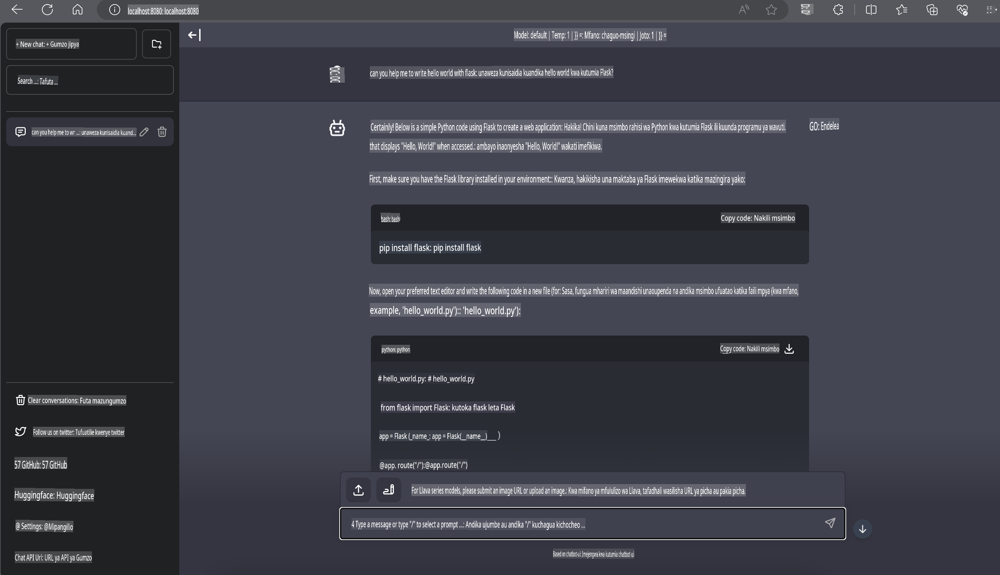

# **Inference Phi-3 katika Nvidia Jetson**

Nvidia Jetson ni mfululizo wa bodi za kompyuta zilizojengewa ndani kutoka Nvidia. Miundo ya Jetson TK1, TX1 na TX2 yote inabeba prosesa ya Tegra (au SoC) kutoka Nvidia ambayo inaunganisha kitengo cha usindikaji wa kati (CPU) cha usanifu wa ARM. Jetson ni mfumo wa matumizi ya nguvu ndogo na umetengenezwa kwa ajili ya kuharakisha matumizi ya ujifunzaji wa mashine. Nvidia Jetson inatumiwa na watengenezaji wa kitaalamu kuunda bidhaa za AI za kisasa katika sekta zote, na na wanafunzi na wapenda teknolojia kwa ajili ya kujifunza AI kwa vitendo na kutengeneza miradi ya kuvutia. SLM inatumiwa kwenye vifaa vya ukingo kama Jetson, ambayo itawezesha utekelezaji bora wa matukio ya matumizi ya AI ya kizazi cha viwandani.

## Utekelezaji kwenye NVIDIA Jetson:
Watengenezaji wanaofanya kazi kwenye roboti zinazojitegemea na vifaa vilivyojengewa ndani wanaweza kutumia Phi-3 Mini. Ukubwa mdogo wa Phi-3 unafanya iwe bora kwa utekelezaji wa ukingo. Vigezo vimepangwa kwa umakini wakati wa mafunzo, kuhakikisha usahihi wa hali ya juu katika majibu.

### Uboreshaji wa TensorRT-LLM:
Maktaba ya [TensorRT-LLM ya NVIDIA](https://github.com/NVIDIA/TensorRT-LLM?WT.mc_id=aiml-138114-kinfeylo) inaboresha utabiri wa mifano mikubwa ya lugha. Inasaidia dirisha refu la muktadha la Phi-3 Mini, likiboresha uwezo wa kusindika na ucheleweshaji. Uboreshaji unajumuisha mbinu kama LongRoPE, FP8, na inflight batching.

### Upatikanaji na Utekelezaji:
Watengenezaji wanaweza kuchunguza Phi-3 Mini na dirisha la muktadha la 128K katika [AI ya NVIDIA](https://www.nvidia.com/en-us/ai-data-science/generative-ai/). Imefungashwa kama NVIDIA NIM, huduma ndogo yenye API ya kawaida ambayo inaweza kutekelezwa mahali popote. Zaidi ya hayo, [utekelezaji wa TensorRT-LLM kwenye GitHub](https://github.com/NVIDIA/TensorRT-LLM).

## **1. Maandalizi**

a. Jetson Orin NX / Jetson NX

b. JetPack 5.1.2+
   
c. Cuda 11.8
   
d. Python 3.8+

## **2. Kuendesha Phi-3 kwenye Jetson**

Tunaweza kuchagua [Ollama](https://ollama.com) au [LlamaEdge](https://llamaedge.com)

Ikiwa unataka kutumia gguf kwenye wingu na vifaa vya ukingo kwa wakati mmoja, LlamaEdge inaweza kueleweka kama WasmEdge (WasmEdge ni mazingira mepesi, yenye utendaji wa hali ya juu, yanayoweza kupanuka ya WebAssembly yanayofaa kwa matumizi ya wingu, ukingo, na yaliyogatuliwa. Inasaidia matumizi ya serverless, kazi zilizojengewa ndani, huduma ndogo, mikataba mahiri na vifaa vya IoT. Unaweza kutekeleza modeli ya gguf kwenye vifaa vya ukingo na wingu kupitia LlamaEdge.


Hizi ni hatua za kutumia:

1. Sakinisha na pakua maktaba na faili zinazohusiana

```bash

curl -sSf https://raw.githubusercontent.com/WasmEdge/WasmEdge/master/utils/install.sh | bash -s -- --plugin wasi_nn-ggml

curl -LO https://github.com/LlamaEdge/LlamaEdge/releases/latest/download/llama-api-server.wasm

curl -LO https://github.com/LlamaEdge/chatbot-ui/releases/latest/download/chatbot-ui.tar.gz

tar xzf chatbot-ui.tar.gz

```

**Kumbuka**: llama-api-server.wasm na chatbot-ui zinapaswa kuwa kwenye saraka moja

2. Endesha maandiko kwenye terminal

```bash

wasmedge --dir .:. --nn-preload default:GGML:AUTO:{Your gguf path} llama-api-server.wasm -p phi-3-chat

```

Hapa ni matokeo ya uendeshaji



***Mfano wa msimbo*** [Phi-3 mini WASM Notebook Sample](https://github.com/Azure-Samples/Phi-3MiniSamples/tree/main/wasm)

Kwa muhtasari, Phi-3 Mini inawakilisha hatua kubwa mbele katika uundaji wa lugha, ikichanganya ufanisi, ufahamu wa muktadha, na uwezo wa uboreshaji wa NVIDIA. Iwe unajenga roboti au programu za ukingo, Phi-3 Mini ni zana yenye nguvu ya kufahamu.

**Kanusho**:  
Hati hii imetafsiriwa kwa kutumia huduma za tafsiri za AI zinazotegemea mashine. Ingawa tunajitahidi kwa usahihi, tafadhali fahamu kuwa tafsiri za kiotomatiki zinaweza kuwa na makosa au kutokuwa sahihi. Hati asili katika lugha yake ya awali inapaswa kuzingatiwa kama chanzo cha mamlaka. Kwa taarifa muhimu, inashauriwa kutumia huduma za tafsiri ya kibinadamu ya kitaalamu. Hatutawajibika kwa kutoelewana au tafsiri zisizo sahihi zinazotokana na matumizi ya tafsiri hii.