# Rekebisha na Kuunganisha Mifano ya Phi-3 Maalum na Prompt Flow katika Azure AI Foundry

Mfano huu wa mwisho hadi mwisho (E2E) umejengwa kwa mwongozo "[Rekebisha na Kuunganisha Mifano ya Phi-3 Maalum na Prompt Flow katika Azure AI Foundry](https://techcommunity.microsoft.com/t5/educator-developer-blog/fine-tune-and-integrate-custom-phi-3-models-with-prompt-flow-in/ba-p/4191726?WT.mc_id=aiml-137032-kinfeylo)" kutoka Microsoft Tech Community. Inatoa maelezo ya mchakato wa kurekebisha, kupeleka, na kuunganisha mifano ya Phi-3 maalum kwa kutumia Prompt Flow ndani ya Azure AI Foundry. Tofauti na mfano wa E2E "[Rekebisha na Kuunganisha Mifano ya Phi-3 Maalum na Prompt Flow](./E2E_Phi-3-FineTuning_PromptFlow_Integration.md)", ambao ulijumuisha kuendesha msimbo kwa ndani, mafunzo haya yanazingatia kabisa kurekebisha na kuunganisha mfano wako ndani ya Azure AI / ML Studio.

## Muhtasari

Katika mfano huu wa E2E, utajifunza jinsi ya kurekebisha mfano wa Phi-3 na kuunganisha na Prompt Flow katika Azure AI Foundry. Kwa kutumia Azure AI / ML Studio, utaanzisha mchakato wa kupeleka na kutumia mifano ya AI maalum. Mfano huu wa E2E umegawanywa katika hali tatu:

**Hali ya 1: Sanidi rasilimali za Azure na Jiandae kwa kurekebisha**

**Hali ya 2: Rekebisha mfano wa Phi-3 na Upeleke katika Azure Machine Learning Studio**

**Hali ya 3: Unganisha na Prompt Flow na Zungumza na mfano wako maalum katika Azure AI Foundry**

Hapa kuna muhtasari wa mfano huu wa E2E.

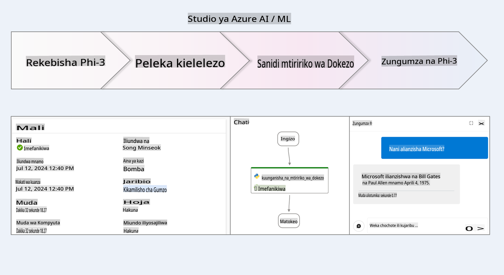

### Jedwali la Yaliyomo

1. **[Hali ya 1: Sanidi rasilimali za Azure na Jiandae kwa kurekebisha](../../../../../../md/02.Application/01.TextAndChat/Phi3)**
    - [Tengeneza Workspace ya Azure Machine Learning](../../../../../../md/02.Application/01.TextAndChat/Phi3)
    - [Omba GPU quotas katika Usajili wa Azure](../../../../../../md/02.Application/01.TextAndChat/Phi3)
    - [Ongeza jukumu la ruhusa](../../../../../../md/02.Application/01.TextAndChat/Phi3)
    - [Sanidi mradi](../../../../../../md/02.Application/01.TextAndChat/Phi3)
    - [Andaa dataset kwa ajili ya kurekebisha](../../../../../../md/02.Application/01.TextAndChat/Phi3)

1. **[Hali ya 2: Rekebisha mfano wa Phi-3 na Upeleke katika Azure Machine Learning Studio](../../../../../../md/02.Application/01.TextAndChat/Phi3)**
    - [Rekebisha mfano wa Phi-3](../../../../../../md/02.Application/01.TextAndChat/Phi3)
    - [Peleka mfano uliorekebishwa wa Phi-3](../../../../../../md/02.Application/01.TextAndChat/Phi3)

1. **[Hali ya 3: Unganisha na Prompt Flow na Zungumza na mfano wako maalum katika Azure AI Foundry](../../../../../../md/02.Application/01.TextAndChat/Phi3)**
    - [Unganisha mfano maalum wa Phi-3 na Prompt Flow](../../../../../../md/02.Application/01.TextAndChat/Phi3)
    - [Zungumza na mfano wako maalum wa Phi-3](../../../../../../md/02.Application/01.TextAndChat/Phi3)

## Hali ya 1: Sanidi rasilimali za Azure na Jiandae kwa kurekebisha

### Tengeneza Workspace ya Azure Machine Learning

1. Andika *azure machine learning* kwenye **kibao cha utafutaji** juu ya ukurasa wa portal na uchague **Azure Machine Learning** kutoka kwa chaguo zilizojitokeza.

    

2. Chagua **+ Create** kutoka kwenye menyu ya urambazaji.

3. Chagua **New workspace** kutoka kwenye menyu ya urambazaji.

    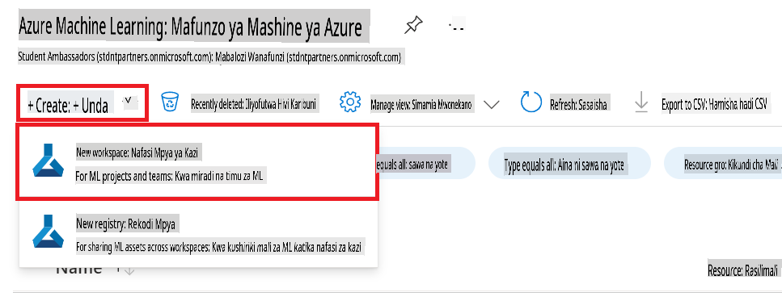

4. Fanya kazi zifuatazo:

    - Chagua **Usajili** wako wa Azure.
    - Chagua **Kikundi cha Rasilimali** cha kutumia (unda kipya ikiwa inahitajika).
    - Weka **Jina la Workspace**. Lazima iwe thamani ya kipekee.
    - Chagua **Eneo** unalopendelea kutumia.
    - Chagua **Akaunti ya Uhifadhi** cha kutumia (unda mpya ikiwa inahitajika).
    - Chagua **Key vault** cha kutumia (unda kipya ikiwa inahitajika).
    - Chagua **Application insights** cha kutumia (unda kipya ikiwa inahitajika).
    - Chagua **Container registry** cha kutumia (unda kipya ikiwa inahitajika).

    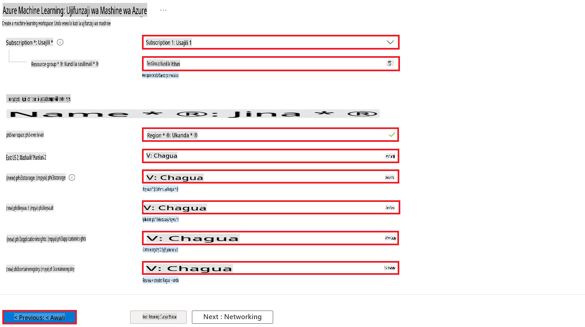

5. Chagua **Review + Create**.

6. Chagua **Create**.

### Omba GPU quotas katika Usajili wa Azure

Katika mafunzo haya, utajifunza jinsi ya kurekebisha na kupeleka mfano wa Phi-3, ukitumia GPUs. Kwa kurekebisha, utatumia *Standard_NC24ads_A100_v4* GPU, ambayo inahitaji ombi la quota. Kwa kupeleka, utatumia *Standard_NC6s_v3* GPU, ambayo pia inahitaji ombi la quota.

> [!NOTE]
>
> Usajili wa Pay-As-You-Go pekee (aina ya kawaida ya usajili) unastahili kwa ugawaji wa GPU; usajili wa faida hauwezi kutumika kwa sasa.
>

1. Tembelea [Azure ML Studio](https://ml.azure.com/home?wt.mc_id=studentamb_279723).

1. Fanya kazi zifuatazo kuomba quota ya *Standard NCADSA100v4 Family*:

    - Chagua **Quota** kutoka kwenye tabo ya upande wa kushoto.
    - Chagua **Virtual machine family** cha kutumia. Kwa mfano, chagua **Standard NCADSA100v4 Family Cluster Dedicated vCPUs**, ambayo inajumuisha GPU ya *Standard_NC24ads_A100_v4*.
    - Chagua **Request quota** kutoka kwenye menyu ya urambazaji.

        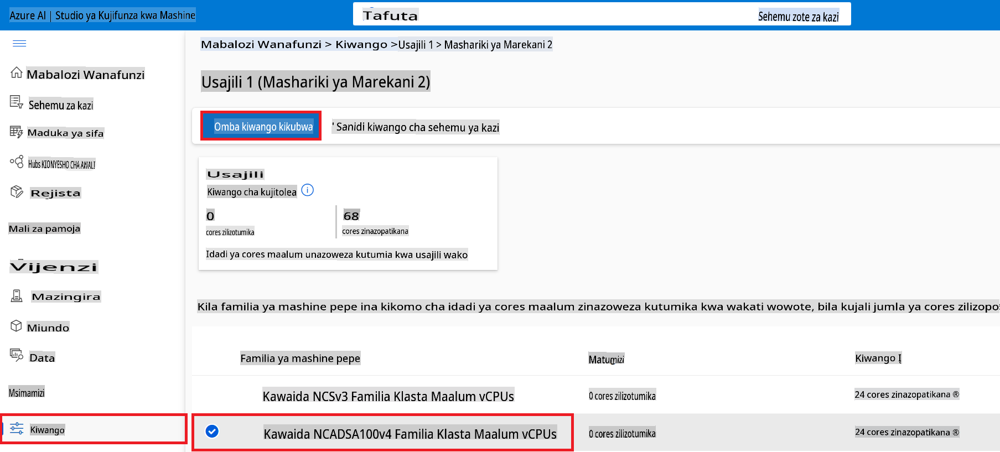

    - Ndani ya ukurasa wa Request quota, weka **New cores limit** unayotaka kutumia. Kwa mfano, 24.
    - Ndani ya ukurasa wa Request quota, chagua **Submit** kuomba quota ya GPU.

1. Fanya kazi zifuatazo kuomba quota ya *Standard NCSv3 Family*:

    - Chagua **Quota** kutoka kwenye tabo ya upande wa kushoto.
    - Chagua **Virtual machine family** cha kutumia. Kwa mfano, chagua **Standard NCSv3 Family Cluster Dedicated vCPUs**, ambayo inajumuisha GPU ya *Standard_NC6s_v3*.
    - Chagua **Request quota** kutoka kwenye menyu ya urambazaji.
    - Ndani ya ukurasa wa Request quota, weka **New cores limit** unayotaka kutumia. Kwa mfano, 24.
    - Ndani ya ukurasa wa Request quota, chagua **Submit** kuomba quota ya GPU.

### Ongeza jukumu la ruhusa

Ili kurekebisha na kupeleka mifano yako, lazima uunde kwanza User Assigned Managed Identity (UAI) na kuipa ruhusa sahihi. UAI hii itatumika kwa uthibitishaji wakati wa kupeleka.

#### Tengeneza User Assigned Managed Identity (UAI)

1. Andika *managed identities* kwenye **kibao cha utafutaji** juu ya ukurasa wa portal na uchague **Managed Identities** kutoka kwa chaguo zilizojitokeza.

    

1. Chagua **+ Create**.

    

1. Fanya kazi zifuatazo:

    - Chagua **Usajili** wako wa Azure.
    - Chagua **Kikundi cha Rasilimali** cha kutumia (unda kipya ikiwa inahitajika).
    - Chagua **Eneo** unalopendelea kutumia.
    - Weka **Jina**. Lazima iwe thamani ya kipekee.

    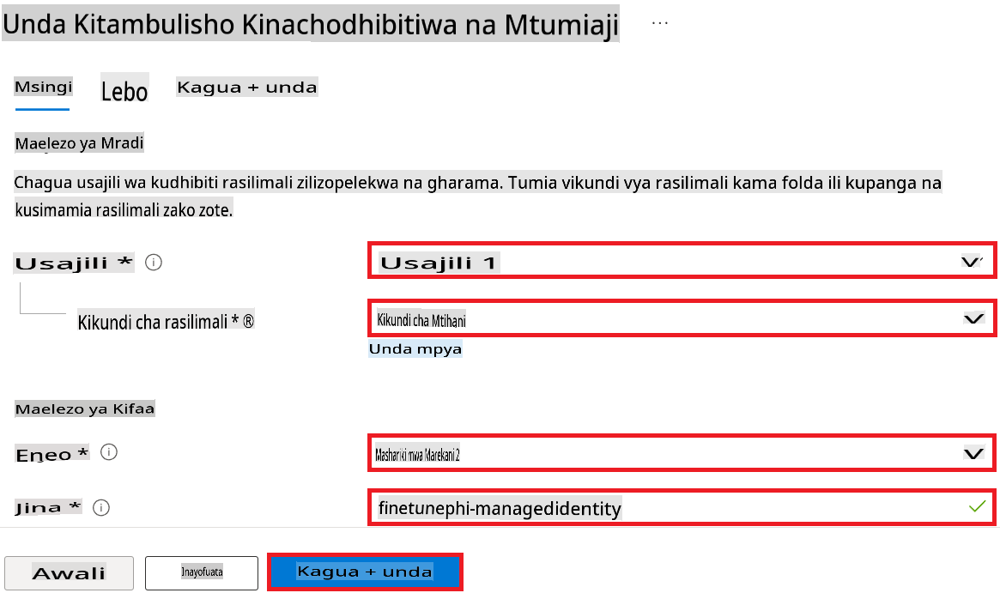

1. Chagua **Review + create**.

1. Chagua **+ Create**.

#### Ongeza jukumu la Contributor kwa Managed Identity

1. Nenda kwenye rasilimali ya Managed Identity uliyoitengeneza.

1. Chagua **Azure role assignments** kutoka kwenye tabo ya upande wa kushoto.

1. Chagua **+Add role assignment** kutoka kwenye menyu ya urambazaji.

1. Ndani ya ukurasa wa Add role assignment, Fanya kazi zifuatazo:
    - Chagua **Scope** kuwa **Resource group**.
    - Chagua **Usajili** wako wa Azure.
    - Chagua **Kikundi cha Rasilimali** cha kutumia.
    - Chagua **Jukumu** kuwa **Contributor**.

    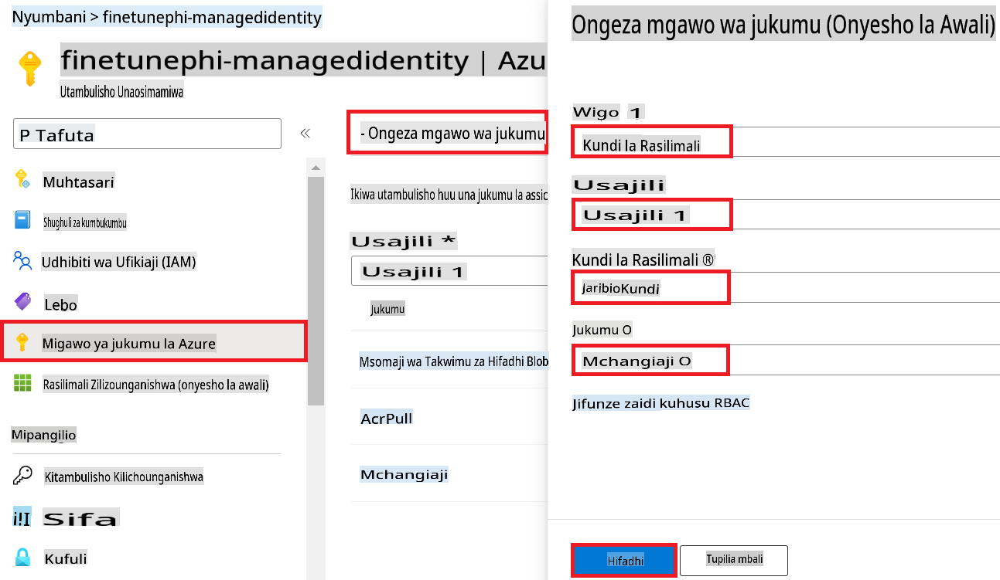

2. Chagua **Save**.

#### Ongeza jukumu la Storage Blob Data Reader kwa Managed Identity

1. Andika *storage accounts* kwenye **kibao cha utafutaji** juu ya ukurasa wa portal na uchague **Storage accounts** kutoka kwa chaguo zilizojitokeza.

    

1. Chagua akaunti ya uhifadhi iliyohusishwa na Azure Machine Learning workspace uliyoitengeneza. Kwa mfano, *finetunephistorage*.

1. Fanya kazi zifuatazo kuingia kwenye ukurasa wa Add role assignment:

    - Nenda kwenye akaunti ya uhifadhi wa Azure uliyoitengeneza.
    - Chagua **Access Control (IAM)** kutoka kwenye tabo ya upande wa kushoto.
    - Chagua **+ Add** kutoka kwenye menyu ya urambazaji.
    - Chagua **Add role assignment** kutoka kwenye menyu ya urambazaji.

    

1. Ndani ya ukurasa wa Add role assignment, Fanya kazi zifuatazo:

    - Ndani ya ukurasa wa Role, andika *Storage Blob Data Reader* kwenye **kibao cha utafutaji** na uchague **Storage Blob Data Reader** kutoka kwa chaguo zilizojitokeza.
    - Ndani ya ukurasa wa Role, chagua **Next**.
    - Ndani ya ukurasa wa Members, chagua **Assign access to** **Managed identity**.
    - Ndani ya ukurasa wa Members, chagua **+ Select members**.
    - Ndani ya ukurasa wa Select managed identities, chagua **Usajili** wako wa Azure.
    - Ndani ya ukurasa wa Select managed identities, chagua **Managed identity** kuwa **Manage Identity**.
    - Ndani ya ukurasa wa Select managed identities, chagua Managed Identity uliyoitengeneza. Kwa mfano, *finetunephi-managedidentity*.
    - Ndani ya ukurasa wa Select managed identities, chagua **Select**.

    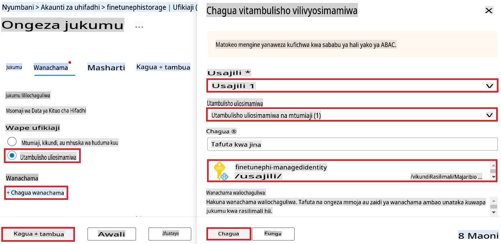

1. Chagua **Review + assign**.

#### Ongeza jukumu la AcrPull kwa Managed Identity

1. Andika *container registries* kwenye **kibao cha utafutaji** juu ya ukurasa wa portal na uchague **Container registries** kutoka kwa chaguo zilizojitokeza.

    

1. Chagua Container Registry iliyohusishwa na Azure Machine Learning workspace. Kwa mfano, *finetunephicontainerregistry*.

1. Fanya kazi zifuatazo kuingia kwenye ukurasa wa Add role assignment:

    - Chagua **Access Control (IAM)** kutoka kwenye tabo ya upande wa kushoto.
    - Chagua **+ Add** kutoka kwenye menyu ya urambazaji.
    - Chagua **Add role assignment** kutoka kwenye menyu ya urambazaji.

1. Ndani ya ukurasa wa Add role assignment, Fanya kazi zifuatazo:

    - Ndani ya ukurasa wa Role, andika *AcrPull* kwenye **kibao cha utafutaji** na uchague **AcrPull** kutoka kwa chaguo zilizojitokeza.
    - Ndani ya ukurasa wa Role, chagua **Next**.
    - Ndani ya ukurasa wa Members, chagua **Assign access to** **Managed identity**.
    - Ndani ya ukurasa wa Members, chagua **+ Select members**.
    - Ndani ya ukurasa wa Select managed identities, chagua **Usajili** wako wa Azure.
    - Ndani ya ukurasa wa Select managed identities, chagua **Managed identity** kuwa **Manage Identity**.
    - Ndani ya ukurasa wa Select managed identities, chagua Managed Identity uliyoitengeneza. Kwa mfano, *finetunephi-managedidentity*.
    - Ndani ya ukurasa wa Select managed identities, chagua **Select**.
    - Chagua **Review + assign**.

### Sanidi mradi

Ili kupakua dataset zinazohitajika kwa kurekebisha, utasanidi mazingira ya ndani.

Katika zoezi hili, utafanya:

- Tengeneza folda ya kufanyia kazi ndani yake.
- Tengeneza mazingira pepe.
- Sakinisha vifurushi vinavyohitajika.
- Tengeneza faili *download_dataset.py* kwa ajili ya kupakua dataset.

#### Tengeneza folda ya kufanyia kazi ndani yake

1. Fungua dirisha la terminal na andika amri ifuatayo kutengeneza folda inayoitwa *finetune-phi* kwenye njia ya msingi.

    ```console
    mkdir finetune-phi
    ```

2. Andika amri ifuatayo ndani ya terminal yako ili kuingia kwenye folda ya *finetune-phi* uliyoitengeneza.

    ```console
    cd finetune-phi
    ```

#### Tengeneza mazingira pepe

1. Andika amri ifuatayo ndani ya terminal yako kutengeneza mazingira pepe yanayoitwa *.venv*.

    ```console
    python -m venv .venv
    ```

2. Andika amri ifuatayo ndani ya terminal yako kuamsha mazingira pepe.

    ```console
    .venv\Scripts\activate.bat
    ```

> [!NOTE]
> Ikiwa imefanikiwa, utaona *(.venv)* kabla ya prompt ya amri.

#### Sakinisha vifurushi vinavyohitajika

1. Andika amri zifuatazo ndani ya terminal yako kusakinisha vifurushi vinavyohitajika.

    ```console
    pip install datasets==2.19.1
    ```

#### Tengeneza `download_dataset.py`

> [!NOTE]
> Muundo kamili wa folda:
>
> ```text
> └── YourUserName
> .    └── finetune-phi
> .        └── download_dataset.py
> ```

1. Fungua **Visual Studio Code**.

1. Chagua **File** kutoka kwenye menyu kuu.

1. Chagua **Open Folder**.

1. Chagua folda ya *finetune-phi* uliyoitengeneza, ambayo iko kwenye *C:\Users\yourUserName\finetune-phi*.

    

1. Katika sehemu ya kushoto ya Visual Studio Code, bofya kulia na uchague **New File** kutengeneza faili mpya inayoitwa *download_dataset.py*.

    

### Andaa dataset kwa ajili ya kurekebisha

Katika zoezi hili, utaendesha faili ya *download_dataset.py* ili kupakua dataset za *ultrachat_200k* kwenye mazingira yako ya ndani. Dataset hizi zitatumika kurekebisha mfano wa Phi-3 katika Azure Machine Learning.

Katika zoezi hili, utafanya:

- Ongeza msimbo kwenye faili *download_dataset.py* ili kupakua dataset.
- Endesha faili *download_dataset.py* kupakua dataset kwenye mazingira yako ya ndani.

#### Pakua dataset yako kwa kutumia *download_dataset.py*

1. Fungua faili ya *download_dataset.py* kwenye Visual Studio Code.

1. Ongeza msimbo ufuatao kwenye faili ya *download_dataset.py*.

    ```python
    import json
    import os
    from datasets import load_dataset

    def load_and_split_dataset(dataset_name, config_name, split_ratio):
        """
        Load and split a dataset.
        """
        # Load the dataset with the specified name, configuration, and split ratio
        dataset = load_dataset(dataset_name, config_name, split=split_ratio)
        print(f"Original dataset size: {len(dataset)}")
        
        # Split the dataset into train and test sets (80% train, 20% test)
        split_dataset = dataset.train_test_split(test_size=0.2)
        print(f"Train dataset size: {len(split_dataset['train'])}")
        print(f"Test dataset size: {len(split_dataset['test'])}")
        
        return split_dataset

    def save_dataset_to_jsonl(dataset, filepath):
        """
        Save a dataset to a JSONL file.
        """
        # Create the directory if it does not exist
        os.makedirs(os.path.dirname(filepath), exist_ok=True)
        
        # Open the file in write mode
        with open(filepath, 'w', encoding='utf-8') as f:
            # Iterate over each record in the dataset
            for record in dataset:
                # Dump the record as a JSON object and write it to the file
                json.dump(record, f)
                # Write a newline character to separate records
                f.write('\n')
        
        print(f"Dataset saved to {filepath}")

    def main():
        """
        Main function to load, split, and save the dataset.
        """
        # Load and split the ULTRACHAT_200k dataset with a specific configuration and split ratio
        dataset = load_and_split_dataset("HuggingFaceH4/ultrachat_200k", 'default', 'train_sft[:1%]')
        
        # Extract the train and test datasets from the split
        train_dataset = dataset['train']
        test_dataset = dataset['test']

        # Save the train dataset to a JSONL file
        save_dataset_to_jsonl(train_dataset, "data/train_data.jsonl")
        
        # Save the test dataset to a separate JSONL file
        save_dataset_to_jsonl(test_dataset, "data/test_data.jsonl")

    if __name__ == "__main__":
        main()

    ```

1. Andika amri ifuatayo ndani ya terminal yako kuendesha script na kupakua dataset kwenye mazingira yako ya ndani.

    ```console
    python download_dataset.py
    ```

1. Hakikisha dataset zimehifadhiwa kwa mafanikio kwenye saraka yako ya ndani ya *finetune-phi/data*.

> [!NOTE]
>
> #### Kumbuka kuhusu ukubwa wa dataset na muda wa kurekebisha
>
> Katika mafunzo haya, unatumia tu 1% ya dataset (`split='
1. Tembelea [Azure ML Studio](https://ml.azure.com/home?wt.mc_id=studentamb_279723).

1. Chagua **Compute** kutoka kwenye menyu ya upande wa kushoto.

1. Chagua **Compute clusters** kutoka kwenye menyu ya urambazaji.

1. Chagua **+ New**.

    

1. Fanya yafuatayo:

    - Chagua **Region** unayotaka kutumia.
    - Chagua **Virtual machine tier** kuwa **Dedicated**.
    - Chagua **Virtual machine type** kuwa **GPU**.
    - Chuja **Virtual machine size** kwa kuchagua **Select from all options**.
    - Chagua **Virtual machine size** kuwa **Standard_NC24ads_A100_v4**.

    

1. Chagua **Next**.

1. Fanya yafuatayo:

    - Weka **Compute name**. Lazima iwe thamani ya kipekee.
    - Chagua **Minimum number of nodes** kuwa **0**.
    - Chagua **Maximum number of nodes** kuwa **1**.
    - Chagua **Idle seconds before scale down** kuwa **120**.

    

1. Chagua **Create**.

#### Rekebisha Phi-3 Model

1. Tembelea [Azure ML Studio](https://ml.azure.com/home?wt.mc_id=studentamb_279723).

1. Chagua Azure Machine Learning workspace uliyoanzisha.

    

1. Fanya yafuatayo:

    - Chagua **Model catalog** kutoka kwenye menyu ya upande wa kushoto.
    - Andika *phi-3-mini-4k* kwenye **search bar** na uchague **Phi-3-mini-4k-instruct** kutoka kwenye chaguo zinazoonekana.

    

1. Chagua **Fine-tune** kutoka kwenye menyu ya urambazaji.

    

1. Fanya yafuatayo:

    - Chagua **Select task type** kuwa **Chat completion**.
    - Chagua **+ Select data** ili kupakia **Training data**.
    - Chagua Validation data upload type kuwa **Provide different validation data**.
    - Chagua **+ Select data** ili kupakia **Validation data**.

    

    > [!TIP]
    >
    > Unaweza kuchagua **Advanced settings** ili kubinafsisha mipangilio kama **learning_rate** na **lr_scheduler_type** ili kuboresha mchakato wa fine-tuning kulingana na mahitaji yako maalum.

1. Chagua **Finish**.

1. Katika zoezi hili, umefanikiwa kufanya fine-tuning ya Phi-3 model ukitumia Azure Machine Learning. Tafadhali kumbuka kuwa mchakato wa fine-tuning unaweza kuchukua muda mrefu. Baada ya kuendesha kazi ya fine-tuning, utahitaji kusubiri hadi itakapokamilika. Unaweza kufuatilia hali ya kazi ya fine-tuning kwa kwenda kwenye tabo ya Jobs upande wa kushoto wa Azure Machine Learning Workspace yako. Katika mfululizo unaofuata, utapeleka model iliyofanyiwa fine-tuning na kuunganisha na Prompt flow.

    

### Peleka Phi-3 Model iliyofanyiwa Fine-Tuning

Ili kuunganisha Phi-3 model iliyofanyiwa fine-tuning na Prompt flow, unahitaji kupeleka model hiyo ili iweze kufikiwa kwa wakati halisi. Mchakato huu unahusisha kusajili model, kuunda endpoint ya mtandaoni, na kupeleka model.

Katika zoezi hili, utafanya:

- Sajili model iliyofanyiwa fine-tuning kwenye Azure Machine Learning workspace.
- Unda endpoint ya mtandaoni.
- Peleka Phi-3 model iliyosajiliwa.

#### Sajili Model Iliyofanyiwa Fine-Tuning

1. Tembelea [Azure ML Studio](https://ml.azure.com/home?wt.mc_id=studentamb_279723).

1. Chagua Azure Machine Learning workspace uliyoanzisha.

    

1. Chagua **Models** kutoka kwenye menyu ya upande wa kushoto.
1. Chagua **+ Register**.
1. Chagua **From a job output**.

    

1. Chagua kazi uliyoanzisha.

    

1. Chagua **Next**.

1. Chagua **Model type** kuwa **MLflow**.

1. Hakikisha kwamba **Job output** imechaguliwa; inapaswa kuchaguliwa kiotomatiki.

    

2. Chagua **Next**.

3. Chagua **Register**.

    

4. Unaweza kuona model uliyosajili kwa kwenda kwenye menyu ya **Models** kutoka upande wa kushoto.

    

#### Peleka Model Iliyofanyiwa Fine-Tuning

1. Nenda kwenye Azure Machine Learning workspace uliyoanzisha.

1. Chagua **Endpoints** kutoka kwenye menyu ya upande wa kushoto.

1. Chagua **Real-time endpoints** kutoka kwenye menyu ya urambazaji.

    

1. Chagua **Create**.

1. Chagua model iliyosajiliwa uliyoanzisha.

    

1. Chagua **Select**.

1. Fanya yafuatayo:

    - Chagua **Virtual machine** kuwa *Standard_NC6s_v3*.
    - Chagua **Instance count** unayotaka kutumia. Kwa mfano, *1*.
    - Chagua **Endpoint** kuwa **New** ili kuunda endpoint.
    - Weka **Endpoint name**. Lazima iwe thamani ya kipekee.
    - Weka **Deployment name**. Lazima iwe thamani ya kipekee.

    

1. Chagua **Deploy**.

> [!WARNING]
> Ili kuepuka gharama za ziada kwenye akaunti yako, hakikisha unafuta endpoint iliyoundwa kwenye Azure Machine Learning workspace.
>

#### Angalia Hali ya Deployment katika Azure Machine Learning Workspace

1. Nenda kwenye Azure Machine Learning workspace uliyoanzisha.

1. Chagua **Endpoints** kutoka kwenye menyu ya upande wa kushoto.

1. Chagua endpoint uliyoanzisha.

    

1. Kwenye ukurasa huu, unaweza kusimamia endpoints wakati wa mchakato wa deployment.

> [!NOTE]
> Mara baada ya deployment kukamilika, hakikisha kwamba **Live traffic** imewekwa kuwa **100%**. Ikiwa haipo, chagua **Update traffic** kurekebisha mipangilio ya trafiki. Kumbuka kwamba huwezi kujaribu model ikiwa trafiki imewekwa kuwa 0%.
>
> 
>

## Hali ya 3: Unganisha na Prompt Flow na Kuzungumza na Model Yako Maalum katika Azure AI Foundry

### Unganisha Phi-3 Model Maalum na Prompt Flow

Baada ya kufanikisha kupeleka model yako iliyofanyiwa fine-tuning, sasa unaweza kuunganisha na Prompt Flow ili kutumia model yako katika matumizi ya wakati halisi, na kuwezesha aina mbalimbali za kazi za maingiliano na model yako maalum ya Phi-3.

Katika zoezi hili, utafanya:

- Unda Azure AI Foundry Hub.
- Unda Azure AI Foundry Project.
- Unda Prompt flow.
- Ongeza muunganisho maalum kwa Phi-3 model iliyofanyiwa fine-tuning.
- Sanidi Prompt flow kuzungumza na Phi-3 model yako maalum.

> [!NOTE]
> Unaweza pia kuunganisha na Prompt Flow ukitumia Azure ML Studio. Mchakato wa kuunganisha ni sawa kwa Azure ML Studio.

#### Unda Azure AI Foundry Hub

Unahitaji kuunda Hub kabla ya kuunda Project. Hub hufanya kazi kama Resource Group, ikikuruhusu kupanga na kusimamia miradi mingi ndani ya Azure AI Foundry.

1. Tembelea [Azure AI Foundry](https://ai.azure.com/?WT.mc_id=aiml-137032-kinfeylo).

1. Chagua **All hubs** kutoka kwenye menyu ya upande wa kushoto.

1. Chagua **+ New hub** kutoka kwenye menyu ya urambazaji.

    

1. Fanya yafuatayo:

    - Weka **Hub name**. Lazima iwe thamani ya kipekee.
    - Chagua **Subscription** yako ya Azure.
    - Chagua **Resource group** ya kutumia (unda mpya ikiwa inahitajika).
    - Chagua **Location** unayotaka kutumia.
    - Chagua **Connect Azure AI Services** ya kutumia (unda mpya ikiwa inahitajika).
    - Chagua **Connect Azure AI Search** kuwa **Skip connecting**.

    

1. Chagua **Next**.

#### Unda Azure AI Foundry Project

1. Katika Hub uliyoanzisha, chagua **All projects** kutoka kwenye menyu ya upande wa kushoto.

1. Chagua **+ New project** kutoka kwenye menyu ya urambazaji.

    

1. Weka **Project name**. Lazima iwe thamani ya kipekee.

    

1. Chagua **Create a project**.

#### Ongeza Muunganisho Maalum kwa Phi-3 Model Iliyofanyiwa Fine-Tuning

Ili kuunganisha Phi-3 model yako maalum na Prompt Flow, unahitaji kuhifadhi endpoint ya model na key katika muunganisho maalum. Mpangilio huu unahakikisha upatikanaji wa model yako maalum ya Phi-3 ndani ya Prompt Flow.

#### Weka Api Key na Endpoint URI ya Phi-3 Model Iliyofanyiwa Fine-Tuning

1. Tembelea [Azure ML Studio](https://ml.azure.com/home?WT.mc_id=aiml-137032-kinfeylo).

1. Nenda kwenye Azure Machine Learning workspace uliyoanzisha.

1. Chagua **Endpoints** kutoka kwenye menyu ya upande wa kushoto.

    

1. Chagua endpoint uliyoanzisha.

    

1. Chagua **Consume** kutoka kwenye menyu ya urambazaji.

1. Nakili **REST endpoint** yako na **Primary key** yako.


#### Ongeza Muunganisho Maalum

1. Tembelea [Azure AI Foundry](https://ai.azure.com/?WT.mc_id=aiml-137032-kinfeylo).

1. Nenda kwenye mradi wa Azure AI Foundry uliouunda.

1. Katika mradi uliouunda, chagua **Settings** kutoka kwenye tab ya upande wa kushoto.

1. Chagua **+ New connection**.

    

1. Chagua **Custom keys** kutoka kwenye menyu ya urambazaji.

    

1. Fanya yafuatayo:

    - Chagua **+ Add key value pairs**.
    - Kwa jina la ufunguo, ingiza **endpoint** na bandika endpoint uliyonakili kutoka Azure ML Studio kwenye sehemu ya thamani.
    - Chagua **+ Add key value pairs** tena.
    - Kwa jina la ufunguo, ingiza **key** na bandika ufunguo uliyonakili kutoka Azure ML Studio kwenye sehemu ya thamani.
    - Baada ya kuongeza funguo, chagua **is secret** ili kuzuia ufunguo kuonekana wazi.

    

1. Chagua **Add connection**.

#### Unda Prompt flow

Umeongeza muunganisho maalum katika Azure AI Foundry. Sasa, wacha tuunde Prompt flow kwa kutumia hatua zifuatazo. Kisha, utaunganisha Prompt flow hii na muunganisho maalum ili uweze kutumia modeli iliyoboreshwa ndani ya Prompt flow.

1. Nenda kwenye mradi wa Azure AI Foundry uliouunda.

1. Chagua **Prompt flow** kutoka kwenye tab ya upande wa kushoto.

1. Chagua **+ Create** kutoka kwenye menyu ya urambazaji.

    

1. Chagua **Chat flow** kutoka kwenye menyu ya urambazaji.

    

1. Ingiza **Folder name** ya kutumia.

    

2. Chagua **Create**.

#### Sanidi Prompt flow kuzungumza na modeli yako maalum ya Phi-3

Unahitaji kuunganisha modeli iliyoboreshwa ya Phi-3 katika Prompt flow. Hata hivyo, Prompt flow iliyopo haijasanidiwa kwa madhumuni haya. Kwa hiyo, lazima upange upya Prompt flow ili kuwezesha ujumuishaji wa modeli maalum.

1. Katika Prompt flow, fanya yafuatayo ili kujenga upya mtiririko uliopo:

    - Chagua **Raw file mode**.
    - Futa msimbo wote uliopo kwenye faili *flow.dag.yml*.
    - Ongeza msimbo ufuatao kwenye faili *flow.dag.yml*.

        ```yml
        inputs:
          input_data:
            type: string
            default: "Who founded Microsoft?"

        outputs:
          answer:
            type: string
            reference: ${integrate_with_promptflow.output}

        nodes:
        - name: integrate_with_promptflow
          type: python
          source:
            type: code
            path: integrate_with_promptflow.py
          inputs:
            input_data: ${inputs.input_data}
        ```

    - Chagua **Save**.

    

1. Ongeza msimbo ufuatao kwenye faili *integrate_with_promptflow.py* ili kutumia modeli maalum ya Phi-3 katika Prompt flow.

    ```python
    import logging
    import requests
    from promptflow import tool
    from promptflow.connections import CustomConnection

    # Logging setup
    logging.basicConfig(
        format="%(asctime)s - %(levelname)s - %(name)s - %(message)s",
        datefmt="%Y-%m-%d %H:%M:%S",
        level=logging.DEBUG
    )
    logger = logging.getLogger(__name__)

    def query_phi3_model(input_data: str, connection: CustomConnection) -> str:
        """
        Send a request to the Phi-3 model endpoint with the given input data using Custom Connection.
        """

        # "connection" is the name of the Custom Connection, "endpoint", "key" are the keys in the Custom Connection
        endpoint_url = connection.endpoint
        api_key = connection.key

        headers = {
            "Content-Type": "application/json",
            "Authorization": f"Bearer {api_key}"
        }
        data = {
            "input_data": {
                "input_string": [
                    {"role": "user", "content": input_data}
                ],
                "parameters": {
                    "temperature": 0.7,
                    "max_new_tokens": 128
                }
            }
        }
        try:
            response = requests.post(endpoint_url, json=data, headers=headers)
            response.raise_for_status()
            
            # Log the full JSON response
            logger.debug(f"Full JSON response: {response.json()}")

            result = response.json()["output"]
            logger.info("Successfully received response from Azure ML Endpoint.")
            return result
        except requests.exceptions.RequestException as e:
            logger.error(f"Error querying Azure ML Endpoint: {e}")
            raise

    @tool
    def my_python_tool(input_data: str, connection: CustomConnection) -> str:
        """
        Tool function to process input data and query the Phi-3 model.
        """
        return query_phi3_model(input_data, connection)

    ```

    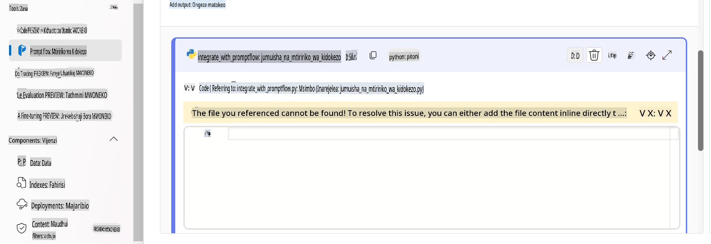

> [!NOTE]
> Kwa maelezo zaidi juu ya kutumia Prompt flow katika Azure AI Foundry, unaweza kurejelea [Prompt flow in Azure AI Foundry](https://learn.microsoft.com/azure/ai-studio/how-to/prompt-flow).

1. Chagua **Chat input**, **Chat output** ili kuwezesha mazungumzo na modeli yako.

    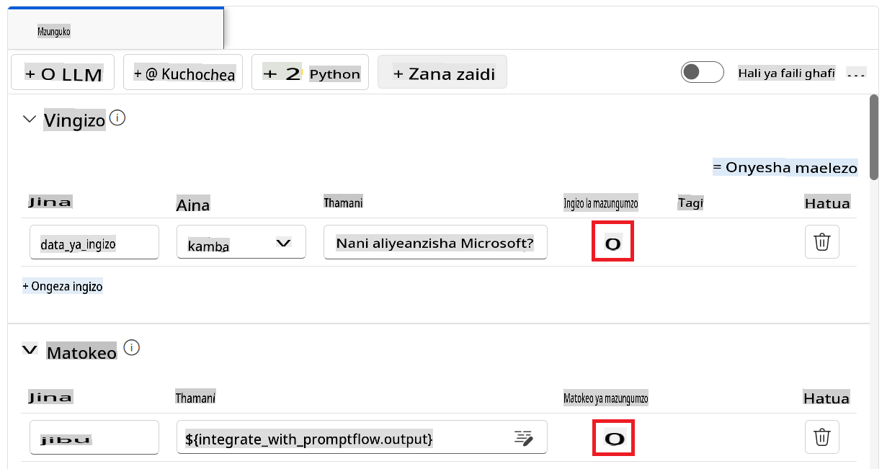

1. Sasa uko tayari kuzungumza na modeli yako maalum ya Phi-3. Katika zoezi lijalo, utajifunza jinsi ya kuanza Prompt flow na kuitumia kuzungumza na modeli yako iliyoboreshwa ya Phi-3.

> [!NOTE]
>
> Mtiririko uliobadilishwa unapaswa kuonekana kama picha hapa chini:
>
> 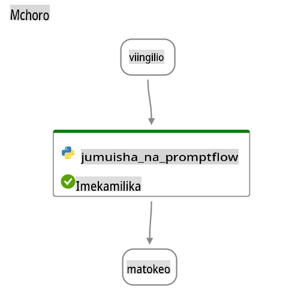
>

### Zungumza na modeli yako maalum ya Phi-3

Sasa kwa kuwa umeboresha na kuunganisha modeli yako maalum ya Phi-3 na Prompt flow, uko tayari kuanza kuingiliana nayo. Zoezi hili litakuongoza katika mchakato wa kusanidi na kuanzisha mazungumzo na modeli yako kwa kutumia Prompt flow. Kwa kufuata hatua hizi, utaweza kutumia kikamilifu uwezo wa modeli yako iliyoboreshwa ya Phi-3 kwa kazi mbalimbali na mazungumzo.

- Zungumza na modeli yako maalum ya Phi-3 kwa kutumia Prompt flow.

#### Anzisha Prompt flow

1. Chagua **Start compute sessions** ili kuanza Prompt flow.

    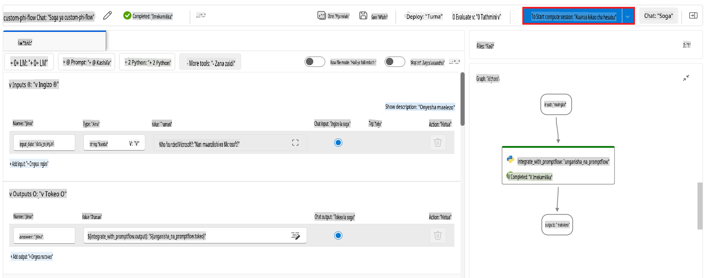

1. Chagua **Validate and parse input** ili kusasisha vigezo.

    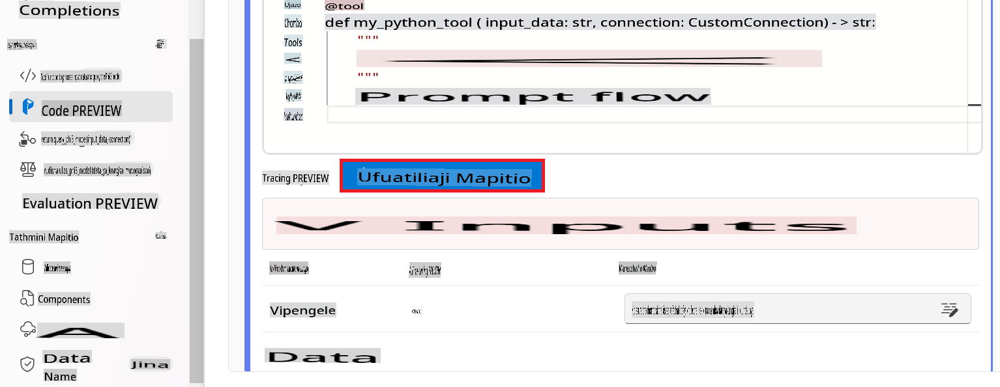

1. Chagua **Value** ya **connection** kwa muunganisho maalum uliouunda. Kwa mfano, *connection*.

    

#### Zungumza na modeli yako maalum

1. Chagua **Chat**.

    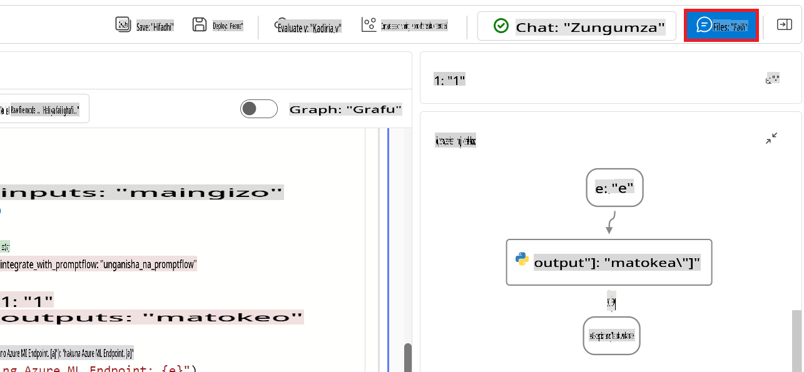

1. Hapa kuna mfano wa matokeo: Sasa unaweza kuzungumza na modeli yako maalum ya Phi-3. Inapendekezwa kuuliza maswali kulingana na data iliyotumika katika kuboresha modeli.

    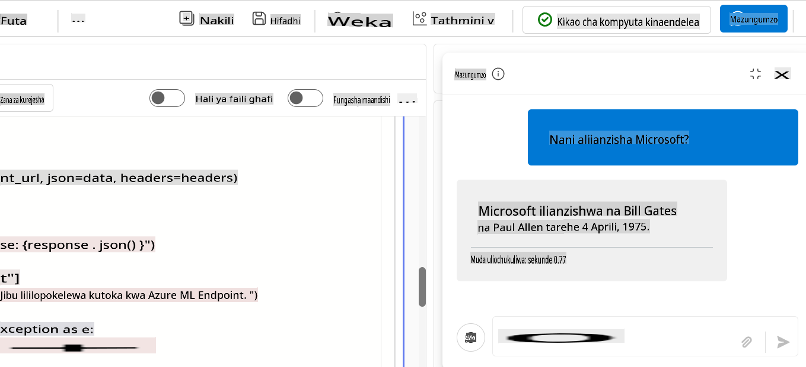

**Kanusho**:  
Hati hii imetafsiriwa kwa kutumia huduma za kutafsiri za AI zinazotegemea mashine. Ingawa tunajitahidi kuhakikisha usahihi, tafadhali fahamu kwamba tafsiri za kiotomatiki zinaweza kuwa na makosa au kutokuwa sahihi. Hati ya asili katika lugha yake ya kiasili inapaswa kuzingatiwa kama chanzo chenye mamlaka. Kwa maelezo muhimu, inapendekezwa kutumia huduma za mtafsiri mtaalamu wa binadamu. Hatutawajibika kwa kutoelewana au tafsiri zisizo sahihi zinazotokana na matumizi ya tafsiri hii.