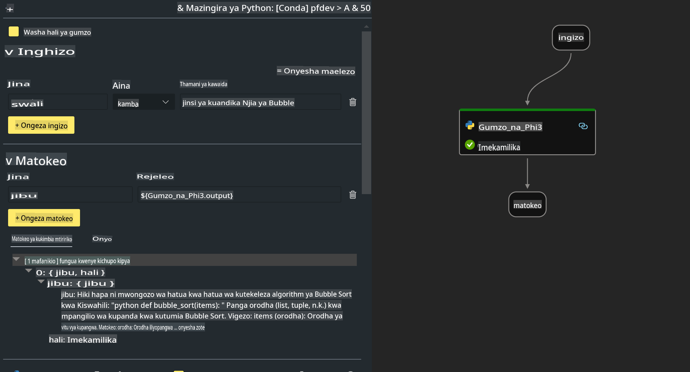

# **Maabara ya 2 - Kuendesha Prompt flow na Phi-3-mini kwenye AIPC**

## **Prompt flow ni nini**

Prompt flow ni seti ya zana za maendeleo zilizoundwa ili kurahisisha mzunguko mzima wa maendeleo ya programu za AI zinazotegemea LLM, kuanzia mawazo, utengenezaji wa mfano, majaribio, tathmini hadi utekelezaji na ufuatiliaji wa uzalishaji. Inarahisisha sana uhandisi wa prompt na inakuwezesha kujenga programu za LLM zenye ubora wa uzalishaji.

Kwa kutumia prompt flow, utaweza:

- Kuunda mifumo inayounganisha LLMs, prompt, msimbo wa Python na zana nyingine kwenye mtiririko wa kazi unaoweza kutekelezeka.

- Kutatua hitilafu na kuboresha mifumo yako, hasa mwingiliano na LLMs kwa urahisi.

- Kutathmini mifumo yako, kuhesabu vipimo vya ubora na utendaji kwa kutumia seti kubwa za data.

- Kujumuisha majaribio na tathmini kwenye mfumo wako wa CI/CD ili kuhakikisha ubora wa mfumo wako.

- Kuweka mifumo yako kwenye jukwaa la kuhudumia unalochagua au kuiunganisha kwa urahisi kwenye msingi wa msimbo wa programu yako.

- (Si lazima lakini inashauriwa sana) Kushirikiana na timu yako kwa kutumia toleo la wingu la Prompt flow kwenye Azure AI.

## **AIPC ni nini**

Kompyuta ya AI (AI PC) ina CPU, GPU, na NPU, kila moja ikiwa na uwezo maalum wa kuongeza kasi ya AI. NPU, au neural processing unit, ni kiongeza kasi maalum kinachoshughulikia kazi za akili bandia (AI) na ujifunzaji wa mashine (ML) moja kwa moja kwenye PC yako badala ya kutuma data kuchakatwa kwenye wingu. GPU na CPU pia zinaweza kushughulikia kazi hizi, lakini NPU ni bora hasa kwa mahesabu ya AI yenye matumizi madogo ya nguvu. AI PC inawakilisha mabadiliko makubwa katika jinsi kompyuta zetu zinavyofanya kazi. Sio suluhisho la tatizo ambalo halikuwepo awali. Badala yake, inaahidi kuwa maboresho makubwa kwa matumizi ya kila siku ya PC.

Kwa hivyo inafanyaje kazi? Ikilinganishwa na AI ya kizazi na mifano mikubwa ya lugha (LLMs) iliyofunzwa kwa data nyingi ya umma, AI ambayo itafanyika kwenye PC yako inapatikana zaidi katika kila ngazi. Dhana yake ni rahisi kuelewa, na kwa kuwa imefunzwa kwa data yako, bila haja ya kufikia wingu, faida zake zinavutia zaidi mara moja kwa idadi kubwa ya watu.

Kwa muda mfupi, ulimwengu wa AI PC unahusisha wasaidizi wa kibinafsi na mifano midogo ya AI inayoendesha moja kwa moja kwenye PC yako, ikitumia data yako kutoa maboresho ya AI ya kibinafsi, ya faragha, na salama zaidi kwa mambo unayofanya kila siku – kuchukua muhtasari wa mikutano, kupanga ligi ya mpira wa miguu ya kufikirika, kuendesha maboresho ya kiotomatiki kwa uhariri wa picha na video, au kupanga ratiba kamilifu ya mkutano wa familia kulingana na nyakati za kuwasili na kuondoka za kila mtu.

## **Kujenga mtiririko wa msimbo wa kizazi kwenye AIPC**

***Kumbuka***: Ikiwa bado hujakamilisha usakinishaji wa mazingira, tafadhali tembelea [Lab 0 -Installations](./01.Installations.md)

1. Fungua Kiendelezi cha Prompt flow katika Visual Studio Code na unda mradi mtupu wa mtiririko.


2. Ongeza vigezo vya Ingizo na Matokeo na Ongeza Msimbo wa Python kama mtiririko mpya.



Unaweza kurejelea muundo huu (flow.dag.yaml) ili kujenga mtiririko wako:

```yaml

inputs:
  question:
    type: string
    default: how to write Bubble Algorithm
outputs:
  answer:
    type: string
    reference: ${Chat_With_Phi3.output}
nodes:
- name: Chat_With_Phi3
  type: python
  source:
    type: code
    path: Chat_With_Phi3.py
  inputs:
    question: ${inputs.question}


```

3. Ongeza Msimbo katika ***Chat_With_Phi3.py***

```python


from promptflow.core import tool

# import torch
from transformers import AutoTokenizer, pipeline,TextStreamer
import intel_npu_acceleration_library as npu_lib

import warnings

import asyncio
import platform

class Phi3CodeAgent:
    
    model = None
    tokenizer = None
    text_streamer = None
    
    model_id = "microsoft/Phi-3-mini-4k-instruct"

    @staticmethod
    def init_phi3():
        
        if Phi3CodeAgent.model is None or Phi3CodeAgent.tokenizer is None or Phi3CodeAgent.text_streamer is None:
            Phi3CodeAgent.model = npu_lib.NPUModelForCausalLM.from_pretrained(
                                    Phi3CodeAgent.model_id,
                                    torch_dtype="auto",
                                    dtype=npu_lib.int4,
                                    trust_remote_code=True
                                )
            Phi3CodeAgent.tokenizer = AutoTokenizer.from_pretrained(Phi3CodeAgent.model_id)
            Phi3CodeAgent.text_streamer = TextStreamer(Phi3CodeAgent.tokenizer, skip_prompt=True)

    

    @staticmethod
    def chat_with_phi3(prompt):
        
        Phi3CodeAgent.init_phi3()

        messages = "<|system|>You are a AI Python coding assistant. Please help me to generate code in Python.The answer only genertated Python code, but any comments and instructions do not need to be generated<|end|><|user|>" + prompt +"<|end|><|assistant|>"


        generation_args = {
            "max_new_tokens": 1024,
            "return_full_text": False,
            "temperature": 0.3,
            "do_sample": False,
            "streamer": Phi3CodeAgent.text_streamer,
        }

        pipe = pipeline(
            "text-generation",
            model=Phi3CodeAgent.model,
            tokenizer=Phi3CodeAgent.tokenizer,
            # **generation_args
        )

        result = ''

        with warnings.catch_warnings():
            warnings.simplefilter("ignore")
            response = pipe(messages, **generation_args)
            result =response[0]['generated_text']
            return result


@tool
def my_python_tool(question: str) -> str:
    if platform.system() == 'Windows':
        asyncio.set_event_loop_policy(asyncio.WindowsSelectorEventLoopPolicy())
    return Phi3CodeAgent.chat_with_phi3(question)


```

4. Unaweza kujaribu mtiririko kutoka kwa Debug au Run ili kuthibitisha kama msimbo wa kizazi uko sawa au la.


5. Endesha mtiririko kama API ya maendeleo kwenye terminal.

```

pf flow serve --source ./ --port 8080 --host localhost   

```

Unaweza kuujaribu kwenye Postman / Thunder Client.

### **Kumbuka**

1. Uendeshaji wa kwanza huchukua muda mrefu. Inashauriwa kupakua mfano wa phi-3 kutoka kwa Hugging face CLI.

2. Kwa kuzingatia uwezo mdogo wa kuchakata wa Intel NPU, inashauriwa kutumia Phi-3-mini-4k-instruct.

3. Tunatumia Uharakishaji wa Intel NPU kubadilisha INT4, lakini ikiwa utaendesha huduma tena, unahitaji kufuta folda za cache na nc_workshop.

## **Rasilimali**

1. Jifunze kuhusu Promptflow [https://microsoft.github.io/promptflow/](https://microsoft.github.io/promptflow/)

2. Jifunze kuhusu Intel NPU Acceleration [https://github.com/intel/intel-npu-acceleration-library](https://github.com/intel/intel-npu-acceleration-library)

3. Msimbo wa Mfano, pakua [Local NPU Agent Sample Code](../../../../../../../../../code/07.Lab/01/AIPC)

**Kanusho**:  
Hati hii imetafsiriwa kwa kutumia huduma za tafsiri za AI zinazotegemea mashine. Ingawa tunajitahidi kwa usahihi, tafadhali fahamu kuwa tafsiri za kiotomatiki zinaweza kuwa na makosa au dosari. Hati ya asili katika lugha yake ya awali inapaswa kuzingatiwa kama chanzo rasmi. Kwa taarifa muhimu, inashauriwa kutumia huduma za wataalamu wa tafsiri za kibinadamu. Hatutawajibika kwa kutoelewana au tafsiri zisizo sahihi zinazotokana na matumizi ya tafsiri hii.