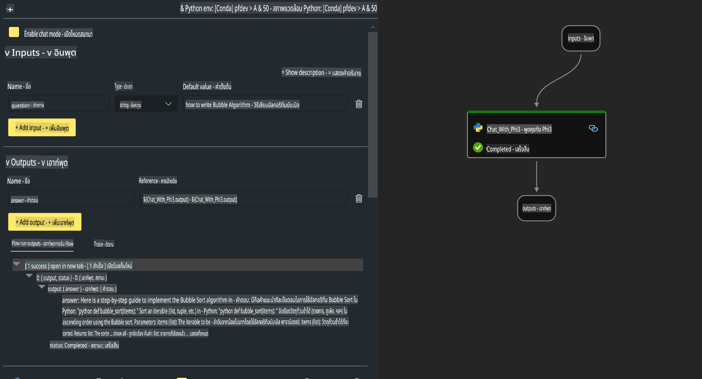

# **Lab 2 - รัน Prompt flow ด้วย Phi-3-mini บน AIPC**

## **Prompt flow คืออะไร**

Prompt flow คือชุดเครื่องมือสำหรับการพัฒนา ที่ออกแบบมาเพื่อทำให้กระบวนการพัฒนาครบวงจรของแอปพลิเคชัน AI ที่ใช้ LLM ง่ายขึ้น ตั้งแต่การระดมความคิด การสร้างต้นแบบ การทดสอบ การประเมินผล จนถึงการนำไปใช้งานจริงและการตรวจสอบประสิทธิภาพ โดยช่วยให้การทำงานด้าน prompt engineering ง่ายขึ้น และช่วยให้คุณสามารถสร้างแอป LLM ที่มีคุณภาพระดับการผลิตได้

ด้วย Prompt flow คุณสามารถ:

- สร้าง flow ที่เชื่อมต่อ LLMs, prompt, โค้ด Python และเครื่องมืออื่นๆ เข้าด้วยกันในรูปแบบ workflow ที่สามารถรันได้

- ดีบักและปรับปรุง flow ของคุณ โดยเฉพาะการโต้ตอบกับ LLMs ได้อย่างง่ายดาย

- ประเมิน flow ของคุณ และคำนวณตัวชี้วัดด้านคุณภาพและประสิทธิภาพด้วยชุดข้อมูลขนาดใหญ่

- รวมการทดสอบและการประเมินผลเข้ากับระบบ CI/CD ของคุณเพื่อรับรองคุณภาพของ flow

- นำ flow ของคุณไปใช้งานบนแพลตฟอร์มที่คุณเลือก หรือรวมเข้ากับโค้ดของแอปพลิเคชันของคุณได้อย่างง่ายดาย

- (ตัวเลือกที่แนะนำอย่างยิ่ง) ทำงานร่วมกับทีมของคุณโดยใช้เวอร์ชันคลาวด์ของ Prompt flow บน Azure AI


## **สร้าง generation code flows บน Apple Silicon**

***หมายเหตุ***: หากคุณยังไม่ได้ติดตั้งสภาพแวดล้อม โปรดไปที่ [Lab 0 - Installations](./01.Installations.md)

1. เปิดส่วนขยาย Prompt flow ใน Visual Studio Code และสร้างโปรเจกต์ flow เปล่า


2. เพิ่มพารามิเตอร์ Inputs และ Outputs และเพิ่มโค้ด Python เป็น flow ใหม่



คุณสามารถอ้างอิงโครงสร้างนี้ (flow.dag.yaml) เพื่อสร้าง flow ของคุณ

```yaml

inputs:
  prompt:
    type: string
    default: Write python code for Fibonacci serie. Please use markdown as output
outputs:
  result:
    type: string
    reference: ${gen_code_by_phi3.output}
nodes:
- name: gen_code_by_phi3
  type: python
  source:
    type: code
    path: gen_code_by_phi3.py
  inputs:
    prompt: ${inputs.prompt}


```

3. ควอนไทซ์ phi-3-mini

เราอยากให้ SLM ทำงานได้ดีขึ้นบนอุปกรณ์ในพื้นที่ โดยทั่วไปเราจะควอนไทซ์โมเดล (INT4, FP16, FP32)

```bash

python -m mlx_lm.convert --hf-path microsoft/Phi-3-mini-4k-instruct

```

**หมายเหตุ:** โฟลเดอร์เริ่มต้นคือ mlx_model 

4. เพิ่มโค้ดใน ***Chat_With_Phi3.py***

```python


from promptflow import tool

from mlx_lm import load, generate


# The inputs section will change based on the arguments of the tool function, after you save the code
# Adding type to arguments and return value will help the system show the types properly
# Please update the function name/signature per need
@tool
def my_python_tool(prompt: str) -> str:

    model_id = './mlx_model_phi3_mini'

    model, tokenizer = load(model_id)

    # <|user|>\nWrite python code for Fibonacci serie. Please use markdown as output<|end|>\n<|assistant|>

    response = generate(model, tokenizer, prompt="<|user|>\n" + prompt  + "<|end|>\n<|assistant|>", max_tokens=2048, verbose=True)

    return response


```

4. คุณสามารถทดสอบ flow ได้จาก Debug หรือ Run เพื่อตรวจสอบว่า generation code ทำงานได้หรือไม่


5. รัน flow เป็น development API ใน terminal

```

pf flow serve --source ./ --port 8080 --host localhost   

```

คุณสามารถทดสอบได้ใน Postman / Thunder Client


### **หมายเหตุ**

1. การรันครั้งแรกจะใช้เวลานาน แนะนำให้ดาวน์โหลดโมเดล phi-3 จาก Hugging Face CLI

2. เนื่องจากข้อจำกัดด้านพลังการประมวลผลของ Intel NPU แนะนำให้ใช้ Phi-3-mini-4k-instruct

3. เราใช้ Intel NPU Acceleration เพื่อควอนไทซ์เป็น INT4 แต่หากคุณต้องการรันบริการอีกครั้ง คุณจำเป็นต้องลบ cache และโฟลเดอร์ nc_workshop


## **แหล่งข้อมูล**

1. เรียนรู้ Promptflow [https://microsoft.github.io/promptflow/](https://microsoft.github.io/promptflow/)

2. เรียนรู้ Intel NPU Acceleration [https://github.com/intel/intel-npu-acceleration-library](https://github.com/intel/intel-npu-acceleration-library)

3. ดาวน์โหลดตัวอย่างโค้ด [Local NPU Agent Sample Code](../../../../../../../../../code/07.Lab/01/AIPC/local-npu-agent)

**ข้อจำกัดความรับผิดชอบ**:  
เอกสารนี้ได้รับการแปลโดยใช้บริการแปลภาษาอัตโนมัติที่ขับเคลื่อนด้วย AI แม้ว่าเราจะพยายามอย่างเต็มที่เพื่อให้ได้ความถูกต้อง แต่โปรดทราบว่าการแปลอัตโนมัติอาจมีข้อผิดพลาดหรือความไม่ถูกต้อง เอกสารต้นฉบับในภาษาต้นฉบับควรถูกพิจารณาเป็นแหล่งข้อมูลที่เชื่อถือได้ สำหรับข้อมูลที่สำคัญ แนะนำให้ใช้บริการแปลภาษาจากมนุษย์มืออาชีพ เราไม่รับผิดชอบต่อความเข้าใจผิดหรือการตีความผิดที่เกิดจากการใช้การแปลนี้