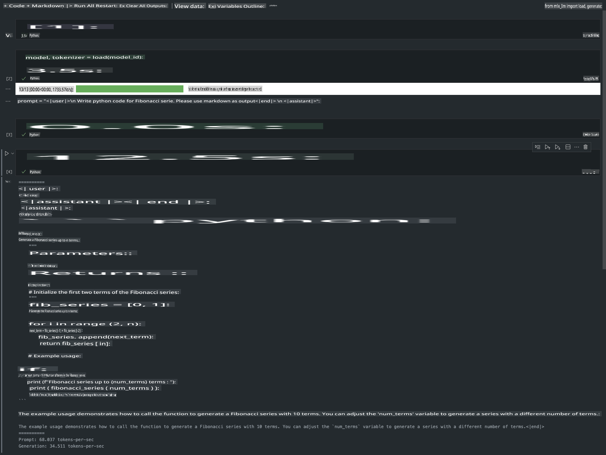

# **การใช้งาน Phi-3 ด้วย Apple MLX Framework**

## **MLX Framework คืออะไร**

MLX เป็นเฟรมเวิร์กสำหรับการวิจัยด้านการเรียนรู้ของเครื่องบนอุปกรณ์ Apple silicon ซึ่งพัฒนาโดยทีมวิจัยการเรียนรู้ของเครื่องของ Apple

MLX ถูกออกแบบโดยนักวิจัยด้านการเรียนรู้ของเครื่องเพื่อใช้งานสำหรับนักวิจัยโดยเฉพาะ เฟรมเวิร์กนี้ถูกสร้างมาให้ใช้งานง่าย แต่ยังคงประสิทธิภาพสูงในการฝึกและใช้งานโมเดล นอกจากนี้ การออกแบบของ MLX ยังมีความเรียบง่ายในเชิงแนวคิด เพื่อให้นักวิจัยสามารถปรับปรุงและขยายความสามารถของ MLX ได้อย่างสะดวก เพื่อทดลองแนวคิดใหม่ๆ ได้อย่างรวดเร็ว

LLMs สามารถเร่งประสิทธิภาพได้บนอุปกรณ์ Apple Silicon ผ่าน MLX และสามารถใช้งานโมเดลได้อย่างสะดวกในเครื่องของคุณเอง

## **การใช้งาน MLX เพื่อรัน Phi-3-mini**

### **1. ตั้งค่า MLX Environment ของคุณ**

1. ใช้ Python 3.11.x  
2. ติดตั้ง MLX Library  

```bash

pip install mlx-lm

```

### **2. การรัน Phi-3-mini ใน Terminal ด้วย MLX**

```bash

python -m mlx_lm.generate --model microsoft/Phi-3-mini-4k-instruct --max-token 2048 --prompt  "<|user|>\nCan you introduce yourself<|end|>\n<|assistant|>"

```

ผลลัพธ์ (ในสภาพแวดล้อมของฉันคือ Apple M1 Max, 64GB) เป็นดังนี้


### **3. การ Quantize Phi-3-mini ด้วย MLX ใน Terminal**

```bash

python -m mlx_lm.convert --hf-path microsoft/Phi-3-mini-4k-instruct

```

***หมายเหตุ：*** โมเดลสามารถทำการ quantize ได้ด้วย mlx_lm.convert โดยค่าเริ่มต้นจะเป็น INT4 ตัวอย่างนี้คือการ quantize Phi-3-mini เป็น INT4

หลังจากทำการ quantize โมเดลแล้ว โมเดลจะถูกเก็บไว้ในไดเรกทอรีเริ่มต้น ./mlx_model

เราสามารถทดสอบโมเดลที่ถูก quantize แล้วด้วย MLX ผ่าน Terminal  

```bash

python -m mlx_lm.generate --model ./mlx_model/ --max-token 2048 --prompt  "<|user|>\nCan you introduce yourself<|end|>\n<|assistant|>"

```

ผลลัพธ์เป็นดังนี้  


### **4. การรัน Phi-3-mini ด้วย MLX ใน Jupyter Notebook**



***หมายเหตุ:*** โปรดอ่านตัวอย่างนี้ [คลิกที่นี่](../../../../../code/03.Inference/MLX/MLX_DEMO.ipynb)

## **แหล่งข้อมูล**

1. เรียนรู้เพิ่มเติมเกี่ยวกับ Apple MLX Framework [https://ml-explore.github.io](https://ml-explore.github.io/mlx/build/html/index.html)

2. Apple MLX GitHub Repo [https://github.com/ml-explore](https://github.com/ml-explore)

**ข้อจำกัดความรับผิดชอบ**:  
เอกสารนี้ได้รับการแปลโดยใช้บริการแปลภาษาอัตโนมัติด้วย AI แม้ว่าเราจะพยายามให้การแปลมีความถูกต้อง แต่โปรดทราบว่าการแปลโดยระบบอัตโนมัติอาจมีข้อผิดพลาดหรือความไม่ถูกต้อง เอกสารต้นฉบับในภาษาต้นทางควรถูกพิจารณาเป็นแหล่งข้อมูลที่เชื่อถือได้ สำหรับข้อมูลที่มีความสำคัญ แนะนำให้ใช้บริการแปลภาษามนุษย์มืออาชีพ เราจะไม่รับผิดชอบต่อความเข้าใจผิดหรือการตีความที่ผิดพลาดซึ่งเกิดจากการใช้การแปลนี้