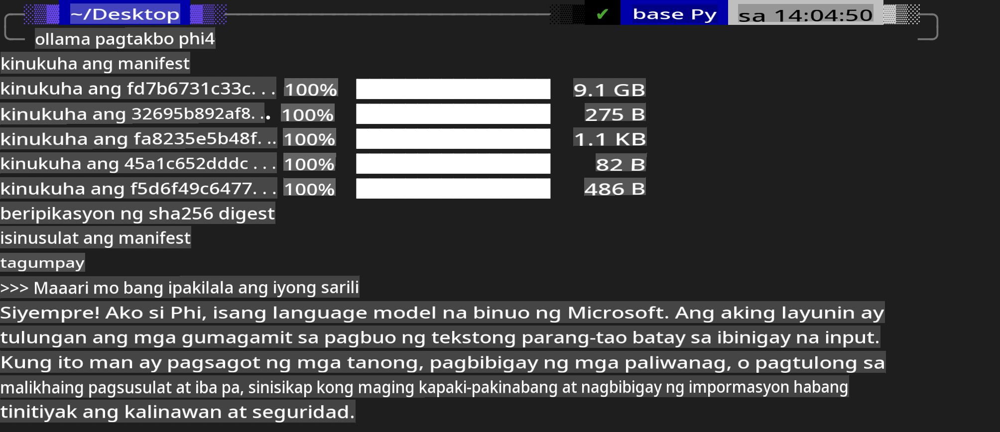

## Pamilya ng Phi sa Ollama

[Ollama](https://ollama.com) ay nagbibigay-daan sa mas maraming tao na direktang mag-deploy ng open source na LLM o SLM gamit ang simpleng mga script, at maaari ring gumawa ng mga API para tumulong sa mga lokal na aplikasyon ng Copilot.

## **1. Pag-install**

Sinusuportahan ng Ollama ang pagpapatakbo sa Windows, macOS, at Linux. Maaari mong i-install ang Ollama gamit ang link na ito ([https://ollama.com/download](https://ollama.com/download)). Matapos ang matagumpay na pag-install, maaari mo nang direktang gamitin ang Ollama script upang tawagin ang Phi-3 sa pamamagitan ng terminal window. Makikita mo ang lahat ng [magagamit na mga library sa Ollama](https://ollama.com/library). Kung bubuksan mo ang repositoryong ito sa isang Codespace, naka-install na ang Ollama doon.

```bash

ollama run phi4

```

> [!NOTE]
> Ang modelo ay unang ida-download kapag ito'y pinatakbo mo sa unang pagkakataon. Siyempre, maaari mo ring direktang tukuyin ang na-download na Phi-4 na modelo. Gagamitin natin ang WSL bilang halimbawa upang patakbuhin ang command. Kapag matagumpay na na-download ang modelo, maaari ka nang direktang makipag-ugnayan sa terminal.



## **2. Tawagin ang phi-4 API mula sa Ollama**

Kung nais mong tawagin ang Phi-4 API na ginawa ng Ollama, maaari mong gamitin ang command na ito sa terminal upang simulan ang Ollama server.

```bash

ollama serve

```

> [!NOTE]
> Kung gumagamit ng MacOS o Linux, pakitandaan na maaaring makaharap ka ng error na ito **"Error: listen tcp 127.0.0.1:11434: bind: address already in use"**. Maaaring lumabas ang error na ito kapag pinatakbo ang command. Maaari mong balewalain ang error na ito, dahil karaniwang nangangahulugan itong tumatakbo na ang server, o maaari mong ihinto at i-restart ang Ollama:

**macOS**

```bash

brew services restart ollama

```

**Linux**

```bash

sudo systemctl stop ollama

```

Sinusuportahan ng Ollama ang dalawang API: generate at chat. Maaari mong tawagin ang model API na ibinibigay ng Ollama ayon sa iyong pangangailangan, sa pamamagitan ng pagpapadala ng mga request sa lokal na serbisyong tumatakbo sa port 11434.

**Chat**

```bash

curl http://127.0.0.1:11434/api/chat -d '{
  "model": "phi3",
  "messages": [
    {
      "role": "system",
      "content": "Your are a python developer."
    },
    {
      "role": "user",
      "content": "Help me generate a bubble algorithm"
    }
  ],
  "stream": false
  
}'

This is the result in Postman


## Additional Resources

Check the list of available models in Ollama in [their library](https://ollama.com/library).

Pull your model from the Ollama server using this command

```bash
ollama pull phi4
```

Run the model using this command

```bash
ollama run phi4
```

***Note:*** Visit this link [https://github.com/ollama/ollama/blob/main/docs/api.md](https://github.com/ollama/ollama/blob/main/docs/api.md) to learn more

## Calling Ollama from Python

You can use `requests` or `urllib3` to make requests to the local server endpoints used above. However, a popular way to use Ollama in Python is via the [openai](https://pypi.org/project/openai/) SDK, since Ollama provides OpenAI-compatible server endpoints as well.

Here is an example for phi3-mini:

```python
import openai

client = openai.OpenAI(
    base_url="http://localhost:11434/v1",
    api_key="nokeyneeded",
)

response = client.chat.completions.create(
    model="phi4",
    temperature=0.7,
    n=1,
    messages=[
        {"role": "system", "content": "You are a helpful assistant."},
        {"role": "user", "content": "Write a haiku about a hungry cat"},
    ],
)

print("Response:")
print(response.choices[0].message.content)
```

## Calling Ollama from JavaScript 

```javascript
// Halimbawa ng Buod ng File gamit ang Phi-4
script({
    model: "ollama:phi4",
    title: "Buod gamit ang Phi-4",
    system: ["system"],
})

// Halimbawa ng buod
const file = def("FILE", env.files)
$`Buodin ang ${file} sa isang talata.`
```

## Calling Ollama from C#

Create a new C# Console application and add the following NuGet package:

```bash
dotnet add package Microsoft.SemanticKernel --version 1.34.0
```

Then replace this code in the `Program.cs` file

```csharp
using Microsoft.SemanticKernel;
using Microsoft.SemanticKernel.ChatCompletion;

// magdagdag ng chat completion service gamit ang lokal na ollama server endpoint
#pragma warning disable SKEXP0001, SKEXP0003, SKEXP0010, SKEXP0011, SKEXP0050, SKEXP0052
builder.AddOpenAIChatCompletion(
    modelId: "phi4",
    endpoint: new Uri("http://localhost:11434/"),
    apiKey: "non required");

// magbigay ng simpleng prompt sa chat service
string prompt = "Magsulat ng biro tungkol sa mga kuting";
var response = await kernel.InvokePromptAsync(prompt);
Console.WriteLine(response.GetValue<string>());
```

Run the app with the command:

```bash
dotnet run

**Paunawa**:  
Ang dokumentong ito ay isinalin gamit ang mga serbisyong AI na nakabatay sa makina. Bagama't aming pinagsisikapan ang katumpakan, mangyaring tandaan na ang mga awtomatikong pagsasalin ay maaaring maglaman ng mga pagkakamali o hindi tumpak na impormasyon. Ang orihinal na dokumento sa sariling wika nito ang dapat ituring na mapagkakatiwalaang pinagmulan. Para sa mahahalagang impormasyon, inirerekomenda ang propesyonal na pagsasaling-wika ng tao. Hindi kami mananagot sa anumang hindi pagkakaunawaan o maling interpretasyon na dulot ng paggamit ng pagsasaling ito.