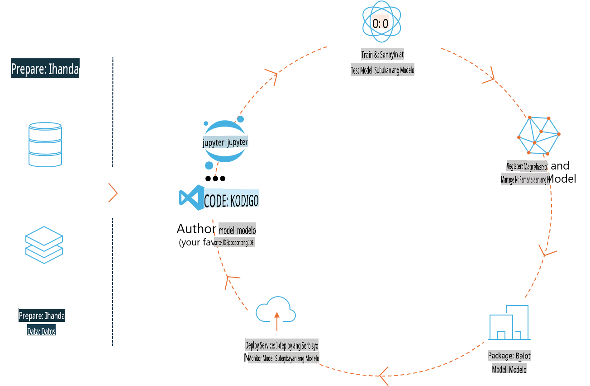
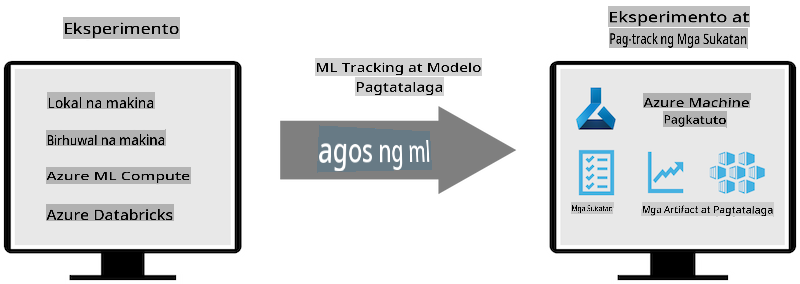
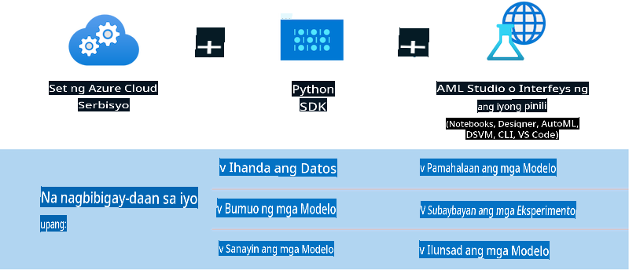

# MLflow

[MLflow](https://mlflow.org/) ay isang open-source na platform na idinisenyo upang pamahalaan ang buong lifecycle ng machine learning.



Ginagamit ang MLFlow upang pamahalaan ang lifecycle ng ML, kabilang ang eksperimento, reproducibility, deployment, at isang sentral na model registry. Sa kasalukuyan, nag-aalok ang MLFlow ng apat na pangunahing bahagi:

- **MLflow Tracking:** Mag-record at mag-query ng mga eksperimento, code, data config, at resulta.
- **MLflow Projects:** I-package ang data science code sa isang format na maaaring i-reproduce sa anumang platform.
- **Mlflow Models:** I-deploy ang mga machine learning model sa iba't ibang serving environments.
- **Model Registry:** Mag-imbak, mag-annotate, at mag-manage ng mga modelo sa isang sentralisadong repository.

May mga kakayahan itong mag-track ng mga eksperimento, mag-package ng code para sa reproducible runs, at magbahagi at mag-deploy ng mga modelo. Ang MLFlow ay integrated sa Databricks at sumusuporta sa iba't ibang ML libraries, kaya ito ay library-agnostic. Maaari itong gamitin sa anumang machine learning library at programming language dahil may REST API at CLI ito para sa kaginhawaan.



Pangunahing mga tampok ng MLFlow:

- **Experiment Tracking:** Mag-record at magkumpara ng mga parameter at resulta.
- **Model Management:** Mag-deploy ng mga modelo sa iba't ibang serving at inference platforms.
- **Model Registry:** Sama-samang pamahalaan ang lifecycle ng MLFlow Models, kabilang ang versioning at annotations.
- **Projects:** I-package ang ML code para sa pagbabahagi o production use.

Sinusuportahan din ng MLFlow ang MLOps loop, kabilang ang paghahanda ng data, pagrehistro at pamamahala ng mga modelo, pag-package ng mga modelo para sa execution, pag-deploy ng mga serbisyo, at pag-monitor ng mga modelo. Layunin nitong gawing mas simple ang proseso ng paglipat mula sa prototype patungo sa production workflow, lalo na sa cloud at edge environments.

## E2E Scenario - Paggawa ng wrapper at paggamit ng Phi-3 bilang MLFlow model

Sa E2E na halimbawa na ito, ipapakita natin ang dalawang magkaibang paraan ng paggawa ng wrapper sa paligid ng Phi-3 small language model (SLM) at pagkatapos ay patakbuhin ito bilang isang MLFlow model, alinman sa lokal o sa cloud, halimbawa, sa Azure Machine Learning workspace.



| Project | Paglalarawan | Lokasyon |
| ------------ | ----------- | -------- |
| Transformer Pipeline | Ang Transformer Pipeline ang pinakamadaling opsyon upang gumawa ng wrapper kung nais mong gumamit ng HuggingFace model gamit ang experimental transformers flavour ng MLFlow. | [**TransformerPipeline.ipynb**](../../../../../../code/06.E2E/E2E_Phi-3-MLflow_TransformerPipeline.ipynb) |
| Custom Python Wrapper | Sa panahon ng pagsulat, hindi sinusuportahan ng transformer pipeline ang MLFlow wrapper generation para sa HuggingFace models sa ONNX format, kahit na gamit ang experimental optimum Python package. Para sa mga ganitong kaso, maaari kang gumawa ng custom na Python wrapper para sa MLFlow mode. | [**CustomPythonWrapper.ipynb**](../../../../../../code/06.E2E/E2E_Phi-3-MLflow_CustomPythonWrapper.ipynb) |

## Project: Transformer Pipeline

1. Kakailanganin mo ng mga kaukulang Python packages mula sa MLFlow at HuggingFace:

    ``` Python
    import mlflow
    import transformers
    ```

2. Sunod, dapat kang mag-setup ng transformer pipeline sa pamamagitan ng pagtukoy sa target na Phi-3 model sa HuggingFace registry. Makikita mula sa model card ng _Phi-3-mini-4k-instruct_ na ang task nito ay "Text Generation":

    ``` Python
    pipeline = transformers.pipeline(
        task = "text-generation",
        model = "microsoft/Phi-3-mini-4k-instruct"
    )
    ```

3. Maaari mo na ngayong i-save ang transformer pipeline ng Phi-3 model sa MLFlow format at magbigay ng karagdagang detalye tulad ng target artifacts path, mga partikular na setting ng model configuration, at inference API type:

    ``` Python
    model_info = mlflow.transformers.log_model(
        transformers_model = pipeline,
        artifact_path = "phi3-mlflow-model",
        model_config = model_config,
        task = "llm/v1/chat"
    )
    ```

## Project: Custom Python Wrapper

1. Maaari nating gamitin dito ang Microsoft's [ONNX Runtime generate() API](https://github.com/microsoft/onnxruntime-genai) para sa inference ng ONNX model at encoding/decoding ng mga tokens. Kailangang piliin ang _onnxruntime_genai_ package para sa iyong target compute, na may halimbawa sa ibaba na nakatuon sa CPU:

    ``` Python
    import mlflow
    from mlflow.models import infer_signature
    import onnxruntime_genai as og
    ```

1. Ang ating custom class ay nag-implement ng dalawang methods: _load_context()_ para i-initialise ang **ONNX model** ng Phi-3 Mini 4K Instruct, **generator parameters**, at **tokenizer**; at _predict()_ para bumuo ng output tokens mula sa ibinigay na prompt:

    ``` Python
    class Phi3Model(mlflow.pyfunc.PythonModel):
        def load_context(self, context):
            # Retrieving model from the artifacts
            model_path = context.artifacts["phi3-mini-onnx"]
            model_options = {
                 "max_length": 300,
                 "temperature": 0.2,         
            }
        
            # Defining the model
            self.phi3_model = og.Model(model_path)
            self.params = og.GeneratorParams(self.phi3_model)
            self.params.set_search_options(**model_options)
            
            # Defining the tokenizer
            self.tokenizer = og.Tokenizer(self.phi3_model)
    
        def predict(self, context, model_input):
            # Retrieving prompt from the input
            prompt = model_input["prompt"][0]
            self.params.input_ids = self.tokenizer.encode(prompt)
    
            # Generating the model's response
            response = self.phi3_model.generate(self.params)
    
            return self.tokenizer.decode(response[0][len(self.params.input_ids):])
    ```

1. Maaari mo nang gamitin ang _mlflow.pyfunc.log_model()_ function upang makabuo ng custom na Python wrapper (sa pickle format) para sa Phi-3 model, kasama ang orihinal na ONNX model at mga kinakailangang dependencies:

    ``` Python
    model_info = mlflow.pyfunc.log_model(
        artifact_path = artifact_path,
        python_model = Phi3Model(),
        artifacts = {
            "phi3-mini-onnx": "cpu_and_mobile/cpu-int4-rtn-block-32-acc-level-4",
        },
        input_example = input_example,
        signature = infer_signature(input_example, ["Run"]),
        extra_pip_requirements = ["torch", "onnxruntime_genai", "numpy"],
    )
    ```

## Mga Signature ng nabubuong MLFlow models

1. Sa hakbang 3 ng Transformer Pipeline project sa itaas, itinakda natin ang task ng MLFlow model sa “_llm/v1/chat_”. Ang ganitong instruksiyon ay bumubuo ng API wrapper ng modelo, na compatible sa OpenAI’s Chat API tulad ng ipinakita sa ibaba:

    ``` Python
    {inputs: 
      ['messages': Array({content: string (required), name: string (optional), role: string (required)}) (required), 'temperature': double (optional), 'max_tokens': long (optional), 'stop': Array(string) (optional), 'n': long (optional), 'stream': boolean (optional)],
    outputs: 
      ['id': string (required), 'object': string (required), 'created': long (required), 'model': string (required), 'choices': Array({finish_reason: string (required), index: long (required), message: {content: string (required), name: string (optional), role: string (required)} (required)}) (required), 'usage': {completion_tokens: long (required), prompt_tokens: long (required), total_tokens: long (required)} (required)],
    params: 
      None}
    ```

1. Dahil dito, maaari mong isumite ang iyong prompt sa ganitong format:

    ``` Python
    messages = [{"role": "user", "content": "What is the capital of Spain?"}]
    ```

1. Pagkatapos, gamitin ang OpenAI API-compatible post-processing, halimbawa _response[0][‘choices’][0][‘message’][‘content’]_, upang gawing mas maganda ang iyong output na magiging ganito:

    ``` JSON
    Question: What is the capital of Spain?
    
    Answer: The capital of Spain is Madrid. It is the largest city in Spain and serves as the political, economic, and cultural center of the country. Madrid is located in the center of the Iberian Peninsula and is known for its rich history, art, and architecture, including the Royal Palace, the Prado Museum, and the Plaza Mayor.
    
    Usage: {'prompt_tokens': 11, 'completion_tokens': 73, 'total_tokens': 84}
    ```

1. Sa hakbang 3 ng Custom Python Wrapper project sa itaas, pinapayagan natin ang MLFlow package na bumuo ng signature ng modelo mula sa ibinigay na input example. Ang signature ng MLFlow wrapper natin ay magiging ganito:

    ``` Python
    {inputs: 
      ['prompt': string (required)],
    outputs: 
      [string (required)],
    params: 
      None}
    ```

1. Kaya, ang ating prompt ay kailangang maglaman ng "prompt" dictionary key, katulad nito:

    ``` Python
    {"prompt": "<|system|>You are a stand-up comedian.<|end|><|user|>Tell me a joke about atom<|end|><|assistant|>",}
    ```

1. Ang output ng modelo ay ibibigay sa string format:

    ``` JSON
    Alright, here's a little atom-related joke for you!
    
    Why don't electrons ever play hide and seek with protons?
    
    Because good luck finding them when they're always "sharing" their electrons!
    
    Remember, this is all in good fun, and we're just having a little atomic-level humor!
    ```

**Paunawa**:  
Ang dokumentong ito ay isinalin gamit ang mga serbisyo ng AI na nakabatay sa makina. Habang sinisikap naming maging wasto, pakatandaan na ang mga awtomatikong pagsasalin ay maaaring maglaman ng mga pagkakamali o hindi eksaktong kahulugan. Ang orihinal na dokumento sa kanyang katutubong wika ang dapat ituring na opisyal na sanggunian. Para sa mahahalagang impormasyon, inirerekomenda ang propesyonal na pagsasalin ng tao. Hindi kami mananagot sa anumang maling pagkaunawa o interpretasyon na dulot ng paggamit ng pagsasaling ito.