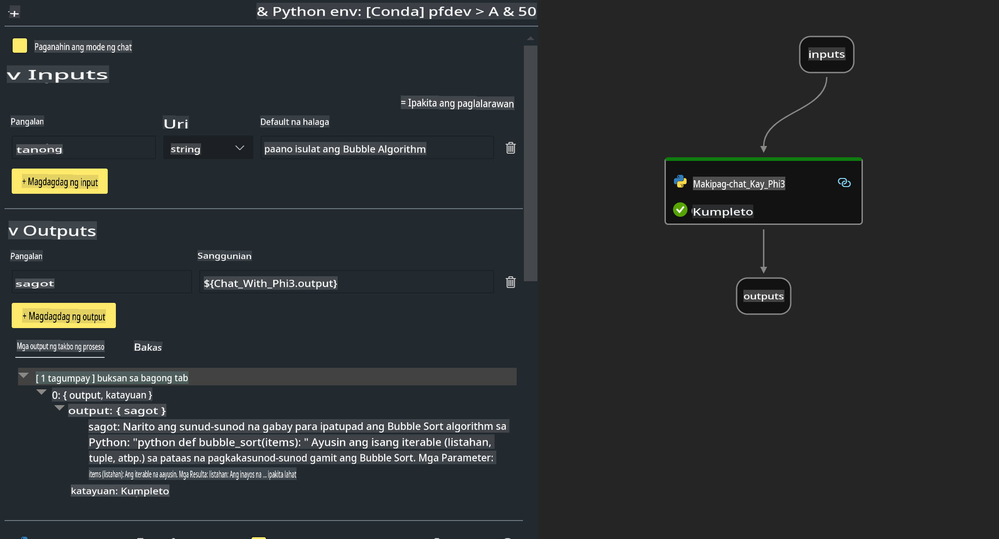

# **Lab 2 - Patakbuhin ang Prompt flow gamit ang Phi-3-mini sa AIPC**

## **Ano ang Prompt flow**

Ang Prompt flow ay isang hanay ng mga development tools na idinisenyo upang gawing mas madali ang end-to-end development cycle ng mga LLM-based AI applications, mula sa ideya, prototyping, testing, pagsusuri, hanggang sa deployment at monitoring sa produksyon. Pinapadali nito ang prompt engineering at nagbibigay-daan sa iyo na bumuo ng mga LLM apps na may kalidad na pang-produksyon.

Sa pamamagitan ng Prompt flow, magagawa mo ang mga sumusunod:

- Lumikha ng mga flow na nag-uugnay sa LLMs, prompts, Python code, at iba pang mga tool sa isang executable workflow.

- I-debug at ulitin ang iyong mga flow, lalo na ang pakikipag-ugnayan sa LLMs nang madali.

- Suriin ang iyong mga flow, kalkulahin ang mga kalidad at performance metrics gamit ang mas malalaking datasets.

- Isama ang testing at pagsusuri sa iyong CI/CD system upang matiyak ang kalidad ng iyong flow.

- I-deploy ang iyong mga flow sa napiling serving platform o isama ito sa code base ng iyong app nang madali.

- (Opsyonal ngunit lubos na inirerekomenda) Makipagtulungan sa iyong team gamit ang cloud version ng Prompt flow sa Azure AI.

## **Ano ang AIPC**

Ang AI PC ay may CPU, GPU, at NPU, bawat isa ay may partikular na kakayahan sa AI acceleration. Ang NPU, o neural processing unit, ay isang espesyal na accelerator na humahawak ng mga gawain sa artificial intelligence (AI) at machine learning (ML) direkta sa iyong PC sa halip na ipadala ang data para iproseso sa cloud. Bagama't ang GPU at CPU ay maaari ring magproseso ng mga workload na ito, ang NPU ay partikular na mahusay sa low-power AI calculations. Ang AI PC ay kumakatawan sa isang pundamental na pagbabago sa paraan ng operasyon ng ating mga computer. Hindi ito solusyon para sa isang problemang hindi umiiral dati, ngunit nangangako ito ng malaking pag-unlad para sa pang-araw-araw na gamit ng PC.

Paano ito gumagana? Kung ikukumpara sa generative AI at ang malalaking large language models (LLMs) na sinanay gamit ang maraming pampublikong data, ang AI na gagana sa iyong PC ay mas madaling ma-access sa halos lahat ng antas. Ang konsepto nito ay mas madaling maunawaan, at dahil ito ay sinanay gamit ang iyong data nang hindi kinakailangang kumonekta sa cloud, ang mga benepisyo nito ay mas kaakit-akit at agad na kapaki-pakinabang para sa mas maraming tao.

Sa malapit na hinaharap, ang mundo ng AI PC ay magpapakilala ng mga personal assistant at mas maliliit na AI models na tumatakbo direkta sa iyong PC, gamit ang iyong data upang mag-alok ng personal, pribado, at mas ligtas na AI enhancements para sa mga bagay na ginagawa mo na araw-araw – tulad ng pagkuha ng meeting minutes, pag-aayos ng fantasy football league, pag-automate ng photo at video editing, o pagbuo ng perpektong itinerary para sa family reunion base sa mga oras ng pagdating at pag-alis ng lahat.

## **Pagbuo ng generation code flows sa AIPC**

***Note***: Kung hindi mo pa natatapos ang pag-install ng environment, bisitahin ang [Lab 0 - Installations](./01.Installations.md)

1. Buksan ang Prompt flow Extension sa Visual Studio Code at gumawa ng isang walang laman na flow project.


2. Magdagdag ng Inputs at Outputs parameters at magdagdag ng Python Code bilang bagong flow.



Maaari kang sumangguni sa istrukturang ito (flow.dag.yaml) upang buuin ang iyong flow:

```yaml

inputs:
  question:
    type: string
    default: how to write Bubble Algorithm
outputs:
  answer:
    type: string
    reference: ${Chat_With_Phi3.output}
nodes:
- name: Chat_With_Phi3
  type: python
  source:
    type: code
    path: Chat_With_Phi3.py
  inputs:
    question: ${inputs.question}


```

3. Magdagdag ng Code sa ***Chat_With_Phi3.py***

```python


from promptflow.core import tool

# import torch
from transformers import AutoTokenizer, pipeline,TextStreamer
import intel_npu_acceleration_library as npu_lib

import warnings

import asyncio
import platform

class Phi3CodeAgent:
    
    model = None
    tokenizer = None
    text_streamer = None
    
    model_id = "microsoft/Phi-3-mini-4k-instruct"

    @staticmethod
    def init_phi3():
        
        if Phi3CodeAgent.model is None or Phi3CodeAgent.tokenizer is None or Phi3CodeAgent.text_streamer is None:
            Phi3CodeAgent.model = npu_lib.NPUModelForCausalLM.from_pretrained(
                                    Phi3CodeAgent.model_id,
                                    torch_dtype="auto",
                                    dtype=npu_lib.int4,
                                    trust_remote_code=True
                                )
            Phi3CodeAgent.tokenizer = AutoTokenizer.from_pretrained(Phi3CodeAgent.model_id)
            Phi3CodeAgent.text_streamer = TextStreamer(Phi3CodeAgent.tokenizer, skip_prompt=True)

    

    @staticmethod
    def chat_with_phi3(prompt):
        
        Phi3CodeAgent.init_phi3()

        messages = "<|system|>You are a AI Python coding assistant. Please help me to generate code in Python.The answer only genertated Python code, but any comments and instructions do not need to be generated<|end|><|user|>" + prompt +"<|end|><|assistant|>"


        generation_args = {
            "max_new_tokens": 1024,
            "return_full_text": False,
            "temperature": 0.3,
            "do_sample": False,
            "streamer": Phi3CodeAgent.text_streamer,
        }

        pipe = pipeline(
            "text-generation",
            model=Phi3CodeAgent.model,
            tokenizer=Phi3CodeAgent.tokenizer,
            # **generation_args
        )

        result = ''

        with warnings.catch_warnings():
            warnings.simplefilter("ignore")
            response = pipe(messages, **generation_args)
            result =response[0]['generated_text']
            return result


@tool
def my_python_tool(question: str) -> str:
    if platform.system() == 'Windows':
        asyncio.set_event_loop_policy(asyncio.WindowsSelectorEventLoopPolicy())
    return Phi3CodeAgent.chat_with_phi3(question)


```

4. Maaari mong subukan ang flow mula sa Debug o Run upang suriin kung maayos ang generation code.


5. Patakbuhin ang flow bilang development API sa terminal.

```

pf flow serve --source ./ --port 8080 --host localhost   

```

Maaari mo itong subukan gamit ang Postman / Thunder Client.

### **Tandaan**

1. Ang unang pagtakbo ay tumatagal ng mahabang oras. Inirerekomenda na i-download ang phi-3 model mula sa Hugging Face CLI.

2. Dahil sa limitadong kakayahan sa computing ng Intel NPU, inirerekomenda na gamitin ang Phi-3-mini-4k-instruct.

3. Gumagamit kami ng Intel NPU Acceleration upang i-quantize ang INT4 conversion, ngunit kung uulitin mo ang serbisyo, kailangan mong tanggalin ang cache at ang mga folder ng nc_workshop.

## **Mga Resources**

1. Matutunan ang Promptflow [https://microsoft.github.io/promptflow/](https://microsoft.github.io/promptflow/)

2. Matutunan ang Intel NPU Acceleration [https://github.com/intel/intel-npu-acceleration-library](https://github.com/intel/intel-npu-acceleration-library)

3. Sample Code, i-download [Local NPU Agent Sample Code](../../../../../../../../../code/07.Lab/01/AIPC)

**Paunawa**:  
Ang dokumentong ito ay isinalin gamit ang mga serbisyong AI na nakabatay sa makina. Habang pinagsisikapan naming maging wasto, pakitandaan na ang mga awtomatikong pagsasalin ay maaaring maglaman ng mga pagkakamali o kawastuhan. Ang orihinal na dokumento sa likas nitong wika ang dapat ituring na pangunahing mapagkukunan. Para sa mahahalagang impormasyon, inirerekomenda ang propesyonal na pagsasalin ng tao. Hindi kami mananagot para sa anumang hindi pagkakaunawaan o maling interpretasyon na dulot ng paggamit ng pagsasaling ito.