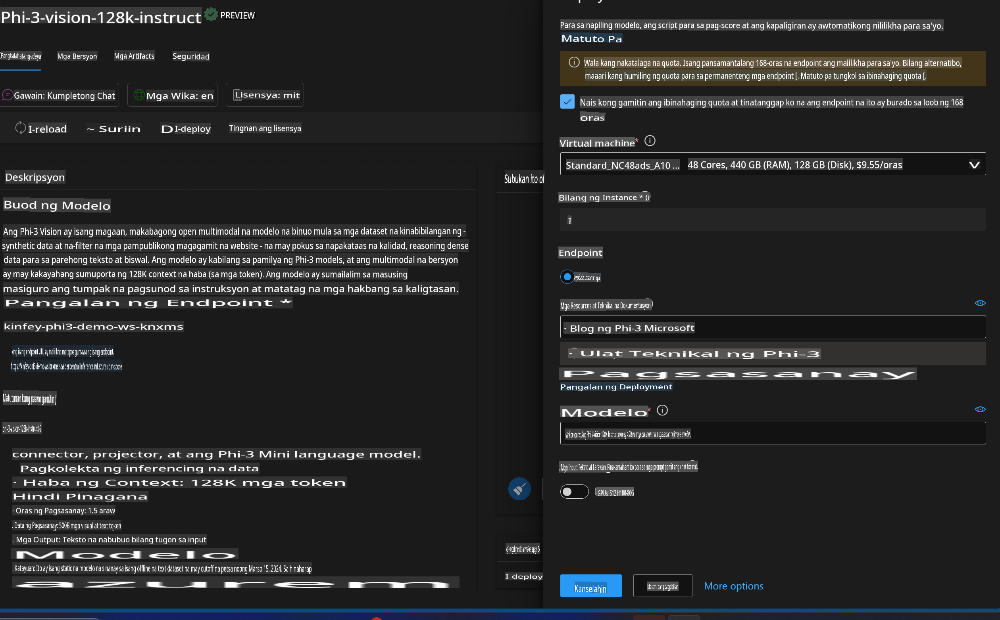

# **Lab 3 - I-deploy ang Phi-3-Vision sa Azure Machine Learning Service**

Gagamit tayo ng NPU para kumpletuhin ang production deployment ng lokal na code, at pagkatapos ay ipakikilala natin ang kakayahang gamitin ang PHI-3-VISION upang makabuo ng code mula sa mga larawan.

Sa introduksyong ito, mabilis nating mabubuo ang isang Model As Service Phi-3 Vision service sa Azure Machine Learning Service.

***Note***: Ang Phi-3 Vision ay nangangailangan ng computing power upang mas mabilis na makabuo ng nilalaman. Kailangan natin ng cloud computing power upang matulungan tayong makamit ito.

### **1. Gumawa ng Azure Machine Learning Service**

Kailangan nating gumawa ng Azure Machine Learning Service sa Azure Portal. Kung nais mong matutunan kung paano ito gawin, pakibisita ang link na ito [https://learn.microsoft.com/azure/machine-learning/quickstart-create-resources?view=azureml-api-2](https://learn.microsoft.com/azure/machine-learning/quickstart-create-resources?view=azureml-api-2)

### **2. Piliin ang Phi-3 Vision sa Azure Machine Learning Service**


### **3. I-deploy ang Phi-3-Vision sa Azure**



### **4. Subukan ang Endpoint gamit ang Postman**


***Note***

1. Ang mga parameter na kailangang ipadala ay dapat kasama ang Authorization, azureml-model-deployment, at Content-Type. Kailangan mong suriin ang impormasyon ng deployment upang makuha ito.

2. Para sa pagpapadala ng mga parameter, kailangang magpadala ang Phi-3-Vision ng link ng larawan. Pakitingnan ang GPT-4-Vision na paraan ng pagpapadala ng mga parameter, tulad ng:

```json

{
  "input_data":{
    "input_string":[
      {
        "role":"user",
        "content":[ 
          {
            "type": "text",
            "text": "You are a Python coding assistant.Please create Python code for image "
          },
          {
              "type": "image_url",
              "image_url": {
                "url": "https://ajaytech.co/wp-content/uploads/2019/09/index.png"
              }
          }
        ]
      }
    ],
    "parameters":{
          "temperature": 0.6,
          "top_p": 0.9,
          "do_sample": false,
          "max_new_tokens": 2048
    }
  }
}

```

3. Tawagin ang **/score** gamit ang Post method.

**Congratulations**! Natapos mo ang mabilisang deployment ng PHI-3-VISION at nasubukan kung paano gamitin ang mga larawan upang makabuo ng code. Susunod, maaari tayong bumuo ng mga aplikasyon sa pamamagitan ng pagsasama ng NPU at cloud.

**Paunawa**:  
Ang dokumentong ito ay isinalin gamit ang mga serbisyo ng AI na nakabatay sa makina. Bagama't sinisikap naming maging tumpak, pakitandaan na ang mga awtomatikong salin ay maaaring maglaman ng mga pagkakamali o di-tumpak na impormasyon. Ang orihinal na dokumento sa sariling wika nito ang dapat ituring na pangunahing sanggunian. Para sa mahahalagang impormasyon, inirerekomenda ang propesyonal na pagsasalin ng tao. Kami ay hindi mananagot sa anumang maling pagkaunawa o maling interpretasyon na dulot ng paggamit ng salin na ito.