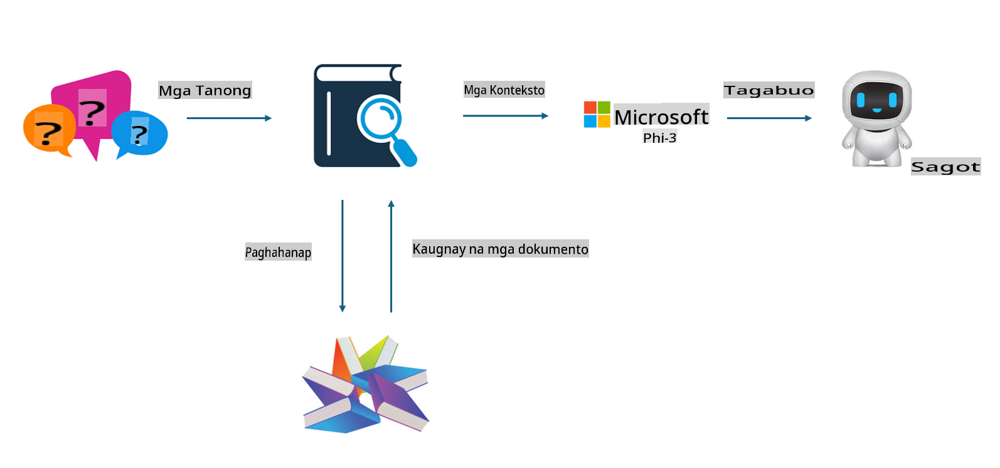

## Fine-tuning vs RAG

## Retrieval Augmented Generation

Ang RAG ay pagsasama ng data retrieval at text generation. Ang mga structured at unstructured na datos ng isang enterprise ay iniimbak sa vector database. Kapag naghahanap ng kaugnay na nilalaman, natutukoy ang mga kaugnay na buod at nilalaman upang makabuo ng konteksto, at ginagamit ang kakayahan ng text completion ng LLM/SLM para makabuo ng nilalaman.

## Proseso ng RAG

## Fine-tuning
Ang fine-tuning ay isang proseso ng pagpapabuti ng isang partikular na modelo. Hindi na kailangang magsimula mula sa model algorithm, ngunit kinakailangang mag-ipon ng datos nang tuloy-tuloy. Kung nais mo ng mas tiyak na terminolohiya at paraan ng pagpapahayag sa mga aplikasyon ng industriya, mas angkop ang fine-tuning. Subalit, kung madalas magbago ang iyong datos, maaaring maging komplikado ang fine-tuning.

## Paano pumili
Kung ang sagot natin ay nangangailangan ng paggamit ng panlabas na datos, ang RAG ang pinakamainam na pagpipilian.

Kung kailangan mo ng matatag at tiyak na kaalaman sa industriya, ang fine-tuning ay isang magandang pagpipilian. Mas inuuna ng RAG ang paghila ng kaugnay na nilalaman ngunit maaaring hindi nito ganap na makuha ang mga espesyal na nuances.

Ang fine-tuning ay nangangailangan ng mataas na kalidad na dataset, at kung maliit lamang ang saklaw ng datos, hindi ito magkakaroon ng malaking epekto. Mas flexible ang RAG.  
Ang fine-tuning ay parang isang black box, isang metaphysics, at mahirap maunawaan ang panloob na mekanismo nito. Subalit, ang RAG ay mas madaling magbigay ng transparency dahil mas madali nitong matutukoy ang pinagmulan ng datos, kaya mas epektibong naiaayos ang mga hallucination o pagkakamali sa nilalaman.

**Paunawa**:  
Ang dokumentong ito ay isinalin gamit ang mga serbisyo ng AI na batay sa makina. Bagama't sinisikap naming maging tumpak, pakatandaan na ang mga awtomatikong pagsasalin ay maaaring maglaman ng mga pagkakamali o hindi tumpak na impormasyon. Ang orihinal na dokumento sa kanyang katutubong wika ang dapat ituring na opisyal na sanggunian. Para sa mahalagang impormasyon, inirerekomenda ang propesyonal na pagsasalin ng tao. Hindi kami mananagot sa anumang hindi pagkakaunawaan o maling interpretasyon na dulot ng paggamit ng pagsasaling ito.