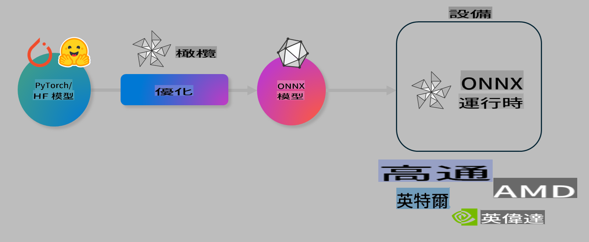

# 實驗室：優化 AI 模型以進行裝置端推理

## 簡介

> [!IMPORTANT]
> 本實驗室需要安裝 **Nvidia A10 或 A100 GPU**，以及相應的驅動程式和 CUDA 工具包（版本 12+）。

> [!NOTE]
> 這是一個 **35 分鐘** 的實驗室，將帶您實際操作，了解使用 OLIVE 優化裝置端推理模型的核心概念。

## 學習目標

完成本實驗室後，您將能夠使用 OLIVE：

- 使用 AWQ 量化方法對 AI 模型進行量化。
- 為特定任務微調 AI 模型。
- 生成 LoRA 適配器（微調模型），以便在 ONNX Runtime 上進行高效的裝置端推理。

### 什麼是 Olive

Olive (*O*NNX *live*) 是一個模型優化工具包，附帶 CLI，能夠幫助您為 ONNX runtime +++https://onnxruntime.ai+++ 提供高品質和高效能的模型。



Olive 的輸入通常是 PyTorch 或 Hugging Face 模型，而輸出則是經過優化的 ONNX 模型，該模型可以在運行 ONNX runtime 的裝置（部署目標）上執行。Olive 會針對硬體供應商（如 Qualcomm、AMD、Nvidia 或 Intel）提供的 AI 加速器（NPU、GPU、CPU）對模型進行優化。

Olive 執行一個 *工作流程*，這是一系列有序的模型優化任務，稱為 *passes*，例如模型壓縮、圖形捕捉、量化、圖形優化等。每個 pass 都有一組參數，可進行調整以達到最佳的準確性和延遲等評估指標。Olive 採用搜索策略，通過搜索算法逐步或成組自動調整每個 pass。

#### Olive 的優勢

- **減少挫折和時間**：避免手動嘗試錯誤的繁瑣過程，通過圖形優化、壓縮和量化技術。只需定義您的品質和效能約束，Olive 會自動為您找到最佳模型。
- **超過 40 種內建模型優化組件**：涵蓋量化、壓縮、圖形優化和微調的最新技術。
- **簡易使用的 CLI**：適用於常見模型優化任務。例如，olive quantize、olive auto-opt、olive finetune。
- 模型打包和部署內建支援。
- 支援生成 **多 LoRA 服務** 的模型。
- 使用 YAML/JSON 構建工作流程，協調模型優化和部署任務。
- 與 **Hugging Face** 和 **Azure AI** 集成。
- 內建 **快取機制**，以 **節省成本**。

## 實驗室指導
> [!NOTE]
> 請確保您已根據實驗室 1 的指導，配置好 Azure AI Hub 和專案，並設置好您的 A100 計算資源。

### 步驟 0：連接到您的 Azure AI 計算資源

您將使用 **VS Code** 的遠端功能連接到 Azure AI 計算資源。

1. 打開 **VS Code** 桌面應用程式：
2. 使用 **Shift+Ctrl+P** 打開 **命令面板**。
3. 在命令面板中搜索 **AzureML - remote: Connect to compute instance in New Window**。
4. 按照螢幕上的指示，連接到計算資源。這包括選擇您在實驗室 1 中設置的 Azure 訂閱、資源群組、專案和計算名稱。
5. 一旦成功連接到 Azure ML 計算節點，您會在 **VS Code 左下角** 看到顯示 `><Azure ML: Compute Name`。

### 步驟 1：克隆此存儲庫

在 VS Code 中，您可以按 **Ctrl+J** 打開新終端，並克隆此存儲庫：

在終端中，您應該會看到提示：

```
azureuser@computername:~/cloudfiles/code$ 
```  
克隆解決方案：

```bash
cd ~/localfiles
git clone https://github.com/microsoft/phi-3cookbook.git
```  

### 步驟 2：在 VS Code 中打開資料夾

要在相關資料夾中打開 VS Code，請在終端中執行以下命令，這將打開一個新視窗：

```bash
code phi-3cookbook/code/04.Finetuning/Olive-lab
```  

或者，您也可以選擇 **文件** > **打開資料夾**，手動打開資料夾。

### 步驟 3：安裝依賴項

在 Azure AI 計算實例的 VS Code 中打開終端視窗（提示：**Ctrl+J**），並執行以下命令以安裝依賴項：

```bash
conda create -n olive-ai python=3.11 -y
conda activate olive-ai
pip install -r requirements.txt
az extension remove -n azure-cli-ml
az extension add -n ml
```  

> [!NOTE]
> 安裝所有依賴項大約需要 5 分鐘。

在本實驗室中，您將從 Azure AI 模型目錄中下載和上傳模型。為了訪問模型目錄，您需要使用以下命令登錄 Azure：

```bash
az login
```  

> [!NOTE]
> 登錄時，系統會要求您選擇訂閱。請確保選擇為本實驗室提供的訂閱。

### 步驟 4：執行 Olive 命令

在 Azure AI 計算實例的 VS Code 中打開終端視窗（提示：**Ctrl+J**），並確保已激活 `olive-ai` conda 環境：

```bash
conda activate olive-ai
```  

接下來，在命令列中執行以下 Olive 命令。

1. **檢查數據**：在此範例中，您將微調 Phi-3.5-Mini 模型，使其專注於回答與旅行相關的問題。以下代碼將顯示數據集的前幾條記錄，數據集為 JSON 行格式：

    ```bash
    head data/data_sample_travel.jsonl
    ```  

2. **量化模型**：在訓練模型之前，首先使用一種名為 Active Aware Quantization (AWQ) +++https://arxiv.org/abs/2306.00978+++ 的技術進行量化。AWQ 通過考慮推理期間生成的激活值來量化模型權重。這意味著量化過程考慮了激活中的實際數據分佈，與傳統的權重量化方法相比，能更好地保留模型的準確性。

    ```bash
    olive quantize \
       --model_name_or_path microsoft/Phi-3.5-mini-instruct \
       --trust_remote_code \
       --algorithm awq \
       --output_path models/phi/awq \
       --log_level 1
    ```  

    完成 AWQ 量化大約需要 **8 分鐘**，這將 **將模型大小從約 7.5GB 減少到約 2.5GB**。

    在本實驗室中，我們展示如何從 Hugging Face 載入模型（例如：`microsoft/Phi-3.5-mini-instruct`). However, Olive also allows you to input models from the Azure AI catalog by updating the `model_name_or_path` argument to an Azure AI asset ID (for example:  `azureml://registries/azureml/models/Phi-3.5-mini-instruct/versions/4`). 

1. **Train the model:** Next, the `olive finetune` 命令來微調量化模型。在微調之前進行量化，而不是之後，能夠提供更好的準確性，因為微調過程會恢復部分因量化而損失的準確性。

    ```bash
    olive finetune \
        --method lora \
        --model_name_or_path models/phi/awq \
        --data_files "data/data_sample_travel.jsonl" \
        --data_name "json" \
        --text_template "<|user|>\n{prompt}<|end|>\n<|assistant|>\n{response}<|end|>" \
        --max_steps 100 \
        --output_path ./models/phi/ft \
        --log_level 1
    ```  

    完成微調（100 步）大約需要 **6 分鐘**。

3. **優化模型**：訓練完成後，使用 Olive 的 `auto-opt` command, which will capture the ONNX graph and automatically perform a number of optimizations to improve the model performance for CPU by compressing the model and doing fusions. It should be noted, that you can also optimize for other devices such as NPU or GPU by just updating the `--device` and `--provider` 參數來優化模型。但在本實驗室中，我們將使用 CPU。

    ```bash
    olive auto-opt \
       --model_name_or_path models/phi/ft/model \
       --adapter_path models/phi/ft/adapter \
       --device cpu \
       --provider CPUExecutionProvider \
       --use_ort_genai \
       --output_path models/phi/onnx-ao \
       --log_level 1
    ```  

    完成優化大約需要 **5 分鐘**。

### 步驟 5：模型推理快速測試

為了測試模型推理，請在您的資料夾中創建一個名為 **app.py** 的 Python 文件，並將以下代碼複製並粘貼進去：

```python
import onnxruntime_genai as og
import numpy as np

print("loading model and adapters...", end="", flush=True)
model = og.Model("models/phi/onnx-ao/model")
adapters = og.Adapters(model)
adapters.load("models/phi/onnx-ao/model/adapter_weights.onnx_adapter", "travel")
print("DONE!")

tokenizer = og.Tokenizer(model)
tokenizer_stream = tokenizer.create_stream()

params = og.GeneratorParams(model)
params.set_search_options(max_length=100, past_present_share_buffer=False)
user_input = "what is the best thing to see in chicago"
params.input_ids = tokenizer.encode(f"<|user|>\n{user_input}<|end|>\n<|assistant|>\n")

generator = og.Generator(model, params)

generator.set_active_adapter(adapters, "travel")

print(f"{user_input}")

while not generator.is_done():
    generator.compute_logits()
    generator.generate_next_token()

    new_token = generator.get_next_tokens()[0]
    print(tokenizer_stream.decode(new_token), end='', flush=True)

print("\n")
```  

使用以下命令執行代碼：

```bash
python app.py
```  

### 步驟 6：將模型上傳到 Azure AI

將模型上傳到 Azure AI 模型存儲庫，可以讓模型與您的開發團隊其他成員共享，並處理模型的版本控制。要上傳模型，請執行以下命令：

> [!NOTE]
> 更新 `{}` placeholders with the name of your resource group and Azure AI Project Name. 

To find your resource group `` 的 `resourceGroup` 和 Azure AI 專案名稱，然後執行以下命令：

```
az ml workspace show
```  

或者，您可以訪問 +++ai.azure.com+++，選擇 **管理中心** > **專案** > **概覽**。

更新 `{}` 佔位符，填入您的資源群組名稱和 Azure AI 專案名稱。

```bash
az ml model create \
    --name ft-for-travel \
    --version 1 \
    --path ./models/phi/onnx-ao \
    --resource-group {RESOURCE_GROUP_NAME} \
    --workspace-name {PROJECT_NAME}
```  
然後，您可以在 https://ml.azure.com/model/list 查看您上傳的模型並進行部署。

**免責聲明**：  
本文檔使用基於機器的人工智能翻譯服務進行翻譯。儘管我們努力保證翻譯的準確性，但請注意，自動翻譯可能會包含錯誤或不準確之處。應以原始語言的文件作為權威來源。對於關鍵信息，建議尋求專業的人類翻譯服務。我們對因使用本翻譯而引起的任何誤解或誤讀不承擔責任。