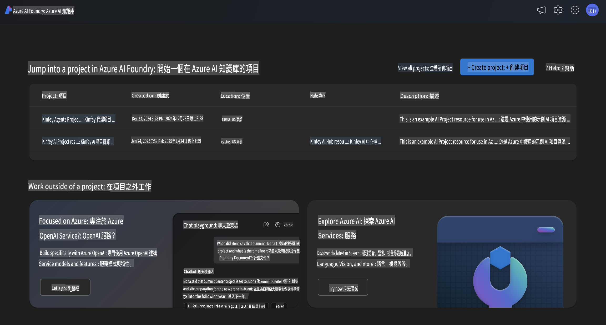
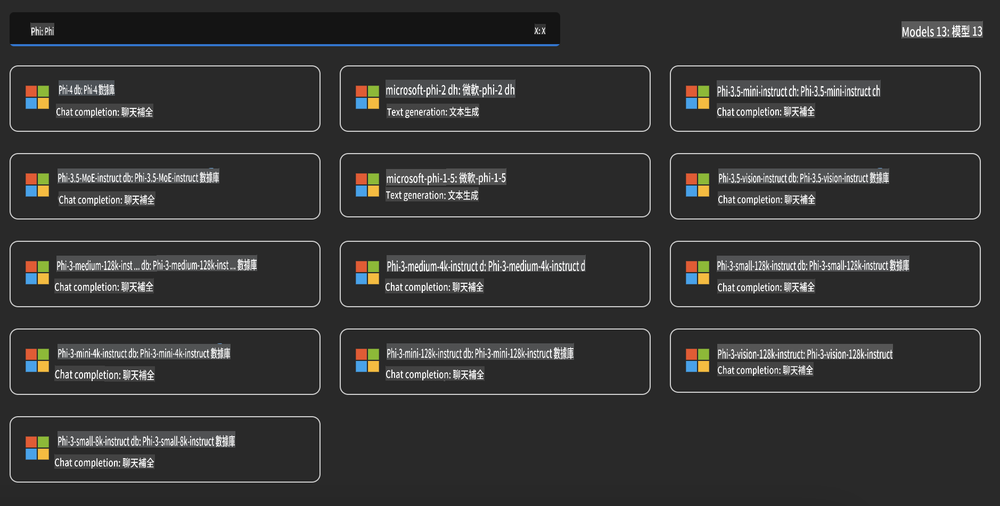
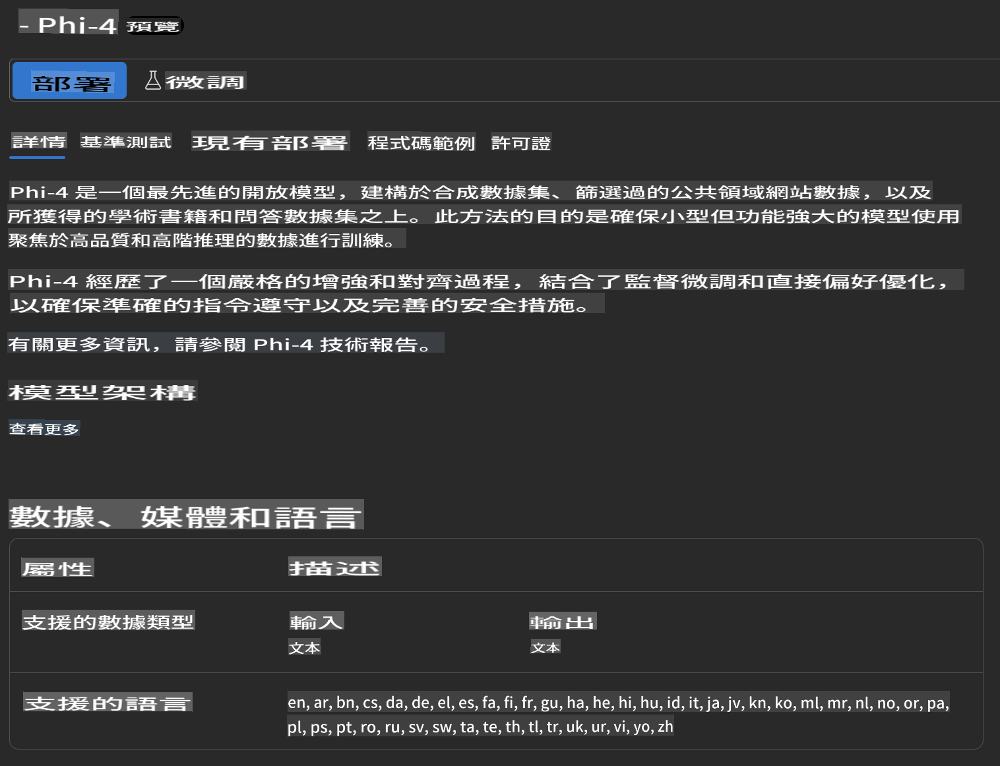
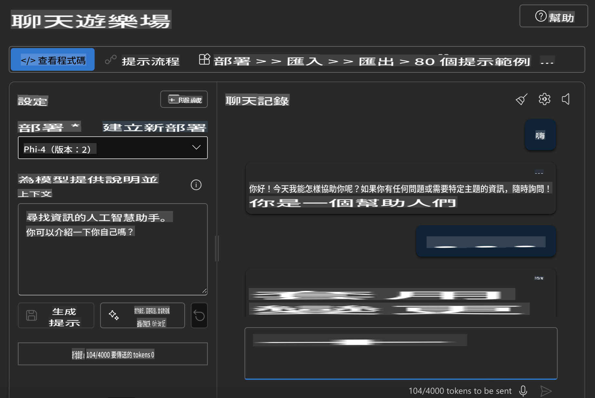

## Azure AI Foundry 中的 Phi 系列

[Azure AI Foundry](https://ai.azure.com) 是一個值得信賴的平台，能讓開發者以安全、可靠且負責任的方式推動創新，並利用 AI 塑造未來。

[Azure AI Foundry](https://ai.azure.com) 專為開發者設計，能夠：

- 在企業級平台上構建生成式 AI 應用。
- 使用尖端的 AI 工具和機器學習模型進行探索、構建、測試和部署，同時遵循負責任的 AI 原則。
- 與團隊合作，完成應用開發的全生命周期。

利用 Azure AI Foundry，您可以探索各種模型、服務和功能，並開始構建最能實現您目標的 AI 應用。Azure AI Foundry 平台支持從概念驗證到完整生產應用的無縫轉換，並具備可擴展性。持續的監控和優化能確保長期成功。



除了在 Azure AI Foundry 中使用 Azure AOAI Service，您還可以在 Azure AI Foundry 模型目錄中使用第三方模型。如果您希望將 Azure AI Foundry 作為 AI 解決方案平台，這是一個不錯的選擇。

我們可以通過 Azure AI Foundry 模型目錄快速部署 Phi 系列模型。



### **在 Azure AI Foundry 中部署 Phi-4**



### **在 Azure AI Foundry Playground 測試 Phi-4**



### **運行 Python 程式碼以調用 Azure AI Foundry Phi-4**

```python

import os  
import base64
from openai import AzureOpenAI  
from azure.identity import DefaultAzureCredential, get_bearer_token_provider  
        
endpoint = os.getenv("ENDPOINT_URL", "Your Azure AOAI Service Endpoint")  
deployment = os.getenv("DEPLOYMENT_NAME", "Phi-4")  
      
token_provider = get_bearer_token_provider(  
    DefaultAzureCredential(),  
    "https://cognitiveservices.azure.com/.default"  
)  
  
client = AzureOpenAI(  
    azure_endpoint=endpoint,  
    azure_ad_token_provider=token_provider,  
    api_version="2024-05-01-preview",  
)  
  

chat_prompt = [
    {
        "role": "system",
        "content": "You are an AI assistant that helps people find information."
    },
    {
        "role": "user",
        "content": "can you introduce yourself"
    }
] 
    
# Include speech result if speech is enabled  
messages = chat_prompt 

completion = client.chat.completions.create(  
    model=deployment,  
    messages=messages,
    max_tokens=800,  
    temperature=0.7,  
    top_p=0.95,  
    frequency_penalty=0,  
    presence_penalty=0,
    stop=None,  
    stream=False  
)  
  
print(completion.to_json())  

```

**免責聲明**：  
本文件使用機器翻譯服務進行翻譯。儘管我們努力確保準確性，但請注意，自動翻譯可能會包含錯誤或不準確之處。應以原始語言的文件為權威來源。對於關鍵資訊，建議尋求專業人工翻譯。我們對因使用本翻譯而產生的任何誤解或錯誤解釋不承擔責任。