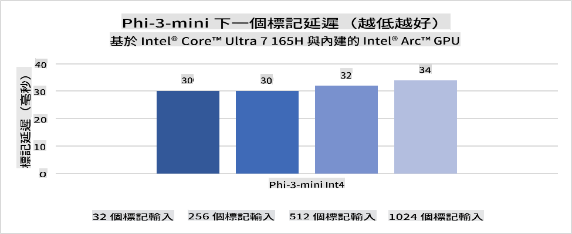
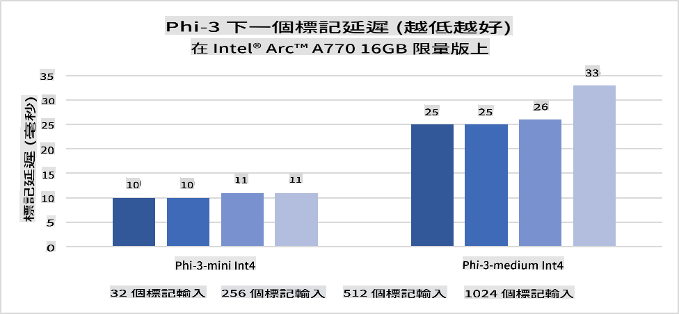
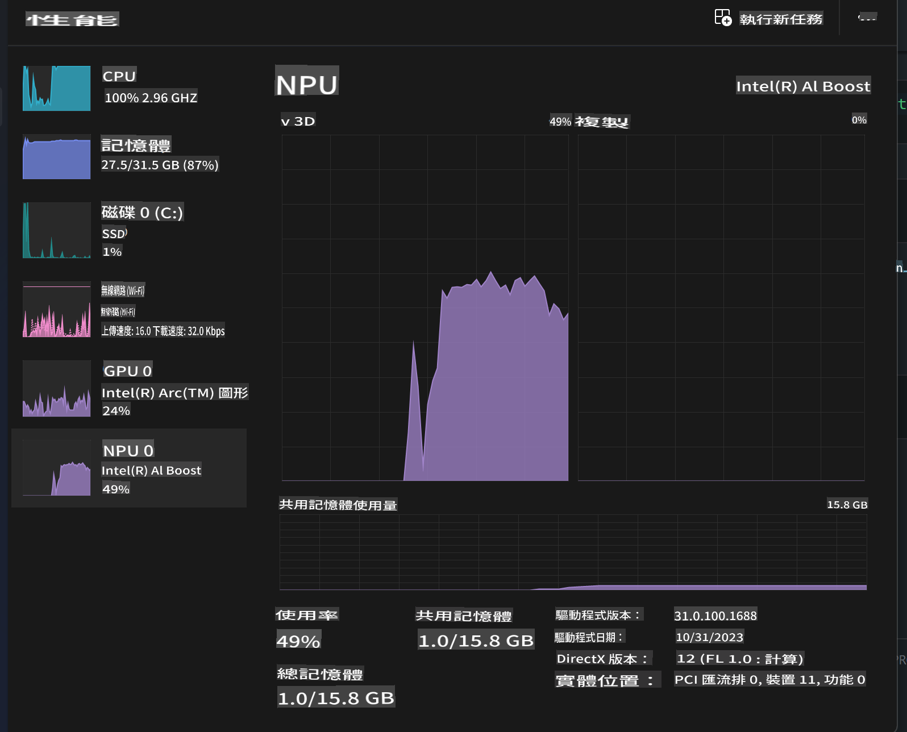
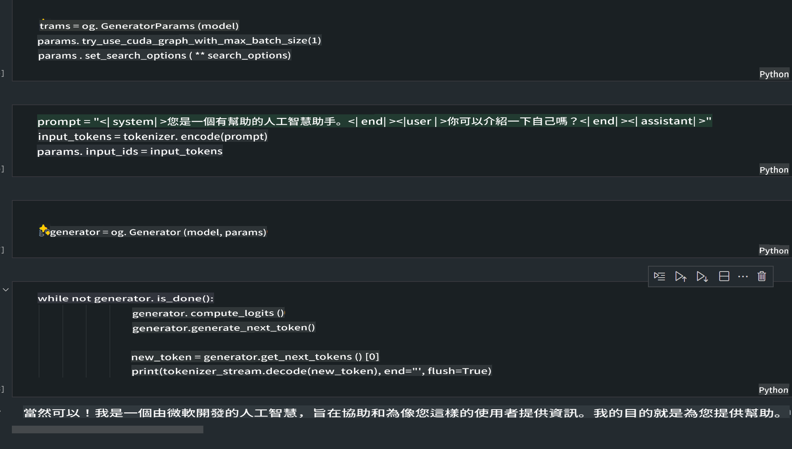
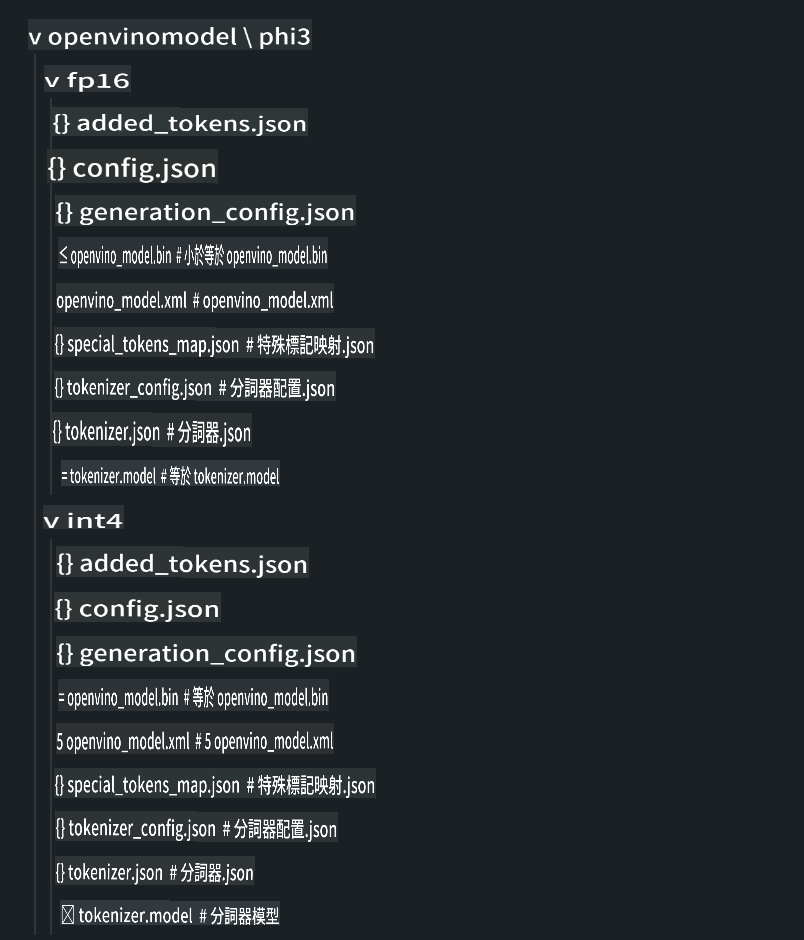
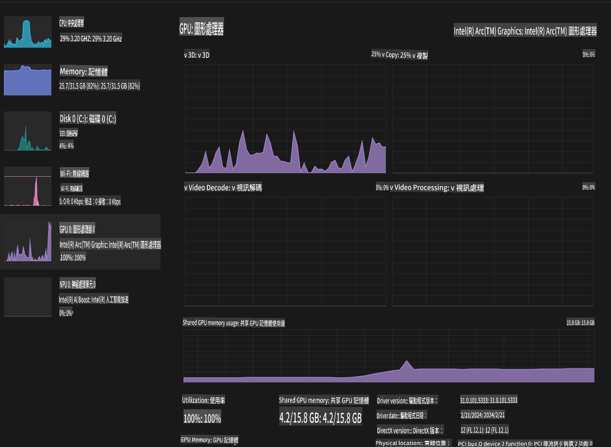

# **在 AI PC 上部署 Phi-3 模型**

隨著生成式 AI 的進步以及邊緣設備硬體能力的提升，越來越多的生成式 AI 模型可以整合到用戶的自帶設備 (BYOD) 中。AI PC 就是這些模型的一部分。從 2024 年開始，Intel、AMD 和 Qualcomm 已與 PC 製造商合作，通過硬體改進推出 AI PC，支持本地化生成式 AI 模型的部署。本討論將聚焦於 Intel AI PC，並探索如何在 Intel AI PC 上部署 Phi-3 模型。

### 什麼是 NPU

NPU（神經處理單元）是一種專用處理器或更大 SoC 上的處理單元，專為加速神經網路操作和 AI 任務而設計。與通用的 CPU 和 GPU 不同，NPU 專為數據驅動的平行運算進行優化，因此在處理大量多媒體數據（如視頻和圖像）以及神經網路數據時效率極高。它們特別擅長處理與 AI 相關的任務，例如語音識別、視頻通話中的背景模糊，以及物件檢測等照片或視頻編輯過程。

## NPU 與 GPU 的比較

雖然許多 AI 和機器學習工作負載可以在 GPU 上運行，但 GPU 與 NPU 之間有一個關鍵區別。  
GPU 以其平行計算能力聞名，但並非所有 GPU 在圖形處理之外都同樣高效。而 NPU 則專為神經網路操作中的複雜計算而設計，使其在 AI 任務中表現出色。

簡而言之，NPU 是加速 AI 計算的數學高手，在 AI PC 的新時代中扮演著關鍵角色！

***此範例基於 Intel 最新的 Intel Core Ultra 處理器***

## **1. 使用 NPU 運行 Phi-3 模型**

Intel® NPU 是一種 AI 推理加速器，集成在 Intel 客戶端 CPU 中，從 Intel® Core™ Ultra 世代的 CPU（以前稱為 Meteor Lake）開始，支持高效能的人工神經網路任務執行。





**Intel NPU 加速庫**

Intel NPU 加速庫 [https://github.com/intel/intel-npu-acceleration-library](https://github.com/intel/intel-npu-acceleration-library) 是一個 Python 庫，旨在利用 Intel 神經處理單元 (NPU) 的能力，對兼容硬體進行高速計算，從而提升應用程式的效率。

以下是基於 Intel® Core™ Ultra 處理器的 AI PC 運行 Phi-3-mini 模型的範例。


使用 pip 安裝 Python 庫

```bash

   pip install intel-npu-acceleration-library

```

***注意*** 此項目仍在開發中，但參考模型已經非常完整。

### **使用 Intel NPU 加速庫運行 Phi-3**

使用 Intel NPU 加速時，此庫不會影響傳統的編碼過程。只需使用該庫對原始 Phi-3 模型進行量化，例如 FP16、INT8、INT4 等。

```python
from transformers import AutoTokenizer, pipeline,TextStreamer
from intel_npu_acceleration_library import NPUModelForCausalLM, int4
from intel_npu_acceleration_library.compiler import CompilerConfig
import warnings

model_id = "microsoft/Phi-3-mini-4k-instruct"

compiler_conf = CompilerConfig(dtype=int4)
model = NPUModelForCausalLM.from_pretrained(
    model_id, use_cache=True, config=compiler_conf, attn_implementation="sdpa"
).eval()

tokenizer = AutoTokenizer.from_pretrained(model_id)

text_streamer = TextStreamer(tokenizer, skip_prompt=True)
```

量化成功後，繼續執行並調用 NPU 運行 Phi-3 模型。

```python
generation_args = {
   "max_new_tokens": 1024,
   "return_full_text": False,
   "temperature": 0.3,
   "do_sample": False,
   "streamer": text_streamer,
}

pipe = pipeline(
   "text-generation",
   model=model,
   tokenizer=tokenizer,
)

query = "<|system|>You are a helpful AI assistant.<|end|><|user|>Can you introduce yourself?<|end|><|assistant|>"

with warnings.catch_warnings():
    warnings.simplefilter("ignore")
    pipe(query, **generation_args)
```

執行代碼時，我們可以通過任務管理器查看 NPU 的運行情況。



***範例*** : [AIPC_NPU_DEMO.ipynb](../../../../../code/03.Inference/AIPC/AIPC_NPU_DEMO.ipynb)

## **2. 使用 DirectML + ONNX Runtime 運行 Phi-3 模型**

### **什麼是 DirectML**

[DirectML](https://github.com/microsoft/DirectML) 是一個高效能、硬體加速的 DirectX 12 機器學習庫。DirectML 提供 GPU 加速，支持多種硬體和驅動，包括來自 AMD、Intel、NVIDIA 和 Qualcomm 的所有 DirectX 12 兼容 GPU。

當單獨使用時，DirectML API 是一個低層次的 DirectX 12 庫，適用於高效能、低延遲的應用，例如框架、遊戲和其他即時應用。DirectML 與 Direct3D 12 的無縫互操作性以及其低開銷和跨硬體的一致性，使其成為需要高效能和結果可靠性的機器學習加速的理想選擇。

***注意*** : 最新的 DirectML 已經支持 NPU(https://devblogs.microsoft.com/directx/introducing-neural-processor-unit-npu-support-in-directml-developer-preview/)

### DirectML 與 CUDA 的功能和效能比較

**DirectML** 是由微軟開發的機器學習庫，專為加速 Windows 設備（包括桌面、筆記型電腦和邊緣設備）上的機器學習工作負載而設計。
- 基於 DX12：DirectML 構建於 DirectX 12（DX12）之上，支持廣泛的硬體，包括 NVIDIA 和 AMD 的 GPU。
- 更廣泛的支持：由於利用了 DX12，DirectML 可以在任何支持 DX12 的 GPU（甚至是集成 GPU）上運行。
- 圖像處理：DirectML 使用神經網路處理圖像和其他數據，適合圖像識別、物件檢測等任務。
- 簡單的設置：DirectML 設置簡單，不需要 GPU 製造商的特定 SDK 或庫。
- 效能：在某些情況下，DirectML 的效能表現良好，甚至可能比 CUDA 更快。
- 限制：然而，DirectML 在處理 float16 大批量數據時可能較慢。

**CUDA** 是 NVIDIA 的平行計算平台和編程模型，允許開發者利用 NVIDIA GPU 的能力進行通用計算，包括機器學習和科學模擬。
- NVIDIA 專屬：CUDA 與 NVIDIA GPU 緊密集成，專為其設計。
- 高度優化：為 GPU 加速任務提供出色的效能，特別是在使用 NVIDIA GPU 時。
- 廣泛應用：許多機器學習框架和庫（如 TensorFlow 和 PyTorch）都支持 CUDA。
- 可定制性：開發者可以針對特定任務微調 CUDA 設置，實現最佳效能。
- 限制：但 CUDA 對 NVIDIA 硬體的依賴可能限制了其在其他 GPU 上的兼容性。

### 選擇 DirectML 還是 CUDA

選擇 DirectML 還是 CUDA 取決於您的具體使用情況、硬體可用性和偏好。如果您需要更廣泛的兼容性和簡單的設置，DirectML 可能是個不錯的選擇。然而，如果您擁有 NVIDIA GPU 並需要高度優化的效能，CUDA 仍然是強大的選擇。總之，DirectML 和 CUDA 各有優勢，請根據您的需求和可用硬體進行選擇。

### **使用 ONNX Runtime 的生成式 AI**

在 AI 時代，AI 模型的可移植性非常重要。ONNX Runtime 可以輕鬆地將訓練好的模型部署到不同的設備上。開發者無需關注推理框架，只需使用統一的 API 完成模型推理。在生成式 AI 時代，ONNX Runtime 也進行了代碼優化 (https://onnxruntime.ai/docs/genai/)。通過優化的 ONNX Runtime，量化的生成式 AI 模型可以在不同的終端上進行推理。在使用 ONNX Runtime 的生成式 AI 中，您可以通過 Python、C#、C/C++ 調用 AI 模型 API。當然，在 iPhone 上部署時，可以利用 C++ 的 Generative AI with ONNX Runtime API。

[範例代碼](https://github.com/Azure-Samples/Phi-3MiniSamples/tree/main/onnx)

***編譯生成式 AI 的 ONNX Runtime 庫***

```bash

winget install --id=Kitware.CMake  -e

git clone https://github.com/microsoft/onnxruntime.git

cd .\onnxruntime\

./build.bat --build_shared_lib --skip_tests --parallel --use_dml --config Release

cd ../

git clone https://github.com/microsoft/onnxruntime-genai.git

cd .\onnxruntime-genai\

mkdir ort

cd ort

mkdir include

mkdir lib

copy ..\onnxruntime\include\onnxruntime\core\providers\dml\dml_provider_factory.h ort\include

copy ..\onnxruntime\include\onnxruntime\core\session\onnxruntime_c_api.h ort\include

copy ..\onnxruntime\build\Windows\Release\Release\*.dll ort\lib

copy ..\onnxruntime\build\Windows\Release\Release\onnxruntime.lib ort\lib

python build.py --use_dml


```

**安裝庫**

```bash

pip install .\onnxruntime_genai_directml-0.3.0.dev0-cp310-cp310-win_amd64.whl

```

以下是運行結果



***範例*** : [AIPC_DirectML_DEMO.ipynb](../../../../../code/03.Inference/AIPC/AIPC_DirectML_DEMO.ipynb)

## **3. 使用 Intel OpenVino 運行 Phi-3 模型**

### **什麼是 OpenVINO**

[OpenVINO](https://github.com/openvinotoolkit/openvino) 是一個開源工具包，用於優化和部署深度學習模型。它可提升來自 TensorFlow、PyTorch 等流行框架的視覺、音頻和語言模型的性能。使用 OpenVINO 開始，還可以結合 CPU 和 GPU 運行 Phi-3 模型。

***注意***: 目前，OpenVINO 尚不支持 NPU。

### **安裝 OpenVINO 庫**

```bash

 pip install git+https://github.com/huggingface/optimum-intel.git

 pip install git+https://github.com/openvinotoolkit/nncf.git

 pip install openvino-nightly

```

### **使用 OpenVINO 運行 Phi-3**

與 NPU 相似，OpenVINO 通過運行量化模型來完成生成式 AI 模型的調用。我們需要首先量化 Phi-3 模型，並通過命令行使用 optimum-cli 完成模型量化。

**INT4**

```bash

optimum-cli export openvino --model "microsoft/Phi-3-mini-4k-instruct" --task text-generation-with-past --weight-format int4 --group-size 128 --ratio 0.6  --sym  --trust-remote-code ./openvinomodel/phi3/int4

```

**FP16**

```bash

optimum-cli export openvino --model "microsoft/Phi-3-mini-4k-instruct" --task text-generation-with-past --weight-format fp16 --trust-remote-code ./openvinomodel/phi3/fp16

```

轉換後的格式如下



通過 OVModelForCausalLM 加載模型路徑 (model_dir)、相關配置 (ov_config = {"PERFORMANCE_HINT": "LATENCY", "NUM_STREAMS": "1", "CACHE_DIR": ""}) 和硬體加速設備 (GPU.0)。

```python

ov_model = OVModelForCausalLM.from_pretrained(
     model_dir,
     device='GPU.0',
     ov_config=ov_config,
     config=AutoConfig.from_pretrained(model_dir, trust_remote_code=True),
     trust_remote_code=True,
)

```

執行代碼時，我們可以通過任務管理器查看 GPU 的運行情況。



***範例*** : [AIPC_OpenVino_Demo.ipynb](../../../../../code/03.Inference/AIPC/AIPC_OpenVino_Demo.ipynb)

### ***注意*** : 以上三種方法各有優勢，但建議在 AI PC 推理中優先使用 NPU 加速。

**免責聲明**：  
本文件已使用基於機器的AI翻譯服務進行翻譯。我們努力確保準確性，但請注意，自動翻譯可能包含錯誤或不準確之處。應以原文的母語版本作為權威來源。對於關鍵信息，建議尋求專業人工翻譯。我們對因使用此翻譯而產生的任何誤解或誤讀概不負責。