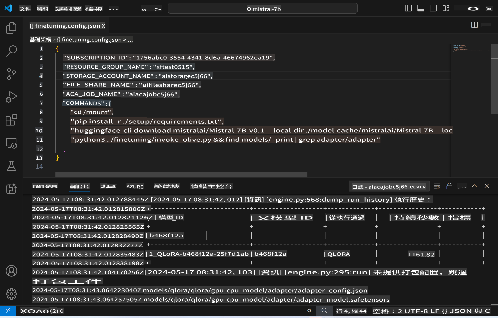
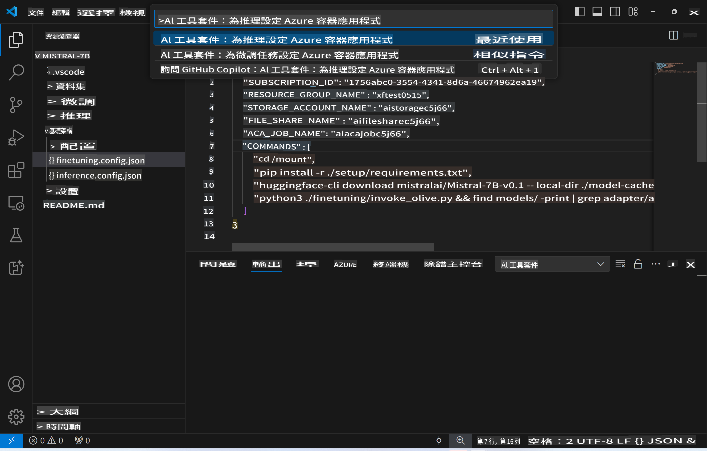
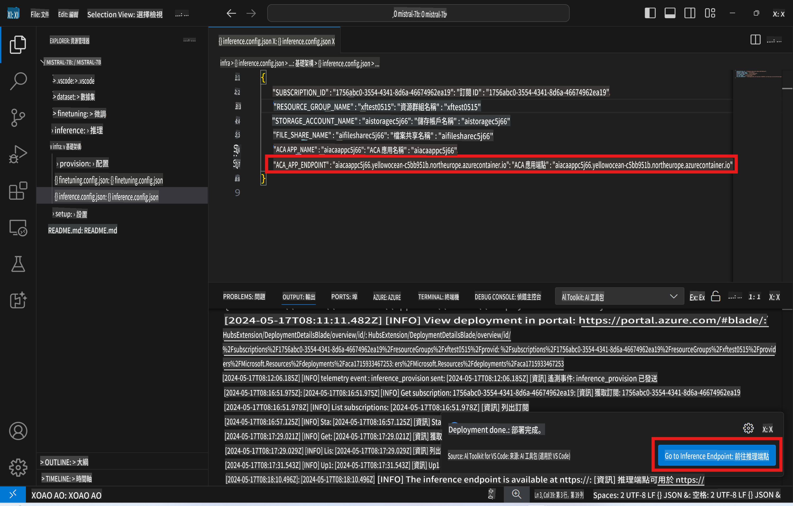

# 使用微調模型進行遠端推理

在遠端環境中訓練完成適配器後，可以使用簡單的 Gradio 應用程式與模型互動。



### 配置 Azure 資源
需要透過命令面板執行 `AI Toolkit: Provision Azure Container Apps for inference` 來設定 Azure 資源以進行遠端推理。在此過程中，您將被要求選擇您的 Azure 訂閱和資源群組。  


預設情況下，推理所使用的訂閱和資源群組應與微調時所用的一致。推理將使用相同的 Azure Container App 環境，並訪問儲存在 Azure Files 中的模型和模型適配器，這些資源是在微調步驟中生成的。

## 使用 AI Toolkit

### 推理部署  
如果需要修改推理程式碼或重新載入推理模型，請執行 `AI Toolkit: Deploy for inference` 命令。此操作將同步最新的程式碼到 ACA 並重新啟動副本。


部署成功完成後，模型即可以通過該端點進行評估。

### 訪問推理 API

您可以通過 VSCode 通知中顯示的「*前往推理端點*」按鈕訪問推理 API。或者，可以在 `ACA_APP_ENDPOINT` 中的 `./infra/inference.config.json` 以及輸出面板中找到 Web API 端點。



> **注意：** 推理端點可能需要幾分鐘才能完全運行。

## 模板中包含的推理組件

| 資料夾 | 內容 |
| ------ |--------- |
| `infra` | 包含遠端操作所需的所有配置。 |
| `infra/provision/inference.parameters.json` | 包含 bicep 模板的參數，用於配置 Azure 資源進行推理。 |
| `infra/provision/inference.bicep` | 包含用於推理的 Azure 資源配置模板。 |
| `infra/inference.config.json` | 由 `AI Toolkit: Provision Azure Container Apps for inference` 命令生成的配置文件，用作其他遠端命令面板的輸入。 |

### 使用 AI Toolkit 配置 Azure 資源
配置 [AI Toolkit](https://marketplace.visualstudio.com/items?itemName=ms-windows-ai-studio.windows-ai-studio)

為推理配置 Azure Container Apps` command.

You can find configuration parameters in `./infra/provision/inference.parameters.json` file. Here are the details:
| Parameter | Description |
| --------- |------------ |
| `defaultCommands` | This is the commands to initiate a web API. |
| `maximumInstanceCount` | This parameter sets the maximum capacity of GPU instances. |
| `location` | This is the location where Azure resources are provisioned. The default value is the same as the chosen resource group's location. |
| `storageAccountName`, `fileShareName` `acaEnvironmentName`, `acaEnvironmentStorageName`, `acaAppName`,  `acaLogAnalyticsName` | These parameters are used to name the Azure resources for provision. By default, they will be same to the fine-tuning resource name. You can input a new, unused resource name to create your own custom-named resources, or you can input the name of an already existing Azure resource if you'd prefer to use that. For details, refer to the section [Using existing Azure Resources](../../../../../md/01.Introduction/03). |

### Using Existing Azure Resources

By default, the inference provision use the same Azure Container App Environment, Storage Account, Azure File Share, and Azure Log Analytics that were used for fine-tuning. A separate Azure Container App is created solely for the inference API. 

If you have customized the Azure resources during the fine-tuning step or want to use your own existing Azure resources for inference, specify their names in the `./infra/inference.parameters.json` 文件。然後，從命令面板執行 `AI Toolkit: Provision Azure Container Apps for inference` 命令。此操作將更新任何指定的資源並創建任何缺失的資源。

例如，如果您已有現有的 Azure 容器環境，您的 `./infra/finetuning.parameters.json` 文件應如下所示：

```json
{
    "$schema": "https://schema.management.azure.com/schemas/2019-04-01/deploymentParameters.json#",
    "contentVersion": "1.0.0.0",
    "parameters": {
      ...
      "acaEnvironmentName": {
        "value": "<your-aca-env-name>"
      },
      "acaEnvironmentStorageName": {
        "value": null
      },
      ...
    }
  }
```

### 手動配置  
如果您更傾向於手動配置 Azure 資源，可以使用 `./infra/provision` folders. If you have already set up and configured all the Azure resources without using the AI Toolkit command palette, you can simply enter the resource names in the `inference.config.json` 文件中提供的 bicep 文件。

例如：

```json
{
  "SUBSCRIPTION_ID": "<your-subscription-id>",
  "RESOURCE_GROUP_NAME": "<your-resource-group-name>",
  "STORAGE_ACCOUNT_NAME": "<your-storage-account-name>",
  "FILE_SHARE_NAME": "<your-file-share-name>",
  "ACA_APP_NAME": "<your-aca-name>",
  "ACA_APP_ENDPOINT": "<your-aca-endpoint>"
}
```

**免責聲明**：  
本文件是使用機器翻譯人工智慧服務進行翻譯的。儘管我們努力確保準確性，但請注意，自動翻譯可能包含錯誤或不準確之處。應以原始語言的文件作為權威來源。對於關鍵資訊，建議尋求專業人工翻譯。我們對因使用此翻譯而引起的任何誤解或誤讀不承擔責任。