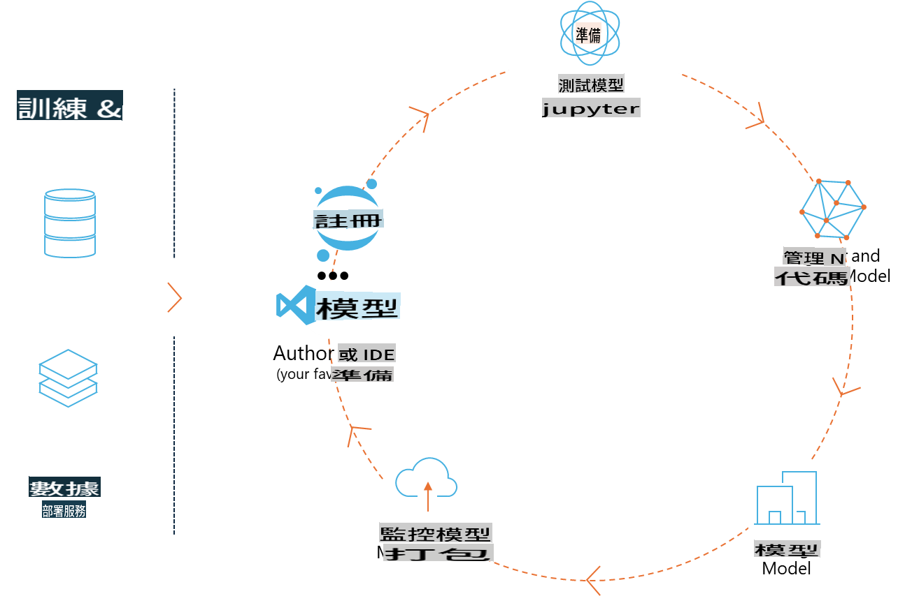
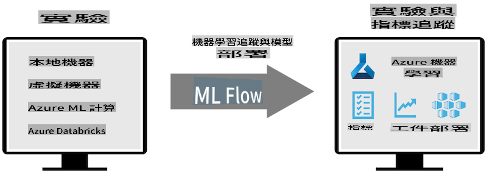
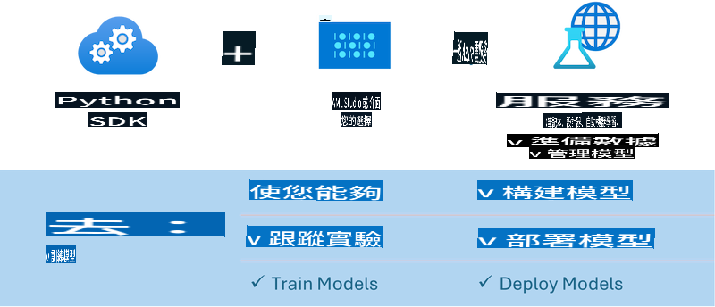

# MLflow

[MLflow](https://mlflow.org/) 是一個開源平台，專為管理端到端的機器學習生命周期而設計。



MLflow 用於管理機器學習的全生命周期，包括實驗、可重現性、部署以及集中化的模型註冊。目前 MLflow 提供四個主要組件：

- **MLflow Tracking:** 記錄和查詢實驗、代碼、數據配置和結果。
- **MLflow Projects:** 將數據科學代碼打包成可在任何平台上重現運行的格式。
- **MLflow Models:** 在多樣化的服務環境中部署機器學習模型。
- **Model Registry:** 在集中式存儲庫中存儲、註解和管理模型。

MLflow 包括實驗跟蹤、將代碼打包成可重現運行的功能，以及模型的共享和部署。MLflow 已集成到 Databricks，並支持多種機器學習庫，使其成為一個庫無關的平台。它可以與任何機器學習庫以及任何編程語言一起使用，並提供 REST API 和 CLI 以提高便利性。



MLflow 的主要功能包括：

- **實驗跟蹤：** 記錄和比較參數及結果。
- **模型管理：** 將模型部署到各種服務和推理平台。
- **模型註冊：** 協作管理 MLflow 模型的生命周期，包括版本控制和註解。
- **專案：** 打包機器學習代碼以便共享或生產使用。

MLflow 還支持 MLOps 循環，包括準備數據、註冊和管理模型、打包模型以供執行、部署服務以及監控模型。它旨在簡化從原型到生產工作流的過程，特別是在雲端和邊緣環境中。

## 端到端場景 - 建立包裝器並將 Phi-3 作為 MLflow 模型使用

在這個端到端的示例中，我們將展示兩種不同的方法來為 Phi-3 小型語言模型（SLM）建立包裝器，並將其作為 MLflow 模型在本地或雲端（例如 Azure 機器學習工作區）運行。



| 專案 | 描述 | 位置 |
| ------------ | ----------- | -------- |
| Transformer Pipeline | 如果想將 HuggingFace 模型與 MLflow 的實驗性 transformers 功能結合使用，Transformer Pipeline 是建立包裝器的最簡單選擇。 | [**TransformerPipeline.ipynb**](../../../../../../code/06.E2E/E2E_Phi-3-MLflow_TransformerPipeline.ipynb) |
| Custom Python Wrapper | 在撰寫本文時，transformer pipeline 尚不支持為 ONNX 格式的 HuggingFace 模型生成 MLflow 包裝器，即使使用了實驗性的 optimum Python 套件也是如此。針對這種情況，可以為 MLflow 模型構建自定義的 Python 包裝器。 | [**CustomPythonWrapper.ipynb**](../../../../../../code/06.E2E/E2E_Phi-3-MLflow_CustomPythonWrapper.ipynb) |

## 專案：Transformer Pipeline

1. 您需要 MLflow 和 HuggingFace 的相關 Python 套件：

    ``` Python
    import mlflow
    import transformers
    ```

2. 接下來，您應該通過 HuggingFace 註冊表引用目標 Phi-3 模型，啟動 transformer pipeline。如 _Phi-3-mini-4k-instruct_ 的模型卡所示，其任務類型為“文本生成”：

    ``` Python
    pipeline = transformers.pipeline(
        task = "text-generation",
        model = "microsoft/Phi-3-mini-4k-instruct"
    )
    ```

3. 現在，您可以將 Phi-3 模型的 transformer pipeline 保存為 MLflow 格式，並提供額外的細節，例如目標 artifact 路徑、特定模型配置設置和推理 API 類型：

    ``` Python
    model_info = mlflow.transformers.log_model(
        transformers_model = pipeline,
        artifact_path = "phi3-mlflow-model",
        model_config = model_config,
        task = "llm/v1/chat"
    )
    ```

## 專案：Custom Python Wrapper

1. 我們可以利用 Microsoft 的 [ONNX Runtime generate() API](https://github.com/microsoft/onnxruntime-genai) 來進行 ONNX 模型的推理以及 token 的編碼/解碼。以下範例針對 CPU，選擇 _onnxruntime_genai_ 套件：

    ``` Python
    import mlflow
    from mlflow.models import infer_signature
    import onnxruntime_genai as og
    ```

2. 我們的自定義類實現了兩個方法：_load_context()_ 用於初始化 Phi-3 Mini 4K Instruct 的 **ONNX 模型**、**生成器參數**和**tokenizer**；_predict()_ 用於生成提供的 prompt 的輸出 token：

    ``` Python
    class Phi3Model(mlflow.pyfunc.PythonModel):
        def load_context(self, context):
            # Retrieving model from the artifacts
            model_path = context.artifacts["phi3-mini-onnx"]
            model_options = {
                 "max_length": 300,
                 "temperature": 0.2,         
            }
        
            # Defining the model
            self.phi3_model = og.Model(model_path)
            self.params = og.GeneratorParams(self.phi3_model)
            self.params.set_search_options(**model_options)
            
            # Defining the tokenizer
            self.tokenizer = og.Tokenizer(self.phi3_model)
    
        def predict(self, context, model_input):
            # Retrieving prompt from the input
            prompt = model_input["prompt"][0]
            self.params.input_ids = self.tokenizer.encode(prompt)
    
            # Generating the model's response
            response = self.phi3_model.generate(self.params)
    
            return self.tokenizer.decode(response[0][len(self.params.input_ids):])
    ```

3. 現在，您可以使用 _mlflow.pyfunc.log_model()_ 函數為 Phi-3 模型生成自定義的 Python 包裝器（以 pickle 格式），以及原始 ONNX 模型和所需的依賴項：

    ``` Python
    model_info = mlflow.pyfunc.log_model(
        artifact_path = artifact_path,
        python_model = Phi3Model(),
        artifacts = {
            "phi3-mini-onnx": "cpu_and_mobile/cpu-int4-rtn-block-32-acc-level-4",
        },
        input_example = input_example,
        signature = infer_signature(input_example, ["Run"]),
        extra_pip_requirements = ["torch", "onnxruntime_genai", "numpy"],
    )
    ```

## 生成的 MLflow 模型的簽名

1. 在上述 Transformer Pipeline 專案的步驟 3 中，我們將 MLflow 模型的任務設置為 “_llm/v1/chat_”。這樣的指令會生成一個與 OpenAI 的 Chat API 兼容的模型 API 包裝器，如下所示：

    ``` Python
    {inputs: 
      ['messages': Array({content: string (required), name: string (optional), role: string (required)}) (required), 'temperature': double (optional), 'max_tokens': long (optional), 'stop': Array(string) (optional), 'n': long (optional), 'stream': boolean (optional)],
    outputs: 
      ['id': string (required), 'object': string (required), 'created': long (required), 'model': string (required), 'choices': Array({finish_reason: string (required), index: long (required), message: {content: string (required), name: string (optional), role: string (required)} (required)}) (required), 'usage': {completion_tokens: long (required), prompt_tokens: long (required), total_tokens: long (required)} (required)],
    params: 
      None}
    ```

2. 因此，您可以以下列格式提交您的 prompt：

    ``` Python
    messages = [{"role": "user", "content": "What is the capital of Spain?"}]
    ```

3. 然後，使用與 OpenAI API 兼容的後處理，例如 _response[0][‘choices’][0][‘message’][‘content’]_，將輸出美化成如下內容：

    ``` JSON
    Question: What is the capital of Spain?
    
    Answer: The capital of Spain is Madrid. It is the largest city in Spain and serves as the political, economic, and cultural center of the country. Madrid is located in the center of the Iberian Peninsula and is known for its rich history, art, and architecture, including the Royal Palace, the Prado Museum, and the Plaza Mayor.
    
    Usage: {'prompt_tokens': 11, 'completion_tokens': 73, 'total_tokens': 84}
    ```

4. 在上述 Custom Python Wrapper 專案的步驟 3 中，我們允許 MLflow 套件從給定的輸入示例生成模型簽名。我們的 MLflow 包裝器的簽名將如下所示：

    ``` Python
    {inputs: 
      ['prompt': string (required)],
    outputs: 
      [string (required)],
    params: 
      None}
    ```

5. 因此，我們的 prompt 需要包含 "prompt" 字典鍵，類似於以下內容：

    ``` Python
    {"prompt": "<|system|>You are a stand-up comedian.<|end|><|user|>Tell me a joke about atom<|end|><|assistant|>",}
    ```

6. 模型的輸出將以字符串格式提供：

    ``` JSON
    Alright, here's a little atom-related joke for you!
    
    Why don't electrons ever play hide and seek with protons?
    
    Because good luck finding them when they're always "sharing" their electrons!
    
    Remember, this is all in good fun, and we're just having a little atomic-level humor!
    ```

**免責聲明**：  
本文件使用基於機器的人工智能翻譯服務進行翻譯。儘管我們努力確保準確性，但請注意，自動翻譯可能包含錯誤或不準確之處。應以原始語言的文件作為權威來源。對於關鍵資訊，建議尋求專業人工翻譯。我們對因使用此翻譯而引起的任何誤解或誤讀概不負責。