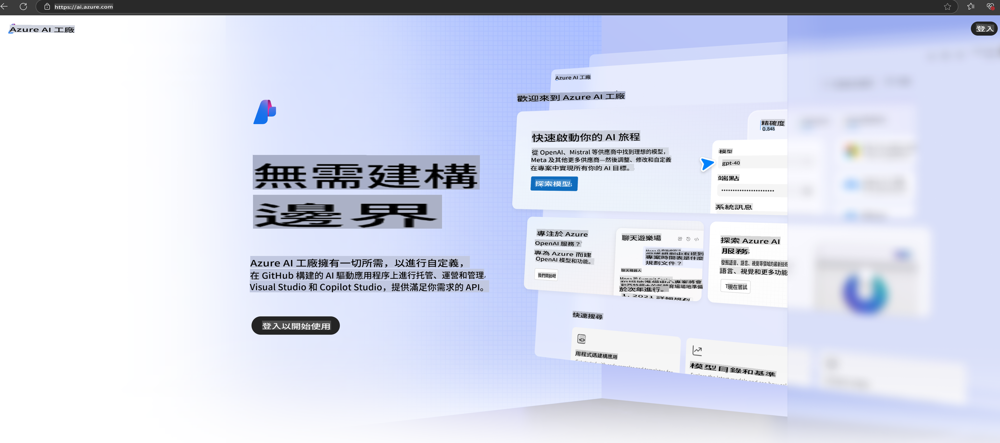

# **在 Azure AI Foundry 中使用 Phi-3**

隨著生成式 AI 的發展，我們希望能使用一個統一的平台來管理不同的 LLM 和 SLM，進行企業數據整合、微調/RAG 操作，以及在整合 LLM 和 SLM 後評估不同企業業務等，以便更好地實現生成式 AI 的智慧應用。[Azure AI Foundry](https://ai.azure.com) 是一個企業級生成式 AI 應用平台。

透過 Azure AI Foundry，您可以評估大型語言模型 (LLM) 的回應，並使用 Prompt Flow 編排提示應用元件以提升效能。該平台支援從概念驗證快速擴展至完整的生產環境，並能輕鬆實現持續監控與優化，助力長期成功。

我們可以透過簡單的步驟快速在 Azure AI Foundry 上部署 Phi-3 模型，並利用 Azure AI Foundry 完成與 Phi-3 相關的 Playground/Chat、微調、評估等相關工作。

## **1. 準備工作**

如果您的機器上已安裝 [Azure Developer CLI](https://learn.microsoft.com/azure/developer/azure-developer-cli/overview?WT.mc_id=aiml-138114-kinfeylo)，只需在一個新目錄中執行以下命令，即可使用此模板。

## 手動創建

創建 Microsoft Azure AI Foundry 項目和 Hub 是組織和管理 AI 工作的好方法。以下是開始的分步指南：

### 在 Azure AI Foundry 中創建項目

1. **進入 Azure AI Foundry**：登錄 Azure AI Foundry 入口。
2. **創建項目**：
   - 如果您已在某個項目中，請選擇頁面左上角的 "Azure AI Foundry" 返回主頁。
   - 選擇 "+ 創建項目"。
   - 輸入項目名稱。
   - 如果您已有 Hub，則會預設選擇該 Hub。如果您有多個 Hub 的訪問權限，可以從下拉選單中選擇其他 Hub。如果您想創建新 Hub，請選擇 "創建新 Hub" 並提供名稱。
   - 選擇 "創建"。

### 在 Azure AI Foundry 中創建 Hub

1. **進入 Azure AI Foundry**：使用您的 Azure 帳戶登錄。
2. **創建 Hub**：
   - 從左側選單選擇管理中心。
   - 選擇 "所有資源"，然後點擊 "+ 新項目" 旁的下拉箭頭，選擇 "+ 新 Hub"。
   - 在 "創建新 Hub" 對話框中，輸入 Hub 的名稱（例如 contoso-hub），並根據需要修改其他欄位。
   - 選擇 "下一步"，檢查信息後選擇 "創建"。

如需更詳細的指引，請參考官方 [Microsoft 文件](https://learn.microsoft.com/azure/ai-studio/how-to/create-projects)。

創建成功後，您可以通過 [ai.azure.com](https://ai.azure.com/) 訪問您創建的工作室。

一個 AI Foundry 可以包含多個項目。在 AI Foundry 中創建項目以做好準備。

創建 Azure AI Foundry [快速入門](https://learn.microsoft.com/azure/ai-studio/quickstarts/get-started-code)

## **2. 在 Azure AI Foundry 中部署 Phi 模型**

點擊項目的 Explore 選項進入模型目錄，並選擇 Phi-3。

選擇 Phi-3-mini-4k-instruct。

點擊 "Deploy" 部署 Phi-3-mini-4k-instruct 模型。

> [!NOTE]
>
> 部署時您可以選擇計算資源。

## **3. 在 Azure AI Foundry 的 Playground 與 Phi 進行聊天**

進入部署頁面，選擇 Playground，並與 Azure AI Foundry 的 Phi-3 進行聊天。

## **4. 從 Azure AI Foundry 部署模型**

要從 Azure 模型目錄中部署模型，可以按照以下步驟操作：

- 登錄 Azure AI Foundry。
- 從 Azure AI Foundry 模型目錄中選擇您要部署的模型。
- 在模型的詳情頁面，選擇 Deploy，然後選擇具有 Azure AI Content Safety 的無伺服器 API。
- 選擇您希望部署模型的項目。若要使用無伺服器 API 功能，您的工作區必須位於 East US 2 或 Sweden Central 區域。您可以自訂部署名稱。
- 在部署精靈中，選擇 Pricing and terms 以了解價格和使用條款。
- 選擇 Deploy。等待部署完成後，您將被重定向到部署頁面。
- 選擇 Open in playground 開始與模型互動。
- 您可以返回部署頁面，選擇部署，並記下端點的目標 URL 和密鑰，這些可以用於調用部署並生成完成結果。
- 您可以隨時通過導航至 Build 標籤，從元件部分選擇 Deployments，找到端點的詳細信息、URL 和訪問密鑰。

> [!NOTE]
> 請注意，您的帳戶必須在資源組上擁有 Azure AI Developer 角色權限才能執行這些步驟。

## **5. 在 Azure AI Foundry 中使用 Phi API**

您可以通過 Postman 的 GET 訪問 https://{Your project name}.region.inference.ml.azure.com/swagger.json，並結合密鑰來了解提供的接口。

您可以非常方便地獲取請求參數以及回應參數。

**免責聲明**：  
本文件使用基於機器的人工智能翻譯服務進行翻譯。儘管我們努力確保翻譯的準確性，但請注意，自動翻譯可能會包含錯誤或不精確之處。應以原始語言的文件作為權威來源。對於關鍵信息，建議尋求專業人工翻譯。我們對因使用本翻譯而引起的任何誤解或錯誤解讀不承擔任何責任。