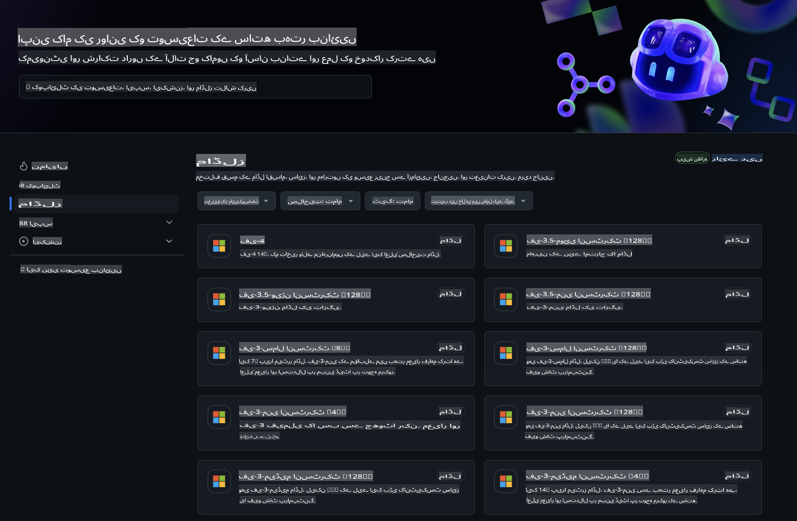
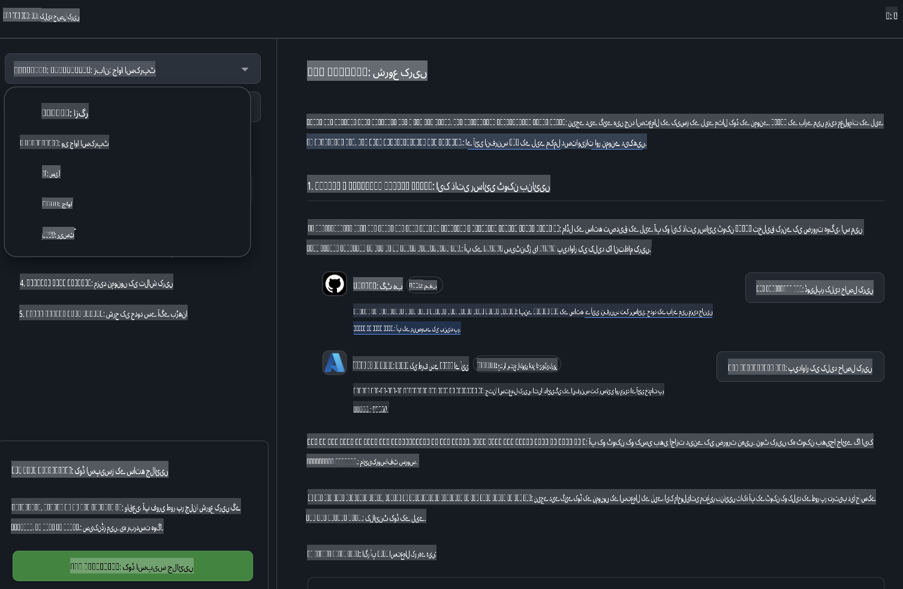

## گِٹ ہب ماڈلز - محدود عوامی بیٹا

[گِٹ ہب ماڈلز](https://github.com/marketplace/models) میں خوش آمدید! ہم نے ہر چیز تیار کر رکھی ہے تاکہ آپ Azure AI پر ہوسٹ کیے گئے AI ماڈلز کو دریافت کر سکیں۔



گِٹ ہب ماڈلز پر دستیاب ماڈلز کے بارے میں مزید معلومات کے لیے [گِٹ ہب ماڈل مارکیٹ پلیس](https://github.com/marketplace/models) دیکھیں۔

## دستیاب ماڈلز

ہر ماڈل کے لیے ایک مخصوص پلے گراؤنڈ اور نمونہ کوڈ موجود ہے۔


### گِٹ ہب ماڈل کیٹلاگ میں Phi-3 ماڈلز

[Phi-3-Medium-128k-Instruct](https://github.com/marketplace/models/azureml/Phi-3-medium-128k-instruct)

[Phi-3-medium-4k-instruct](https://github.com/marketplace/models/azureml/Phi-3-medium-4k-instruct)

[Phi-3-mini-128k-instruct](https://github.com/marketplace/models/azureml/Phi-3-mini-128k-instruct)

[Phi-3-mini-4k-instruct](https://github.com/marketplace/models/azureml/Phi-3-mini-4k-instruct)

[Phi-3-small-128k-instruct](https://github.com/marketplace/models/azureml/Phi-3-small-128k-instruct)

[Phi-3-small-8k-instruct](https://github.com/marketplace/models/azureml/Phi-3-small-8k-instruct)

## شروعات کریں

چند بنیادی مثالیں موجود ہیں جو آپ کے چلانے کے لیے تیار ہیں۔ آپ انہیں samples ڈائریکٹری میں تلاش کر سکتے ہیں۔ اگر آپ اپنی پسندیدہ زبان پر سیدھا جانا چاہتے ہیں، تو آپ درج ذیل زبانوں میں مثالیں دیکھ سکتے ہیں:

- Python  
- JavaScript  
- cURL  

نمونوں اور ماڈلز کو چلانے کے لیے ایک مخصوص Codespaces ماحول بھی موجود ہے۔



## نمونہ کوڈ

نیچے چند استعمال کے معاملات کے لیے مثال کوڈ کے ٹکڑے دیے گئے ہیں۔ Azure AI Inference SDK کے بارے میں مزید معلومات کے لیے مکمل دستاویزات اور نمونے دیکھیں۔

## سیٹ اپ

1. ایک پرسنل ایکسیس ٹوکن بنائیں  
آپ کو ٹوکن کو کسی بھی اجازت دینے کی ضرورت نہیں ہے۔ نوٹ کریں کہ ٹوکن Microsoft سروس کو بھیجا جائے گا۔

ذیل میں دیے گئے کوڈ کے ٹکڑوں کو استعمال کرنے کے لیے، ایک environment variable بنائیں تاکہ آپ اپنے ٹوکن کو کلائنٹ کوڈ کے لیے key کے طور پر سیٹ کر سکیں۔

اگر آپ bash استعمال کر رہے ہیں:  
```
export GITHUB_TOKEN="<your-github-token-goes-here>"
```  
اگر آپ powershell میں ہیں:  

```
$Env:GITHUB_TOKEN="<your-github-token-goes-here>"
```  

اگر آپ Windows کمانڈ پرامپٹ استعمال کر رہے ہیں:  

```
set GITHUB_TOKEN=<your-github-token-goes-here>
```  

## Python نمونہ

### ضروریات انسٹال کریں  
Azure AI Inference SDK کو pip کے ذریعے انسٹال کریں (Python >=3.8 ضروری ہے):  

```
pip install azure-ai-inference
```  

### ایک بنیادی کوڈ نمونہ چلائیں  

یہ نمونہ چیٹ کمپلیشن API کو ایک بنیادی کال کرنے کا مظاہرہ کرتا ہے۔ یہ GitHub AI ماڈل انفرنس اینڈ پوائنٹ اور آپ کے GitHub ٹوکن کا استعمال کر رہا ہے۔ یہ کال synchronous ہے۔  

```
import os
from azure.ai.inference import ChatCompletionsClient
from azure.ai.inference.models import SystemMessage, UserMessage
from azure.core.credentials import AzureKeyCredential

endpoint = "https://models.inference.ai.azure.com"
# Replace Model_Name 
model_name = "Phi-3-small-8k-instruct"
token = os.environ["GITHUB_TOKEN"]

client = ChatCompletionsClient(
    endpoint=endpoint,
    credential=AzureKeyCredential(token),
)

response = client.complete(
    messages=[
        SystemMessage(content="You are a helpful assistant."),
        UserMessage(content="What is the capital of France?"),
    ],
    model=model_name,
    temperature=1.,
    max_tokens=1000,
    top_p=1.
)

print(response.choices[0].message.content)
```  

### ایک ملٹی ٹرن گفتگو چلائیں  

یہ نمونہ چیٹ کمپلیشن API کے ساتھ ایک ملٹی ٹرن گفتگو کا مظاہرہ کرتا ہے۔ جب آپ ماڈل کو چیٹ ایپلیکیشن کے لیے استعمال کر رہے ہوں، تو آپ کو اس گفتگو کی ہسٹری کو مینیج کرنا ہوگا اور تازہ ترین پیغامات ماڈل کو بھیجنے ہوں گے۔  

```
import os
from azure.ai.inference import ChatCompletionsClient
from azure.ai.inference.models import AssistantMessage, SystemMessage, UserMessage
from azure.core.credentials import AzureKeyCredential

token = os.environ["GITHUB_TOKEN"]
endpoint = "https://models.inference.ai.azure.com"
# Replace Model_Name
model_name = "Phi-3-small-8k-instruct"

client = ChatCompletionsClient(
    endpoint=endpoint,
    credential=AzureKeyCredential(token),
)

messages = [
    SystemMessage(content="You are a helpful assistant."),
    UserMessage(content="What is the capital of France?"),
    AssistantMessage(content="The capital of France is Paris."),
    UserMessage(content="What about Spain?"),
]

response = client.complete(messages=messages, model=model_name)

print(response.choices[0].message.content)
```  

### آؤٹ پٹ کو سٹریم کریں  

بہتر یوزر تجربے کے لیے، آپ ماڈل کے رسپانس کو سٹریم کرنا چاہیں گے تاکہ پہلا ٹوکن جلدی ظاہر ہو اور لمبے جوابات کے لیے انتظار نہ کرنا پڑے۔  

```
import os
from azure.ai.inference import ChatCompletionsClient
from azure.ai.inference.models import SystemMessage, UserMessage
from azure.core.credentials import AzureKeyCredential

token = os.environ["GITHUB_TOKEN"]
endpoint = "https://models.inference.ai.azure.com"
# Replace Model_Name
model_name = "Phi-3-small-8k-instruct"

client = ChatCompletionsClient(
    endpoint=endpoint,
    credential=AzureKeyCredential(token),
)

response = client.complete(
    stream=True,
    messages=[
        SystemMessage(content="You are a helpful assistant."),
        UserMessage(content="Give me 5 good reasons why I should exercise every day."),
    ],
    model=model_name,
)

for update in response:
    if update.choices:
        print(update.choices[0].delta.content or "", end="")

client.close()
```  

## JavaScript

### ضروریات انسٹال کریں  

Node.js انسٹال کریں۔  

درج ذیل لائنز کو کاپی کریں اور انہیں ایک فائل package.json کے طور پر اپنے فولڈر میں محفوظ کریں۔  

```
{
  "type": "module",
  "dependencies": {
    "@azure-rest/ai-inference": "latest",
    "@azure/core-auth": "latest",
    "@azure/core-sse": "latest"
  }
}
```  

نوٹ: @azure/core-sse صرف اس وقت ضروری ہے جب آپ چیٹ کمپلیشن رسپانس کو سٹریم کریں۔  

اس فولڈر میں ایک ٹرمینل ونڈو کھولیں اور npm install چلائیں۔  

ذیل میں دیے گئے ہر کوڈ کے ٹکڑے کے لیے، مواد کو ایک فائل sample.js میں کاپی کریں اور node sample.js کے ساتھ چلائیں۔  

### ایک بنیادی کوڈ نمونہ چلائیں  

یہ نمونہ چیٹ کمپلیشن API کو ایک بنیادی کال کرنے کا مظاہرہ کرتا ہے۔ یہ GitHub AI ماڈل انفرنس اینڈ پوائنٹ اور آپ کے GitHub ٹوکن کا استعمال کر رہا ہے۔ یہ کال synchronous ہے۔  

```
import ModelClient from "@azure-rest/ai-inference";
import { AzureKeyCredential } from "@azure/core-auth";

const token = process.env["GITHUB_TOKEN"];
const endpoint = "https://models.inference.ai.azure.com";
// Update your modelname
const modelName = "Phi-3-small-8k-instruct";

export async function main() {

  const client = new ModelClient(endpoint, new AzureKeyCredential(token));

  const response = await client.path("/chat/completions").post({
    body: {
      messages: [
        { role:"system", content: "You are a helpful assistant." },
        { role:"user", content: "What is the capital of France?" }
      ],
      model: modelName,
      temperature: 1.,
      max_tokens: 1000,
      top_p: 1.
    }
  });

  if (response.status !== "200") {
    throw response.body.error;
  }
  console.log(response.body.choices[0].message.content);
}

main().catch((err) => {
  console.error("The sample encountered an error:", err);
});
```  

### ایک ملٹی ٹرن گفتگو چلائیں  

یہ نمونہ چیٹ کمپلیشن API کے ساتھ ایک ملٹی ٹرن گفتگو کا مظاہرہ کرتا ہے۔ جب آپ ماڈل کو چیٹ ایپلیکیشن کے لیے استعمال کر رہے ہوں، تو آپ کو اس گفتگو کی ہسٹری کو مینیج کرنا ہوگا اور تازہ ترین پیغامات ماڈل کو بھیجنے ہوں گے۔  

```
import ModelClient from "@azure-rest/ai-inference";
import { AzureKeyCredential } from "@azure/core-auth";

const token = process.env["GITHUB_TOKEN"];
const endpoint = "https://models.inference.ai.azure.com";
// Update your modelname
const modelName = "Phi-3-small-8k-instruct";

export async function main() {

  const client = new ModelClient(endpoint, new AzureKeyCredential(token));

  const response = await client.path("/chat/completions").post({
    body: {
      messages: [
        { role: "system", content: "You are a helpful assistant." },
        { role: "user", content: "What is the capital of France?" },
        { role: "assistant", content: "The capital of France is Paris." },
        { role: "user", content: "What about Spain?" },
      ],
      model: modelName,
    }
  });

  if (response.status !== "200") {
    throw response.body.error;
  }

  for (const choice of response.body.choices) {
    console.log(choice.message.content);
  }
}

main().catch((err) => {
  console.error("The sample encountered an error:", err);
});
```  

### آؤٹ پٹ کو سٹریم کریں  
بہتر یوزر تجربے کے لیے، آپ ماڈل کے رسپانس کو سٹریم کرنا چاہیں گے تاکہ پہلا ٹوکن جلدی ظاہر ہو اور لمبے جوابات کے لیے انتظار نہ کرنا پڑے۔  

```
import ModelClient from "@azure-rest/ai-inference";
import { AzureKeyCredential } from "@azure/core-auth";
import { createSseStream } from "@azure/core-sse";

const token = process.env["GITHUB_TOKEN"];
const endpoint = "https://models.inference.ai.azure.com";
// Update your modelname
const modelName = "Phi-3-small-8k-instruct";

export async function main() {

  const client = new ModelClient(endpoint, new AzureKeyCredential(token));

  const response = await client.path("/chat/completions").post({
    body: {
      messages: [
        { role: "system", content: "You are a helpful assistant." },
        { role: "user", content: "Give me 5 good reasons why I should exercise every day." },
      ],
      model: modelName,
      stream: true
    }
  }).asNodeStream();

  const stream = response.body;
  if (!stream) {
    throw new Error("The response stream is undefined");
  }

  if (response.status !== "200") {
    stream.destroy();
    throw new Error(`Failed to get chat completions, http operation failed with ${response.status} code`);
  }

  const sseStream = createSseStream(stream);

  for await (const event of sseStream) {
    if (event.data === "[DONE]") {
      return;
    }
    for (const choice of (JSON.parse(event.data)).choices) {
        process.stdout.write(choice.delta?.content ?? ``);
    }
  }
}

main().catch((err) => {
  console.error("The sample encountered an error:", err);
});
```  

## REST

### ایک بنیادی کوڈ نمونہ چلائیں  

شیل میں درج ذیل کو پیسٹ کریں:  

```
curl -X POST "https://models.inference.ai.azure.com/chat/completions" \
    -H "Content-Type: application/json" \
    -H "Authorization: Bearer $GITHUB_TOKEN" \
    -d '{
        "messages": [
            {
                "role": "system",
                "content": "You are a helpful assistant."
            },
            {
                "role": "user",
                "content": "What is the capital of France?"
            }
        ],
        "model": "Phi-3-small-8k-instruct"
    }'
```  

### ایک ملٹی ٹرن گفتگو چلائیں  

چیٹ کمپلیشن API کو کال کریں اور چیٹ ہسٹری پاس کریں:  

```
curl -X POST "https://models.inference.ai.azure.com/chat/completions" \
    -H "Content-Type: application/json" \
    -H "Authorization: Bearer $GITHUB_TOKEN" \
    -d '{
        "messages": [
            {
                "role": "system",
                "content": "You are a helpful assistant."
            },
            {
                "role": "user",
                "content": "What is the capital of France?"
            },
            {
                "role": "assistant",
                "content": "The capital of France is Paris."
            },
            {
                "role": "user",
                "content": "What about Spain?"
            }
        ],
        "model": "Phi-3-small-8k-instruct"
    }'
```  

### آؤٹ پٹ کو سٹریم کریں  

یہ اینڈ پوائنٹ کو کال کرنے اور رسپانس کو سٹریم کرنے کی ایک مثال ہے۔  

```
curl -X POST "https://models.inference.ai.azure.com/chat/completions" \
    -H "Content-Type: application/json" \
    -H "Authorization: Bearer $GITHUB_TOKEN" \
    -d '{
        "messages": [
            {
                "role": "system",
                "content": "You are a helpful assistant."
            },
            {
                "role": "user",
                "content": "Give me 5 good reasons why I should exercise every day."
            }
        ],
        "stream": true,
        "model": "Phi-3-small-8k-instruct"
    }'
```  

## گِٹ ہب ماڈلز کے لیے مفت استعمال اور ریٹ کی حدیں  

  

[پلے گراؤنڈ اور مفت API استعمال کے لیے ریٹ کی حدیں](https://docs.github.com/en/github-models/prototyping-with-ai-models#rate-limits) آپ کو ماڈلز کے ساتھ تجربہ کرنے اور اپنی AI ایپلیکیشن کو پروٹوٹائپ کرنے میں مدد دینے کے لیے بنائی گئی ہیں۔ ان حدوں سے آگے استعمال کے لیے، اور اپنی ایپلیکیشن کو اسکیل پر لانے کے لیے، آپ کو Azure اکاؤنٹ سے وسائل فراہم کرنے ہوں گے اور وہاں سے تصدیق کرنی ہوگی بجائے کہ آپ کے GitHub پرسنل ایکسیس ٹوکن کے۔ آپ کو اپنے کوڈ میں کچھ اور تبدیل کرنے کی ضرورت نہیں ہے۔ Azure AI میں مفت ٹیر کی حدوں سے آگے جانے کے بارے میں جاننے کے لیے اس لنک کا استعمال کریں۔  

### انکشافات  

یاد رکھیں کہ ماڈل کے ساتھ تعامل کرتے وقت آپ AI کے ساتھ تجربہ کر رہے ہیں، لہٰذا مواد میں غلطیاں ممکن ہیں۔  

یہ فیچر مختلف حدوں کے تابع ہے (جیسے کہ منٹ میں درخواستیں، دن میں درخواستیں، ہر درخواست میں ٹوکن، اور بیک وقت درخواستیں) اور پروڈکشن استعمال کے معاملات کے لیے ڈیزائن نہیں کیا گیا۔  

گِٹ ہب ماڈلز Azure AI Content Safety استعمال کرتا ہے۔ یہ فلٹرز گِٹ ہب ماڈلز کے تجربے کا حصہ ہونے کی وجہ سے بند نہیں کیے جا سکتے۔ اگر آپ ماڈلز کو ایک ادائیگی کی سروس کے ذریعے استعمال کرنے کا فیصلہ کرتے ہیں، تو براہ کرم اپنے مواد کے فلٹرز کو اپنی ضروریات کے مطابق ترتیب دیں۔  

یہ سروس گِٹ ہب کے پری ریلیز شرائط کے تحت ہے۔  

**ڈسکلیمر**:  
یہ دستاویز مشین پر مبنی اے آئی ترجمہ سروسز کا استعمال کرتے ہوئے ترجمہ کی گئی ہے۔ ہم درستگی کے لیے کوشش کرتے ہیں، لیکن براہ کرم آگاہ رہیں کہ خودکار ترجمے میں غلطیاں یا خامیاں ہو سکتی ہیں۔ اصل دستاویز کو اس کی اصل زبان میں مستند ماخذ سمجھا جانا چاہیے۔ اہم معلومات کے لیے، پیشہ ور انسانی ترجمہ تجویز کیا جاتا ہے۔ ہم اس ترجمے کے استعمال سے پیدا ہونے والی کسی بھی غلط فہمی یا غلط تشریح کے ذمہ دار نہیں ہیں۔