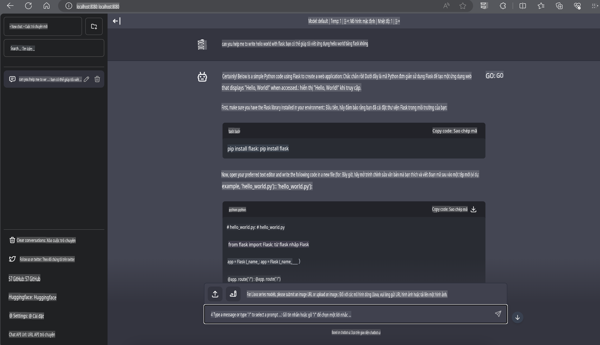

# **Suy luận Phi-3 trên Nvidia Jetson**

Nvidia Jetson là một dòng bo mạch tính toán nhúng từ Nvidia. Các mẫu Jetson TK1, TX1 và TX2 đều sử dụng bộ xử lý Tegra (hoặc SoC) từ Nvidia, tích hợp bộ xử lý trung tâm kiến trúc ARM (CPU). Jetson là một hệ thống tiết kiệm năng lượng và được thiết kế để tăng tốc các ứng dụng học máy. Nvidia Jetson được các nhà phát triển chuyên nghiệp sử dụng để tạo ra các sản phẩm AI đột phá trong mọi ngành công nghiệp, cũng như bởi sinh viên và người đam mê để học tập thực hành AI và thực hiện các dự án ấn tượng. SLM được triển khai trên các thiết bị biên như Jetson, giúp hiện thực hóa tốt hơn các kịch bản ứng dụng AI sáng tạo trong công nghiệp.

## Triển khai trên NVIDIA Jetson:
Các nhà phát triển làm việc trên robot tự hành và thiết bị nhúng có thể tận dụng Phi-3 Mini. Kích thước nhỏ gọn của Phi-3 khiến nó trở nên lý tưởng cho triển khai ở biên. Các tham số đã được tinh chỉnh kỹ lưỡng trong quá trình huấn luyện, đảm bảo độ chính xác cao trong phản hồi.

### Tối ưu hóa TensorRT-LLM:
Thư viện [TensorRT-LLM của NVIDIA](https://github.com/NVIDIA/TensorRT-LLM?WT.mc_id=aiml-138114-kinfeylo) tối ưu hóa suy luận mô hình ngôn ngữ lớn. Nó hỗ trợ cửa sổ ngữ cảnh dài của Phi-3 Mini, cải thiện cả thông lượng và độ trễ. Các tối ưu hóa bao gồm các kỹ thuật như LongRoPE, FP8 và inflight batching.

### Khả dụng và triển khai:
Các nhà phát triển có thể khám phá Phi-3 Mini với cửa sổ ngữ cảnh 128K tại [NVIDIA's AI](https://www.nvidia.com/en-us/ai-data-science/generative-ai/). Nó được đóng gói dưới dạng một NVIDIA NIM, một dịch vụ vi mô với API tiêu chuẩn có thể được triển khai ở bất kỳ đâu. Ngoài ra, tham khảo thêm [các triển khai TensorRT-LLM trên GitHub](https://github.com/NVIDIA/TensorRT-LLM).

## **1. Chuẩn bị**

a. Jetson Orin NX / Jetson NX

b. JetPack 5.1.2+
   
c. Cuda 11.8
   
d. Python 3.8+

## **2. Chạy Phi-3 trên Jetson**

Chúng ta có thể chọn [Ollama](https://ollama.com) hoặc [LlamaEdge](https://llamaedge.com)

Nếu bạn muốn sử dụng gguf trên cả đám mây và thiết bị biên cùng lúc, LlamaEdge có thể được hiểu như WasmEdge (WasmEdge là một runtime WebAssembly nhẹ, hiệu suất cao, có khả năng mở rộng, phù hợp cho các ứng dụng đám mây gốc, biên và phi tập trung. Nó hỗ trợ các ứng dụng serverless, hàm nhúng, microservices, hợp đồng thông minh và thiết bị IoT. Bạn có thể triển khai mô hình định lượng của gguf đến thiết bị biên và đám mây thông qua LlamaEdge.


Dưới đây là các bước sử dụng:

1. Cài đặt và tải xuống các thư viện và tệp liên quan

```bash

curl -sSf https://raw.githubusercontent.com/WasmEdge/WasmEdge/master/utils/install.sh | bash -s -- --plugin wasi_nn-ggml

curl -LO https://github.com/LlamaEdge/LlamaEdge/releases/latest/download/llama-api-server.wasm

curl -LO https://github.com/LlamaEdge/chatbot-ui/releases/latest/download/chatbot-ui.tar.gz

tar xzf chatbot-ui.tar.gz

```

**Lưu ý**: llama-api-server.wasm và chatbot-ui cần nằm trong cùng một thư mục

2. Chạy các script trong terminal

```bash

wasmedge --dir .:. --nn-preload default:GGML:AUTO:{Your gguf path} llama-api-server.wasm -p phi-3-chat

```

Đây là kết quả chạy



***Mẫu mã*** [Phi-3 mini WASM Notebook Sample](https://github.com/Azure-Samples/Phi-3MiniSamples/tree/main/wasm)

Tóm lại, Phi-3 Mini đại diện cho một bước tiến lớn trong mô hình ngôn ngữ, kết hợp hiệu suất, nhận thức ngữ cảnh và sự tối ưu hóa từ NVIDIA. Cho dù bạn đang xây dựng robot hay ứng dụng biên, Phi-3 Mini là một công cụ mạnh mẽ mà bạn nên biết đến.

**Tuyên bố miễn trừ trách nhiệm**:  
Tài liệu này đã được dịch bằng các dịch vụ dịch thuật AI tự động. Mặc dù chúng tôi cố gắng đảm bảo độ chính xác, xin lưu ý rằng các bản dịch tự động có thể chứa lỗi hoặc sự không chính xác. Tài liệu gốc bằng ngôn ngữ bản địa nên được coi là nguồn thông tin đáng tin cậy. Đối với các thông tin quan trọng, nên sử dụng dịch vụ dịch thuật chuyên nghiệp của con người. Chúng tôi không chịu trách nhiệm về bất kỳ sự hiểu lầm hoặc diễn giải sai nào phát sinh từ việc sử dụng bản dịch này.