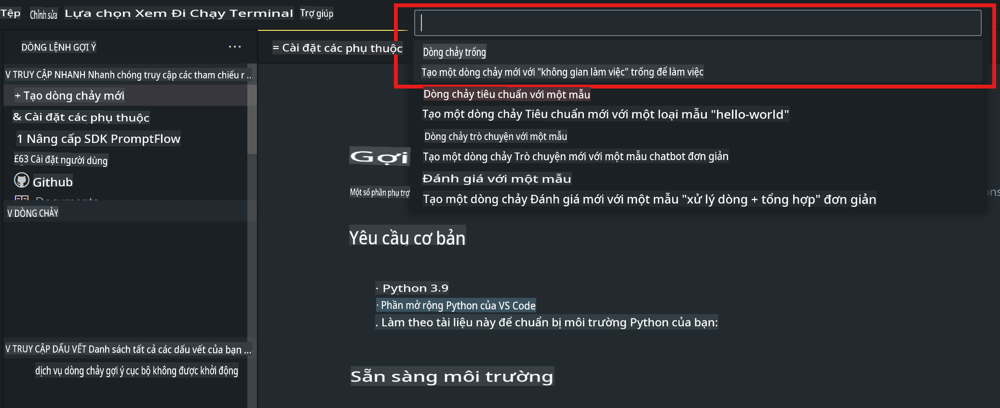

# **Lab 2 - Chạy Prompt flow với Phi-3-mini trong AIPC**

## **Prompt flow là gì**

Prompt flow là một bộ công cụ phát triển được thiết kế để đơn giản hóa toàn bộ chu trình phát triển ứng dụng AI dựa trên LLM, từ giai đoạn ý tưởng, tạo mẫu, kiểm thử, đánh giá cho đến triển khai và giám sát sản phẩm. Công cụ này giúp việc thiết kế prompt trở nên dễ dàng hơn và hỗ trợ bạn xây dựng các ứng dụng LLM đạt chất lượng sản phẩm.

Với Prompt flow, bạn có thể:

- Tạo các luồng kết nối LLM, prompts, mã Python và các công cụ khác thành một quy trình làm việc có thể thực thi.

- Gỡ lỗi và cải thiện các luồng của bạn, đặc biệt là trong việc tương tác với LLM một cách dễ dàng.

- Đánh giá luồng của bạn, tính toán các chỉ số chất lượng và hiệu suất với các tập dữ liệu lớn hơn.

- Tích hợp việc kiểm thử và đánh giá vào hệ thống CI/CD của bạn để đảm bảo chất lượng cho luồng.

- Triển khai luồng của bạn lên nền tảng phục vụ mà bạn chọn hoặc tích hợp vào mã nguồn ứng dụng của bạn một cách dễ dàng.

- (Tùy chọn nhưng rất được khuyến khích) Hợp tác với nhóm của bạn bằng cách sử dụng phiên bản Prompt flow trên đám mây trong Azure AI.


## **Xây dựng luồng mã sinh trên Apple Silicon**

***Lưu ý***: Nếu bạn chưa hoàn tất cài đặt môi trường, vui lòng truy cập [Lab 0 - Installations](./01.Installations.md)

1. Mở tiện ích mở rộng Prompt flow trong Visual Studio Code và tạo một dự án luồng trống.



2. Thêm các tham số Inputs và Outputs, sau đó thêm mã Python làm luồng mới.


Bạn có thể tham khảo cấu trúc này (flow.dag.yaml) để xây dựng luồng của mình:

```yaml

inputs:
  prompt:
    type: string
    default: Write python code for Fibonacci serie. Please use markdown as output
outputs:
  result:
    type: string
    reference: ${gen_code_by_phi3.output}
nodes:
- name: gen_code_by_phi3
  type: python
  source:
    type: code
    path: gen_code_by_phi3.py
  inputs:
    prompt: ${inputs.prompt}


```

3. Định lượng phi-3-mini

Chúng ta mong muốn chạy SLM tốt hơn trên các thiết bị cục bộ. Thông thường, chúng ta định lượng mô hình (INT4, FP16, FP32).

```bash

python -m mlx_lm.convert --hf-path microsoft/Phi-3-mini-4k-instruct

```

**Lưu ý:** thư mục mặc định là mlx_model.

4. Thêm mã vào ***Chat_With_Phi3.py***

```python


from promptflow import tool

from mlx_lm import load, generate


# The inputs section will change based on the arguments of the tool function, after you save the code
# Adding type to arguments and return value will help the system show the types properly
# Please update the function name/signature per need
@tool
def my_python_tool(prompt: str) -> str:

    model_id = './mlx_model_phi3_mini'

    model, tokenizer = load(model_id)

    # <|user|>\nWrite python code for Fibonacci serie. Please use markdown as output<|end|>\n<|assistant|>

    response = generate(model, tokenizer, prompt="<|user|>\n" + prompt  + "<|end|>\n<|assistant|>", max_tokens=2048, verbose=True)

    return response


```

4. Bạn có thể kiểm tra luồng bằng cách Debug hoặc Run để xem mã sinh có hoạt động đúng hay không.


5. Chạy luồng như một API phát triển trong terminal.

```

pf flow serve --source ./ --port 8080 --host localhost   

```

Bạn có thể kiểm tra nó bằng Postman / Thunder Client.


### **Lưu ý**

1. Lần chạy đầu tiên sẽ mất nhiều thời gian. Khuyến nghị tải xuống mô hình phi-3 từ Hugging Face CLI.

2. Do giới hạn về sức mạnh tính toán của Intel NPU, khuyến nghị sử dụng Phi-3-mini-4k-instruct.

3. Chúng ta sử dụng Intel NPU Acceleration để chuyển đổi định lượng INT4, nhưng nếu bạn chạy lại dịch vụ, cần xóa cache và các thư mục nc_workshop.


## **Tài nguyên**

1. Tìm hiểu về Promptflow [https://microsoft.github.io/promptflow/](https://microsoft.github.io/promptflow/)

2. Tìm hiểu về Intel NPU Acceleration [https://github.com/intel/intel-npu-acceleration-library](https://github.com/intel/intel-npu-acceleration-library)

3. Mã mẫu, tải xuống [Local NPU Agent Sample Code](../../../../../../../../../code/07.Lab/01/AIPC/local-npu-agent)

**Tuyên bố miễn trừ trách nhiệm**:  
Tài liệu này đã được dịch bằng các dịch vụ dịch thuật AI tự động. Mặc dù chúng tôi cố gắng đảm bảo độ chính xác, xin lưu ý rằng các bản dịch tự động có thể chứa lỗi hoặc sai sót. Tài liệu gốc bằng ngôn ngữ bản địa nên được coi là nguồn thông tin chính thức. Đối với các thông tin quan trọng, nên sử dụng dịch vụ dịch thuật chuyên nghiệp từ con người. Chúng tôi không chịu trách nhiệm cho bất kỳ sự hiểu lầm hoặc diễn giải sai nào phát sinh từ việc sử dụng bản dịch này.