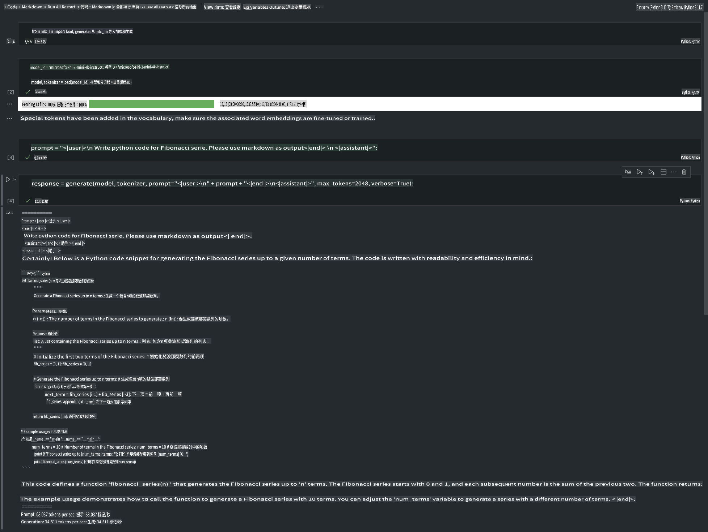

# **使用 Apple MLX 框架推理 Phi-3**

## **什么是 MLX 框架**

MLX 是一个专为 Apple 芯片上的机器学习研究设计的框架，由 Apple 机器学习研究团队开发。

MLX 是为机器学习研究者设计的，旨在既易于使用又高效地训练和部署模型。框架的设计概念也非常简单，目的是让研究人员能够轻松扩展和改进 MLX，以便快速探索新想法。

通过 MLX，可以在 Apple Silicon 设备上加速运行大语言模型 (LLMs)，并且模型可以非常方便地在本地运行。

## **使用 MLX 推理 Phi-3-mini**

### **1. 设置 MLX 环境**

1. Python 3.11.x  
2. 安装 MLX 库  

```bash

pip install mlx-lm

```

### **2. 在终端中使用 MLX 运行 Phi-3-mini**

```bash

python -m mlx_lm.generate --model microsoft/Phi-3-mini-4k-instruct --max-token 2048 --prompt  "<|user|>\nCan you introduce yourself<|end|>\n<|assistant|>"

```

运行结果（我的环境是 Apple M1 Max, 64GB）如下：


### **3. 在终端中使用 MLX 量化 Phi-3-mini**

```bash

python -m mlx_lm.convert --hf-path microsoft/Phi-3-mini-4k-instruct

```

***注意：*** 模型可以通过 mlx_lm.convert 进行量化，默认的量化格式是 INT4。本示例将 Phi-3-mini 量化为 INT4。

模型通过 mlx_lm.convert 进行量化，默认量化格式为 INT4。本示例将 Phi-3-mini 量化为 INT4。量化后，模型会存储在默认目录 ./mlx_model 中。

我们可以在终端中测试使用 MLX 量化后的模型：

```bash

python -m mlx_lm.generate --model ./mlx_model/ --max-token 2048 --prompt  "<|user|>\nCan you introduce yourself<|end|>\n<|assistant|>"

```

运行结果如下：


### **4. 在 Jupyter Notebook 中使用 MLX 运行 Phi-3-mini**



***注意：*** 请参考此示例 [点击此链接](../../../../../code/03.Inference/MLX/MLX_DEMO.ipynb)

## **资源**

1. 了解 Apple MLX 框架 [https://ml-explore.github.io](https://ml-explore.github.io/mlx/build/html/index.html)

2. Apple MLX GitHub 仓库 [https://github.com/ml-explore](https://github.com/ml-explore)

**免责声明**：  
本文件使用基于机器的人工智能翻译服务进行翻译。虽然我们尽力确保准确性，但请注意，自动翻译可能包含错误或不准确之处。应以原始语言的文件为权威来源。对于关键信息，建议使用专业人工翻译。我们对因使用本翻译而引起的任何误解或误读不承担责任。