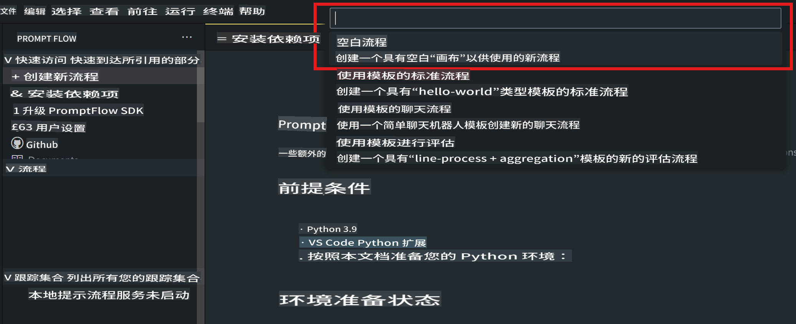
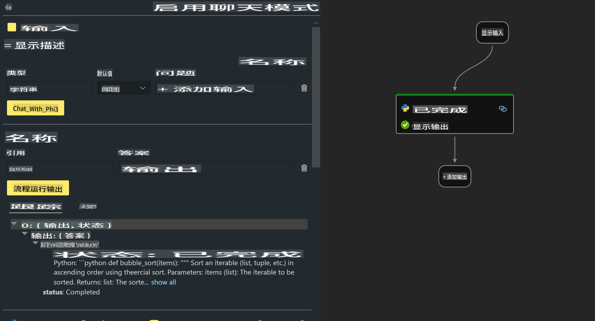

# **实验 2 - 在 AIPC 中运行 Phi-3-mini 的 Prompt flow**

## **什么是 Prompt flow**

Prompt flow 是一套开发工具，旨在简化基于大型语言模型 (LLM) 的 AI 应用程序从构思、原型设计、测试、评估到生产部署和监控的整个开发周期。它让提示工程变得更加简单，并帮助您构建具有生产质量的 LLM 应用程序。

通过 Prompt flow，您可以：

- 创建将 LLM、提示、Python 代码和其他工具链接在一起的可执行工作流。

- 轻松调试和迭代您的工作流，特别是与 LLM 的交互。

- 使用更大的数据集评估您的工作流，计算质量和性能指标。

- 将测试和评估集成到您的 CI/CD 系统中，以确保工作流的质量。

- 将您的工作流部署到您选择的服务平台，或轻松集成到应用程序的代码库中。

- （可选但强烈推荐）通过利用 Azure AI 上的 Prompt flow 云版本，与您的团队协作。

## **什么是 AIPC**

AI PC 配备了 CPU、GPU 和 NPU，每种组件都有特定的 AI 加速能力。NPU，即神经处理单元，是一种专用加速器，可以直接在您的 PC 上处理人工智能 (AI) 和机器学习 (ML) 任务，而无需将数据发送到云端处理。虽然 GPU 和 CPU 也可以处理这些工作负载，但 NPU 在低功耗 AI 计算方面表现尤为出色。AI PC 代表了我们计算机运行方式的一个根本性转变。它并不是为了解决一个以前不存在的问题，而是承诺在日常 PC 使用中带来巨大改进。

那么它是如何工作的呢？与生成式 AI 和基于海量公共数据训练的大型语言模型 (LLMs) 相比，AI PC 上运行的 AI 在各个层面上都更加易于接近。这个概念更容易理解，而且因为它基于您的数据进行训练，无需访问云端，其优势对更广泛的人群来说更具吸引力。

在短期内，AI PC 世界包括运行在您的 PC 上的个人助手和较小的 AI 模型，利用您的数据为您日常的工作提供个性化、私密且更安全的 AI 增强功能——例如记录会议纪要、组织梦幻足球联赛、自动优化照片和视频编辑，或根据每个人的到达和离开时间规划完美的家庭聚会行程。

## **在 AIPC 上构建生成代码的流程**

***注意***：如果您尚未完成环境安装，请访问 [实验 0 - 安装](./01.Installations.md)

1. 在 Visual Studio Code 中打开 Prompt flow 扩展，并创建一个空的流程项目。



2. 添加输入和输出参数，并将 Python 代码添加为新流程。



您可以参考以下结构 (flow.dag.yaml) 来构建您的流程：

```yaml

inputs:
  question:
    type: string
    default: how to write Bubble Algorithm
outputs:
  answer:
    type: string
    reference: ${Chat_With_Phi3.output}
nodes:
- name: Chat_With_Phi3
  type: python
  source:
    type: code
    path: Chat_With_Phi3.py
  inputs:
    question: ${inputs.question}


```

3. 在 ***Chat_With_Phi3.py*** 中添加代码：

```python


from promptflow.core import tool

# import torch
from transformers import AutoTokenizer, pipeline,TextStreamer
import intel_npu_acceleration_library as npu_lib

import warnings

import asyncio
import platform

class Phi3CodeAgent:
    
    model = None
    tokenizer = None
    text_streamer = None
    
    model_id = "microsoft/Phi-3-mini-4k-instruct"

    @staticmethod
    def init_phi3():
        
        if Phi3CodeAgent.model is None or Phi3CodeAgent.tokenizer is None or Phi3CodeAgent.text_streamer is None:
            Phi3CodeAgent.model = npu_lib.NPUModelForCausalLM.from_pretrained(
                                    Phi3CodeAgent.model_id,
                                    torch_dtype="auto",
                                    dtype=npu_lib.int4,
                                    trust_remote_code=True
                                )
            Phi3CodeAgent.tokenizer = AutoTokenizer.from_pretrained(Phi3CodeAgent.model_id)
            Phi3CodeAgent.text_streamer = TextStreamer(Phi3CodeAgent.tokenizer, skip_prompt=True)

    

    @staticmethod
    def chat_with_phi3(prompt):
        
        Phi3CodeAgent.init_phi3()

        messages = "<|system|>You are a AI Python coding assistant. Please help me to generate code in Python.The answer only genertated Python code, but any comments and instructions do not need to be generated<|end|><|user|>" + prompt +"<|end|><|assistant|>"


        generation_args = {
            "max_new_tokens": 1024,
            "return_full_text": False,
            "temperature": 0.3,
            "do_sample": False,
            "streamer": Phi3CodeAgent.text_streamer,
        }

        pipe = pipeline(
            "text-generation",
            model=Phi3CodeAgent.model,
            tokenizer=Phi3CodeAgent.tokenizer,
            # **generation_args
        )

        result = ''

        with warnings.catch_warnings():
            warnings.simplefilter("ignore")
            response = pipe(messages, **generation_args)
            result =response[0]['generated_text']
            return result


@tool
def my_python_tool(question: str) -> str:
    if platform.system() == 'Windows':
        asyncio.set_event_loop_policy(asyncio.WindowsSelectorEventLoopPolicy())
    return Phi3CodeAgent.chat_with_phi3(question)


```

4. 您可以通过 Debug 或 Run 测试流程，以检查生成代码是否正常。


5. 在终端中以开发 API 的形式运行流程：

```

pf flow serve --source ./ --port 8080 --host localhost   

```

您可以使用 Postman 或 Thunder Client 进行测试。

### **注意事项**

1. 第一次运行需要较长时间。建议通过 Hugging Face CLI 下载 phi-3 模型。

2. 鉴于 Intel NPU 的计算能力有限，建议使用 Phi-3-mini-4k-instruct。

3. 我们使用 Intel NPU 加速进行 INT4 量化转换，但如果您重新运行服务，需要删除缓存和 nc_workshop 文件夹。

## **资源**

1. 学习 Promptflow [https://microsoft.github.io/promptflow/](https://microsoft.github.io/promptflow/)

2. 学习 Intel NPU 加速 [https://github.com/intel/intel-npu-acceleration-library](https://github.com/intel/intel-npu-acceleration-library)

3. 示例代码，下载 [本地 NPU Agent 示例代码](../../../../../../../../../code/07.Lab/01/AIPC)

**免责声明**：  
本文档通过基于机器的人工智能翻译服务进行翻译。尽管我们努力确保准确性，但请注意，自动翻译可能包含错误或不准确之处。应以原文档的原始语言版本为权威来源。对于关键信息，建议寻求专业人工翻译。因使用此翻译引起的任何误解或误读，我们概不负责。