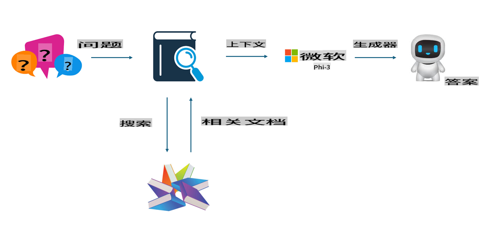

## 微调 vs RAG

## 检索增强生成

RAG 是数据检索 + 文本生成。企业的结构化数据和非结构化数据存储在向量数据库中。在搜索相关内容时，找到相关的摘要和内容以形成上下文，并结合 LLM/SLM 的文本生成能力来生成内容。

## RAG 过程

## 微调
微调是基于某个模型的改进。不需要从模型算法开始，但需要不断积累数据。如果在行业应用中需要更精确的术语和语言表达，微调是更好的选择。但如果数据频繁变化，微调可能会变得复杂。

## 如何选择
如果我们的回答需要引入外部数据，RAG 是最佳选择。

如果需要输出稳定且精确的行业知识，微调是一个不错的选择。RAG 优先拉取相关内容，但可能无法始终准确把握专业细节。

微调需要高质量的数据集，如果只是小范围的数据，效果不会有太大差异。RAG 更加灵活。

微调是一个黑盒子，带有一定的神秘性，内部机制难以理解。但 RAG 可以更容易找到数据来源，从而有效调整幻觉或内容错误，并提供更好的透明性。

**免责声明**：  
本文件使用基于机器的人工智能翻译服务进行翻译。尽管我们努力确保翻译的准确性，但请注意，自动翻译可能包含错误或不准确之处。应以原始语言的文件为权威来源。对于关键信息，建议使用专业人工翻译。因使用此翻译而导致的任何误解或误读，我们概不负责。